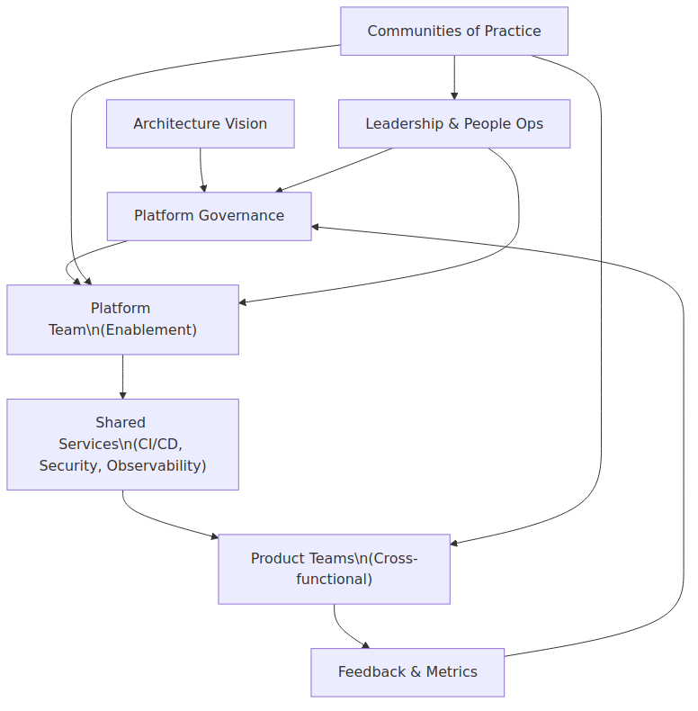
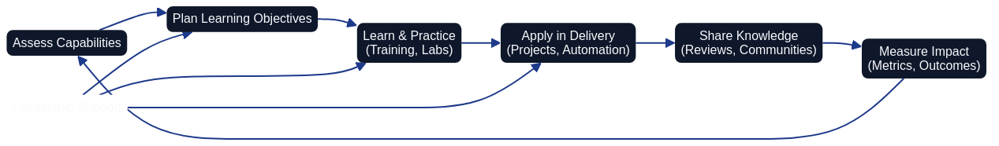

# Team Structure and Competency Development for Architecture as Code



Successful Architecture as Code adoption demands far more than tools; it requires an intentionally designed operating model where leadership, enablement teams, and delivery squads share accountability. The collaboration ecosystem illustrated above shows how platform governance, shared services, and communities of practice reinforce one another to create reliable delivery loops.

## Organisational transformation for Architecture as Code

Traditional organisational charts that separate development, testing, and operations create silos which hinder Architecture as Code practices. Cross-functional teams with shared responsibility for the entire service lifecycle achieve faster feedback, higher quality, and sustainable flow. Reorganising around product-aligned delivery teams also improves transparency because the system design mirrors the communication pathways predicted by Conway's Law.

Platform teams act as internal service providers. They own the common toolchains, guardrails, and reusable modules that allow application teams to move quickly without sacrificing governance. This balance of central expertise and decentralised autonomy is essential for scaling Architecture as Code in large enterprises.

## Competency domains for Architecture as Code specialists



Architecture as Code specialists blend system engineering, software craftsmanship, and cloud fluency. Core skills include modern programming languages for automation (such as Python, Go, or PowerShell), multi-cloud familiarity spanning AWS, Azure, and Google Cloud, and disciplined software engineering practices like version control, testing, and peer review. The competency development loop depicted above highlights how continuous assessment, learning, and knowledge sharing reinforce professional growth.

Soft skills are equally significant. Practitioners must communicate design intent, negotiate trade-offs with stakeholders, and mentor peers adopting new tooling. These interpersonal abilities ensure technical decisions are understood and adopted across the organisation.

### Skills matrix reference

Teams often need a shared view of expectations at each stage of mastery. The tables below capture the technical and interpersonal competencies to evaluate during quarterly development conversations.

**Technical Skills Progression:**

| Level | Focus Area | Core Competencies |
|-------|-----------|-------------------|
| Foundation (Level 1) | Basic operations | Execute basic Git operations (clone, commit, push, pull); Explain core cloud computing concepts; Perform routine Linux or Windows administration tasks; Read and edit YAML or JSON structures; Describe fundamental networking concepts |
| Practitioner (Level 2) | Infrastructure automation | Build and reuse Terraform or CloudFormation modules; Create and maintain CI/CD pipelines; Apply container fundamentals (Docker); Configure infrastructure monitoring and alerting; Implement security scanning and compliance checks |
| Advanced (Level 3) | Architecture design | Design multi-cloud architectures; Operate Kubernetes clusters at scale; Develop advanced automation scripts; Optimise infrastructure spend; Design disaster recovery strategies |
| Expert (Level 4) | Platform leadership | Architect platform-level capabilities; Evaluate and select new tooling; Mentor colleagues and lead knowledge transfer; Shape strategic roadmaps; Facilitate cross-team collaboration |

**Interpersonal Skills:**

| Skill Domain | Key Capabilities |
|--------------|------------------|
| Communication | Produce clear technical documentation; Deliver presentations and training sessions; Manage stakeholder expectations; Resolve conflicts constructively |
| Leadership | Coach and mentor team members; Plan and execute complex projects; Lead organisational change initiatives; Contribute to long-term strategic thinking |

Managers revisit the matrix alongside metrics and feedback to tailor coaching plans, ensuring each engineer advances at a sustainable pace.

## Learning strategies and certifications

Structured learning programmes combine theory, labs, and mentoring to accelerate capability building. External platforms (A Cloud Guru, Pluralsight, Linux Academy) provide curated curricula aligned to Architecture as Code tooling, while internal academies tailor the content to organisational context. Industry certifications such as AWS Certified DevOps Engineer, Microsoft Azure DevOps Engineer Expert, and HashiCorp Certified Terraform Associate validate proficiency and guide progression through increasingly advanced competencies.

To turn knowledge into practice, organisations invest in sandbox environments, lab challenges, and pair programming. Managers should track completion, but also emphasise practical demonstrations of new capabilities applied to real delivery scenarios.

### Training programme blueprint

The following programme structure translates the learning strategy into an actionable plan. It is introduced before implementation so teams understand how each module reinforces core Architecture as Code responsibilities.

```yaml
# training-program.yaml
architecture_as_code_training_program:
  duration: "12 weeks"
  format: "Blended learning"

  modules:
    week_1_2:
      title: "Foundation Skills"
      topics:
        - Git version control
        - Cloud platform fundamentals
        - Infrastructure concepts
      deliverables:
        - Personal development environment setup
        - Basic Git workflow demonstration

    week_3_4:
      title: "Infrastructure as Code Fundamentals"
      topics:
        - Terraform modules
        - YAML and JSON data formats
        - Resource management principles
      deliverables:
        - Simple infrastructure deployment
        - Code review participation

    week_5_6:
      title: "Automation and CI/CD"
      topics:
        - Pipeline development
        - Testing strategies
        - Deployment automation
      deliverables:
        - Automated deployment pipeline
        - Test suite implementation

    week_7_8:
      title: "Security and Compliance"
      topics:
        - Security scanning
        - Policy as Code
        - Secrets management
      deliverables:
        - Security policy implementation
        - Compliance audit preparation

    week_9_10:
      title: "Monitoring and Observability"
      topics:
        - Infrastructure monitoring
        - Alerting strategies
        - Performance optimisation
      deliverables:
        - Monitoring dashboard creation
        - Alert configuration

    week_11_12:
      title: "Advanced Topics and Capstone"
      topics:
        - Architecture patterns
        - Troubleshooting strategies
        - Future trends
      deliverables:
        - Capstone project presentation
        - Knowledge sharing session

  assessment:
    methods:
      - Practical assignments (60%)
      - Peer code reviews (20%)
      - Final project presentation (20%)

    certification:
      internal: "Architecture as Code Practitioner Certificate"
      external: "Support for AWS, Azure, or GCP certification"
```

After completing each module, facilitators review the measurable deliverables to confirm knowledge transfer into production delivery. Capstone demonstrations and code reviews provide tangible evidence that the curriculum elevates team capability.

## Agile team models for infrastructure

Architecture as Code thrives when infrastructure is treated as a product. Cross-functional teams include cloud engineers, automation specialists, security experts, and site reliability engineers collaborating on a prioritised backlog. Product owners representing internal customers balance feature acceleration, resilience, and compliance.

Scrum or Kanban provide planning cadence and make operational work visible. Teams blend roadmap items with service improvements and technical debt remediation to maintain long-term velocity. Service level objectives, error budgets, and deployment frequency metrics ensure platform engineering efforts are tied to business value.

### Platform and product team charter

The YAML definition below formalises the accountability boundaries established earlier. It is positioned within the team model discussion to demonstrate how governance choices appear in executable documentation.

```yaml
# team-structure.yaml
teams:
  platform_team:
    mission: "Provide Architecture as Code capabilities and tooling"
    responsibilities:
      - Core Architecture as Code framework development
      - Tool standardisation and governance
      - Training and documentation enablement
      - Platform engineering services

    roles:
      - Platform Engineer (3)
      - Cloud Architect (1)
      - DevOps Engineer (2)
      - Security Engineer (1)

    metrics:
      - Developer experience satisfaction
      - Platform adoption rate
      - Mean time to provision infrastructure
      - Security compliance percentage

  application_teams:
    model: "Cross-functional product teams"
    composition:
      - Product Owner (1)
      - Software Engineers (4-6)
      - Cloud Engineer (1)
      - Quality Engineer (1)

    responsibilities:
      - Application infrastructure definition
      - Service deployment and monitoring
      - Application security automation
      - Performance optimisation
```

Following the charter, teams host quarterly alignment reviews to check whether service levels and adoption targets remain realistic. Any gaps drive updates to responsibilities, metrics, or staffing.

## Knowledge sharing and communities of practice

Documented runbooks, architecture decision records, troubleshooting guides, and curated repositories form the knowledge backbone for Architecture as Code. Teams co-maintain these references to reduce the bus factor and to keep onboarding friction low. Communities of practice connect practitioners across product lines through short talks, clinics, and peer coaching, ensuring ideas diffuse rapidly beyond immediate squads.

### Community of practice framework

This template accompanies the knowledge sharing guidance. It clarifies roles, cadences, and collaboration platforms so that community leaders can launch a consistent operating rhythm.

```markdown
# Infrastructure as Code Community of Practice

## Purpose
Foster knowledge sharing, collaboration, and continuous learning in Architecture as Code practices across the organisation.

## Structure

### Core Team
- Community Leader (Platform Team)
- Technical Advocates (from each application team)
- Learning and Development Partner
- Security Representative

### Activities

#### Monthly Tech Talks
- 45-minute presentations on Architecture as Code topics
- Internal case studies and lessons learned
- External speaker sessions
- Tool demonstrations and comparisons

#### Quarterly Workshops
- Hands-on learning sessions
- New tool evaluations
- Architecture review sessions
- Cross-team collaboration exercises

#### Annual Conference
- Full-day internal conference
- Keynote presentations
- Breakout sessions
- Team showcase presentations

### Knowledge Sharing

#### Wiki and Documentation
- Architecture as Code best practice repository
- Architecture decision records
- Troubleshooting guides
- Tool comparisons and recommendations

#### Collaboration Channels
- #architecture-as-code-general for discussions
- #architecture-as-code-help for troubleshooting
- #architecture-as-code-announcements for updates
- #architecture-as-code-tools for tool discussions

#### Code Repositories
- Shared module libraries
- Example implementations
- Template repositories
- Learning exercises

### Metrics and Success Criteria
- Community participation rates
- Knowledge sharing frequency
- Cross-team collaboration instances
- Skill development progression
- Innovation and improvement suggestions
```

Community coordinators review these artefacts after each quarter, ensuring insights captured during talks and workshops make their way into documentation, reusable modules, and the broader operating model.

## Performance management and career progression

Clear technical career pathways help specialists envision advancement from associate automation engineers to senior architects. Competency frameworks articulate the behaviours, technical mastery, and leadership impact expected at each level. Balanced scorecards combine operational indicators (deployment frequency, change failure rate, mean time to restore) with softer measures such as knowledge sharing contributions and cross-team collaboration.

Leadership development pathways prepare senior individual contributors for management roles when appropriate. Training on stakeholder management, strategic planning, and inclusive team building equips future leaders to steward Architecture as Code capabilities responsibly.

## Summary

Architecture as Code succeeds when teams evolve their operating model alongside their tooling. Purposeful organisational design, continuous skill development, disciplined knowledge sharing, and measurable performance management create a resilient ecosystem. By aligning leadership support, platform enablement, and empowered delivery teams, organisations sustain the momentum required to treat infrastructure as a strategic asset.

## Sources and references

- Gene Kim, Jez Humble, Patrick Debois, John Willis. *The DevOps Handbook.* IT Revolution Press.
- Matthew Skelton, Manuel Pais. *Team Topologies: Organizing Business and Technology Teams.* IT Revolution Press.
- Google Cloud. "DevOps Research and Assessment (DORA) Reports." Google Cloud Platform.
- Atlassian. "DevOps Team Structure and Best Practices." Atlassian Documentation.
- HashiCorp. "Infrastructure as Code Maturity Model." HashiCorp Learn Platform.

