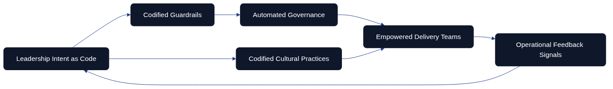
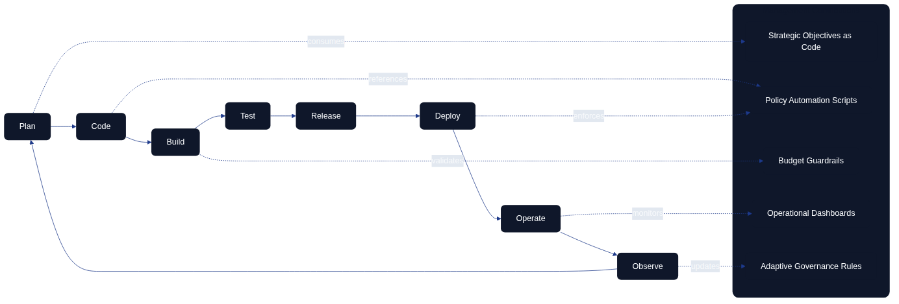
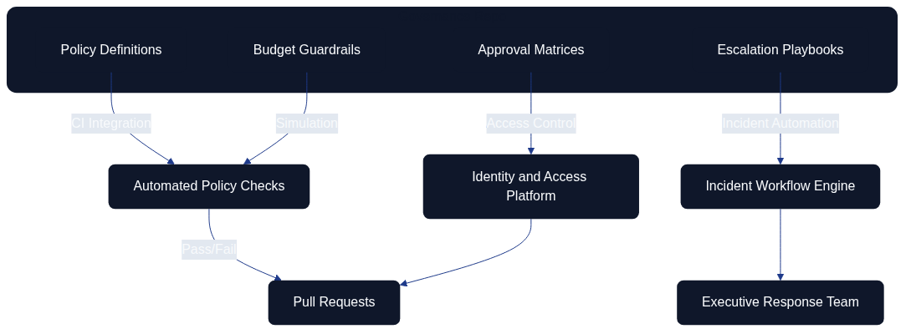
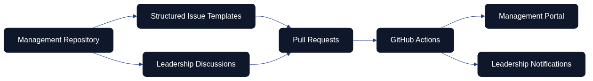
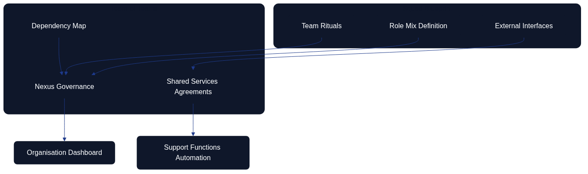

# Management as Code

## Introduction
Management as Code (MaC) extends the well-established principles of Infrastructure as Code and Architecture as Code into the realm of organisational leadership. It treats management intent, governance routines, and decision frameworks as executable artefacts that can be versioned, tested, automated, and refined. In organisations where the entire delivery pipeline is codified, management practices that remain trapped in meetings, slide decks, or undocumented intuition quickly become bottlenecks. A MaC discipline eliminates that bottleneck by encoding strategic direction, operational constraints, and cultural values into the same repositories that power the technology stack. This chapter explores how MaC manifests in fully code-based environments, how management roles adapt to DevOps loops, and how tooling such as GitHub can embed leadership into the change lifecycle while addressing budgeting, capability development, and the orchestration of multiple teams or teams-of-teams.

*Figure: Management as Code operating model linking leadership intent, codified guardrails, automation, empowered teams, culture, and feedback loops.*

The opening operating-model diagram frames the chapter by showing leadership intent flowing into codified guardrails and automated governance. Empowered teams and codified cultural practices amplify those guardrails, while continuous feedback loops return insight to leadership so that intent can evolve. It establishes the idea that MaC is a living system rather than a static document.

*Figure: Management as Code feedback loop connecting leadership vision, guardrails, automation, empowered teams, and operational feedback.*

The overview diagram reinforces Management as Code as a self-reinforcing loop where leadership vision flows into codified guardrails, automation, and delivery teams while operational feedback continuously informs future strategic intent. It emphasises that MaC is not a one-off documentation exercise but an active governance system that evolves with every iteration of the software delivery lifecycle.

## Defining Management as Code
At its core, MaC is the systematic translation of management artefacts into reproducible code. Policies, playbooks, delegation models, role definitions, and decision guardrails are captured as declarative specifications that tooling can enforce. Rather than issuing static policy documents, leadership teams create repositories that contain structured definitions for escalation thresholds, strategic objectives and key results (OKRs), and the criteria for portfolio prioritisation. Automation hooks process these definitions to trigger workflows, generate dashboards, or enforce access controls. By storing these assets in Git repositories, management directives acquire the same benefits as other code: auditability, peer review, continuous integration, and rollback.

MaC differs from traditional management documentation in three crucial ways. The artefacts are executable—scripts, configuration files, or policy-as-code rules integrate directly with operational systems. Management inputs follow the same change management discipline as software features, so leaders iterate transparently. Finally, telemetry instruments every directive, enabling evidence-based leadership for globally distributed teams without waiting for synchronous communication.

## Principles of MaC in Code-First Organisations
Fully code-based organisations share a set of principles that underpin MaC. They prioritise declarative specifications over narrative documents, expecting every significant management decision to be represented in a machine-readable form. Version control governs all management artefacts, providing traceability for who authorised a particular policy and when it changed. Automated testing of management rules—such as simulated budget scenarios or compliance checks for role-based access control—ensures that leadership decisions do not break downstream systems.

A key principle is alignment with continuous delivery cadences. Management cadences must be as responsive as the deployment frequency, using iterations of policy code to reflect business changes. Another principle is collaboration parity: management contributions use the same pull request (PR) pathways as engineering contributions, complete with reviews, automated checks, and documentation updates, so leadership work becomes inspectable and improvable through shared tooling.

## Embedding Management in the DevOps Loop
A DevOps loop is often depicted as a continuous cycle: plan, code, build, test, release, deploy, operate, observe, and feed insights back into planning. MaC expands this loop by articulating leadership responsibilities in each stage. During planning, management-as-code repositories define strategic intents, budget envelopes, and compliance constraints. The coding phase includes management scripts for feature approval workflows or objective tracking. Build and test stages incorporate automated validation of management artefacts, such as ensuring new OKRs align with portfolio policies. Release and deploy phases use policy-as-code to verify that launch criteria—risk sign-off, stakeholder notifications, capacity adjustments—are satisfied. The operate stage relies on management dashboards generated from code to review service health, financial performance, and staffing adequacy. Observation feeds into adaptive management routines, triggering updates to strategy code or organisational design specifications.

*Figure: DevOps loop extended with Management as Code contributions for strategy, policy automation, budgeting, dashboards, and adaptive governance.*

The diagram illustrates how management artefacts intersect with each loop phase. Instead of management being an external approval layer, MaC ensures that leadership intent is encoded at the same points where DevOps teams act. Planning repositories can provide strategic intents expressed in YAML files, while automation transforms these definitions into backlog templates or alerts when proposals deviate from strategic goals. During operation, monitoring dashboards generated from configuration code link service-level indicators to financial KPIs. As teams observe anomalies, adaptive governance rules encoded in policy files trigger scenario playbooks or review cadences.

## Governance and Policy Automation
MaC provides a robust foundation for governance-as-code, where leadership rules are implemented as automated checks. Access control policies become parameterised configurations that pipeline tools consume, ensuring only authorised roles can approve specific changes. Risk tolerance levels appear as threshold values in configuration files, automatically cross-referenced against deployment metrics. Governance repositories can also contain escalation playbooks, specifying decision-makers, communication channels, and response time objectives.

Automated compliance tests run alongside software unit tests. For instance, a pull request adjusting a service’s operating budget triggers simulations that verify it stays within the portfolio guardrails declared in management code. If the change would breach the guardrails, the PR fails and prompts the contributor to adjust the request or seek executive approval. This automation dramatically reduces the manual overhead of governance and gives leaders more time to focus on strategic initiatives.

*Figure: Governance pipeline where management repositories feed automated checks, workflows, and access control enforcement.*

This governance diagram emphasises how management repositories integrate with CI pipelines, incident workflows, and identity platforms. By codifying playbooks and roles, leadership actions become auditable and repeatable. Every update to these artefacts follows the same review process as software code, enabling cross-functional transparency.

## GitHub Configuration for MaC
GitHub is a natural home for MaC artefacts due to its robust collaboration features. Organisations can create dedicated repositories for management policies, or integrate management directories into existing architecture-as-code projects. Protected branches and CODEOWNERS files map leadership responsibilities to directories—budget rules might require approval from finance leaders, while team competency matrices might need sign-off from HR directors.

GitHub Actions automate the validation and deployment of management artefacts. A workflow might parse OKR definitions written in Markdown and publish them to an internal portal, while another converts competency frameworks encoded in JSON into dashboards. Actions can also notify leadership channels when management policies change, ensuring stakeholders are aware of updates in near real-time. Discussions and Issues offer living forums for management decisions, replacing informal email threads. Leadership proposals start as GitHub Issues with templates prompting for context, risk analysis, and resource implications. Discussions host exploratory conversations before a policy is formalised into code. Once consensus emerges, a PR updates the relevant management artefact, referencing the Issue or Discussion for traceability.

*Figure: GitHub workflow illustrating repositories, discussions, issues, pull requests, actions, portals, and alerts in a Management as Code context.*

The GitHub integration diagram shows how ideas move from Discussions to Issues, through PRs, and into automated publishing. This approach embeds management into the same cadence as engineering work while adding the visibility executives need for governance.

## Management in Change Management Pipelines
Fully codified environments rely on automated change management, and MaC keeps leadership in the loop without reintroducing bottlenecks. Change requests can reference management policies stored as code, enabling automated approval for low-risk changes while routing higher-risk items to the appropriate leaders. Because the criteria are codified, the pipeline logs every decision for audit purposes. Continuous delivery dashboards track change velocity, lead time for approvals, and adherence to strategic themes so leaders can adjust resources or guardrails proactively rather than reactively.

## Achieving Transparency Through Issues and Discussions

Transparency is a cornerstone principle of Architecture as Code and Management as Code practices. When architecture decisions, infrastructure changes, and management directives occur behind closed doors—buried in email threads, private meetings, or undocumented conversations—organisations lose the institutional memory, auditability, and collaborative potential that code-based practices promise. GitHub Issues and Discussions transform transparency from an aspirational value into an operational reality by creating structured, searchable, and accessible forums for all stakeholders.

*Figure: Transparency workflow illustrating how problems flow through discussions, issues, reviews, and decisions into searchable archives.*

The transparency workflow diagram demonstrates the complete lifecycle from problem identification through strategic discussion, structured issue tracking, collaborative review, and final implementation. Each stage creates permanent records that build institutional knowledge whilst maintaining accountability and enabling asynchronous participation across distributed teams.

### Issues as Transparent Decision Records

GitHub Issues provide a structured interface for capturing management work whilst establishing a permanent, searchable record of how decisions evolved. Custom templates ensure that leadership topics include expected data—financial impact, staffing needs, compliance considerations, risk assessments, and dependencies on other initiatives. This structured approach prevents critical context from being lost and ensures that future team members can understand not just what was decided, but why.

Transparency through Issues manifests in several ways:

**Visibility and Accessibility**: Every stakeholder with repository access can view ongoing discussions, understand current priorities, and contribute perspectives. This democratises decision-making and prevents siloed thinking that emerges when only select individuals participate in critical conversations.

**Traceability**: Issues create an immutable audit trail linking strategic intent to tactical implementation. When an architecture decision record references an Issue, reviewers can trace the entire conversation chain—from initial problem statement through stakeholder debate to final resolution. This traceability satisfies compliance requirements whilst enabling teams to learn from past decisions.

**Accountability**: Assigning Issues to specific owners, setting milestones, and tracking progress creates clear accountability. Teams know who is responsible for each initiative, reducing ambiguity and preventing work from falling through organisational cracks. Labels reflect strategic pillars, enabling filtering and reporting across different dimensions of the architecture portfolio.

**Collaborative Resolution**: Issues encourage participation from diverse perspectives. Engineers can flag technical constraints, security specialists can highlight risks, and product managers can clarify business context—all within a single, coherent thread. This collaborative approach surfaces potential problems earlier and leads to more robust solutions.

### Practical Examples of Transparent Issue Usage

**Example 1: Infrastructure Migration Decision**

An organisation planning to migrate from on-premises infrastructure to cloud services creates an Issue titled "Cloud Migration Strategy for Payment Processing System". The Issue includes:
- **Context**: Current infrastructure costs, performance bottlenecks, and compliance requirements
- **Stakeholder Input**: Security team highlights PCI-DSS requirements, finance team provides budget constraints, engineering team identifies technical dependencies
- **Options Analysis**: Documented comparisons of AWS, Azure, and GCP with pros/cons
- **Decision Rationale**: Final selection justified with references to compliance needs and cost projections
- **Implementation Link**: References to pull requests implementing the migration in phases

This transparent approach ensures that three years later, when reviewing the decision, new team members understand not just what was chosen, but why alternatives were rejected and what constraints influenced the decision.

**Example 2: Architecture Decision Record Integration**

When introducing a new microservices communication pattern, teams create both an Issue and an ADR. The Issue captures stakeholder discussions, concerns about latency, and debate over event-driven versus request-response patterns. Once consensus emerges, an ADR formalises the decision whilst referencing the Issue for complete context. Future developers reviewing the ADR can follow the link to understand the full deliberation, including rejected alternatives and edge cases that influenced the final choice.

**Example 3: Security Vulnerability Response**

A security scanning tool identifies a critical vulnerability in a production dependency. The team creates a private Issue (maintaining appropriate confidentiality) that:
- Documents the vulnerability details and potential impact
- Assigns clear ownership to the security team lead
- Tracks remediation steps with checkboxes
- Links to pull requests applying patches
- Records post-incident learnings

Even though the Issue remains private for security reasons, the transparency within the authorised team ensures coordinated response, prevents duplicate work, and creates an audit trail for compliance reviews.

### Discussions for Strategic Deliberation

Whilst Issues track concrete work items and decisions, Discussions provide the forum for exploratory thinking, strategy formulation, and community building. Leadership teams can host strategic retrospectives, policy design workshops, or budget prioritisation debates within GitHub Discussions. These asynchronous forums enable thoughtful deliberation without the time-boxing constraints of synchronous meetings.

Discussions enhance transparency through:

**Open Ideation**: Teams can propose ideas, gather feedback, and iterate on concepts before formalising them into Issues or code changes. This openness encourages innovation whilst building consensus around strategic direction. Junior team members who might hesitate to speak in meetings can contribute thoughtful written perspectives.

**Documented Context**: Threads stay searchable and the resulting consensus links directly to the code change that implements it, providing institutional memory that normalises management participation in developer-centric tools. When new team members join, they can review Discussion history to understand organisational values, decision-making patterns, and the rationale behind current architectures.

**Asynchronous Participation**: Global teams operating across time zones benefit from asynchronous collaboration. Stakeholders can contribute when convenient, review others' inputs thoughtfully, and build on ideas over time rather than rushing to consensus in a single meeting.

**Knowledge Sharing**: Discussions become learning resources. Best practices emerge through community conversation, lessons learned are documented publicly, and expertise becomes accessible to the entire organisation rather than locked in individual minds.

### Practical Examples of Strategic Discussions

**Example 1: Annual Technology Strategy**

Leadership teams use GitHub Discussions to deliberate annual technology strategy rather than relying solely on closed-door meetings. A Discussion thread titled "2024 Technology Strategy: Cloud-Native Adoption" enables:
- **Asynchronous Participation**: Contributors from different time zones add perspectives over two weeks
- **Structured Input**: Engineers share technical feasibility assessments, finance provides budget implications, product teams outline business requirements
- **Iterative Refinement**: The strategy evolves through multiple rounds of feedback rather than being presented as a fait accompli
- **Transparent Documentation**: The entire deliberation process remains searchable, showing how concerns were addressed and decisions evolved

Once consensus emerges, specific initiatives spawn dedicated Issues with concrete implementation tasks, all referencing the originating Discussion for strategic context.

**Example 2: Post-Incident Learning**

Following a significant production incident, teams host a Discussion for blameless retrospective rather than confining learnings to a private meeting. The Discussion:
- Documents timeline and technical details transparently
- Encourages honest assessment of contributing factors
- Surfaces systemic issues that individual Issues might not capture
- Generates follow-up Issues for specific remediation actions
- Becomes training material for new team members learning about system resilience

The transparency creates psychological safety—when leadership participates constructively in public retrospectives, it signals that learning trumps blame.

**Example 3: Architecture Pattern Evaluation**

When evaluating whether to adopt a new architecture pattern (such as event sourcing or CQRS), teams launch a Discussion to gather perspectives before committing to implementation. The Discussion includes:
- References to external articles and case studies from other organisations
- Code snippets demonstrating proof-of-concept implementations
- Performance benchmarks and scalability analysis
- Concerns about operational complexity and team skills gaps
- Gradual emergence of consensus around where the pattern adds value versus where simpler approaches suffice

This exploratory phase prevents premature standardisation whilst building shared understanding. When teams eventually create Issues to implement the pattern in specific services, the Discussion provides the "why" context that justifies the "what".

### Linking Transparency to Architecture Evolution

The true power of Issues and Discussions emerges when they integrate seamlessly with code-based architecture practices. Every significant architecture change should originate from or reference an Issue or Discussion, creating bidirectional traceability between strategic intent and technical implementation.

When a team proposes infrastructure changes via pull request, reviewers can follow references back to the originating Issue to understand business justification. Conversely, stakeholders tracking high-level strategy in Issues can drill down into the actual code changes that implement their decisions. This linkage ensures alignment between what organisations say they value and what they actually build.

Automated processes further enhance transparency. GitHub Actions can comment on Issues when related code deploys to production, closing the feedback loop between decision and outcome. Dashboards generated from Issue metadata provide leadership visibility into architectural health, technical debt, and delivery velocity without requiring manual status reports.

### Implementing Transparent Workflows: Practical Steps

Organisations transitioning to transparent, issue-based workflows benefit from structured implementation:

**1. Establish Issue and Discussion Templates**

Create templates that prompt for essential context:
- **Problem Statement**: What challenge motivates this Issue or Discussion?
- **Business Impact**: How does this affect users, revenue, or compliance?
- **Technical Context**: What systems, dependencies, or constraints are involved?
- **Stakeholder Input**: Which teams or individuals should contribute perspectives?
- **Success Criteria**: How will we know when this Issue is successfully resolved?

Templates ensure consistency whilst preventing critical information from being omitted.

**2. Define Labelling Taxonomy**

Implement a clear labelling system that enables filtering and reporting:
- **Strategic Themes**: `security`, `performance`, `cost-optimization`, `compliance`
- **Affected Systems**: `payment-service`, `user-management`, `data-pipeline`
- **Priority Levels**: `critical`, `high`, `medium`, `low`
- **Workflow States**: `needs-discussion`, `approved`, `in-progress`, `blocked`

Consistent labels transform Issues into queryable data that leadership dashboards can aggregate.

**3. Link Issues to Code Changes**

Enforce conventions through automation:
- Pull request templates require Issue references
- GitHub Actions validate that PRs link to approved Issues
- Commit messages follow conventional formats that enable automated changelog generation
- Merge commits automatically update linked Issues with deployment status

These integrations ensure transparency flows in both directions—from strategy to implementation and from deployment back to strategic tracking.

**4. Schedule Regular Discussion Reviews**

Prevent Discussions from becoming stale archives:
- Leadership conducts monthly reviews of active Discussions
- Teams identify Discussions ready to convert into actionable Issues
- Automation flags Discussions with no activity for 90 days, prompting closure or renewal
- Quarterly retrospectives assess whether Discussion outcomes materialised into code changes

Active curation keeps Discussions valuable whilst respecting participants' time.

**5. Measure and Communicate Impact**

Demonstrate the value of transparent workflows through metrics:
- Track reduction in decision lead time (comparing pre- and post-adoption periods)
- Measure stakeholder participation breadth (how many different contributors engage?)
- Monitor onboarding velocity (how quickly new team members contribute meaningfully?)
- Survey psychological safety (do team members feel comfortable raising concerns openly?)

Sharing these metrics reinforces the cultural shift towards transparency.

### Cultural Implications of Transparent Workflows

Adopting Issues and Discussions as primary communication channels represents a cultural shift for organisations accustomed to email-based or meeting-centric decision-making. Leaders must model transparency by conducting their work openly, encouraging questions, and demonstrating vulnerability when mistakes occur. Teams need psychological safety to discuss failures, debate trade-offs, and challenge assumptions without fear of retribution.

Transparent workflows also require discipline. Teams must resist the temptation to resolve complex matters through private channels simply because it feels faster. The investment in documenting context, structuring Issues properly, and maintaining Discussion threads pays dividends through improved decision quality, reduced rework, and accelerated onboarding of new team members.

### Security and Access Considerations

Whilst transparency is valuable, it must be balanced with appropriate confidentiality. Organisations can create private repositories for sensitive management topics whilst maintaining public or team-accessible repositories for architecture decisions. Fine-grained access controls ensure that commercially sensitive information, personal data, or security vulnerabilities are appropriately restricted whilst maximising visibility for routine architectural work.

The goal is not absolute transparency in all matters, but rather deliberate and appropriate transparency that balances openness with legitimate confidentiality requirements. Architecture as Code teams should regularly review their repository access policies to ensure they enable collaboration without exposing inappropriate information.

*Figure: Management workflow showing topics progressing through templates, analysis, decisions, follow-up, and archival.*

The workflow diagram demonstrates how Issues and Discussions guide management work from inception to archival, ensuring nothing gets lost and every action is traceable.

## Budgeting as Code
Budgeting as Code (BaC) is a crucial subset of MaC. Finance policies, spending limits, cost allocation rules, and investment hypotheses are encoded into version-controlled artefacts. YAML or JSON files define budget envelopes per product, platform, or team, and automated tests validate that proposed expenditures remain within budget. GitHub Actions integrate with financial systems to update actuals, enabling near real-time visibility of spending versus plan.

BaC also supports scenario modelling. Leaders can adjust parameters—such as currency fluctuations, expected cloud usage, or headcount growth—and run simulations automatically. The results feed dashboards that highlight when adjustments are necessary. Encoding budget rules ensures that finance decisions align with engineering realities; for example, release pipelines can read the budget configuration to determine whether additional environments can be provisioned. When budgets must adjust, a PR proposes the change, complete with analysis and simulation results for finance, product, and engineering leaders to review together.

## Competence Management as Code
Competence development becomes more effective when treated as code. Competency frameworks become structured data that define skills, proficiency levels, and assessment criteria. Automation transforms these definitions into learning pathways, certification requirements, or mentoring pairings, and GitHub repositories can integrate with learning management systems (LMS) via Actions that push updates whenever competencies evolve.

By version-controlling competence frameworks, organisations avoid the drift that occurs when role descriptions live in static documents. Every change is reviewed, with commentary from HR, engineering leadership, and learning teams. Executives can run analytics on the competency codebase to identify skills gaps, plan targeted hiring, or adjust training budgets, feeding workforce planning models that align capability development with strategic objectives.

## Team Composition and Team-of-Teams Leadership
MaC enables repeatable patterns for designing teams and scaling leadership across multiple squads. Team charters, role compositions, and interaction models are defined in code. Templates describe optimal ratios—such as the balance of senior to junior engineers, product managers, designers, and site reliability specialists. Leadership heuristics specify when a team should split or when additional support functions are needed.

For teams of teams, MaC includes meta-structures that map dependencies, shared services, and governance forums. Executable artefacts can generate visualisations of team topology, highlight communication channels, and schedule synchronisation rituals. Leaders adjust structures through PRs that modify the underlying configuration, ensuring organisational design evolves deliberately while automation sets up collaboration infrastructure such as shared communication channels and recurring events.

*Figure: Team-of-teams view linking squad blueprints to governance, shared services, dependencies, and automation.*

This team topology diagram demonstrates how squad-level definitions inform team-of-teams governance, with automation producing visibility and support structures.

## Leading Multiple Teams Through Code
When leaders oversee several teams or teams-of-teams, MaC provides the scaffolding to maintain coherence. Objectives cascade as code modules so portfolio-level OKRs break down into team objectives linked to backlog items and metrics. Leadership dashboards aggregate signals across squads, highlighting where intervention is needed, while automated alerts flag deviations from strategic priorities or capacity constraints. Playbooks codify coaching strategies, escalation patterns, and decision rights, and leaders can invoke these modules by triggering automation—such as launching a mediation workflow or scheduling a post-incident review—without manually coordinating every step.

## Cultural and Behavioural Codification
Culture often feels intangible, yet MaC encourages organisations to codify desired behaviours. Cultural principles become structured statements linked to behavioural examples, recognition programmes, and feedback loops. Automation can remind teams of cultural commitments during key events—such as including inclusivity reminders in retrospectives or surfacing customer empathy metrics during planning—while surveys feed analytics that compare actual behaviours to the coded ideals. Codifying culture does not remove human judgement; it provides scaffolding for consistency, and Git history keeps employees informed when cultural commitments evolve.

## Measuring Management Effectiveness
To evaluate MaC, organisations gather metrics similar to those used in DevOps: lead time for management decisions, change failure rates for policies, and mean time to recovery for organisational issues. Telemetry dashboards draw from management repositories, recording how long it takes to merge a policy update, how many stakeholders reviewed it, and how often policies revert, while integrated surveys capture qualitative understanding. These metrics fuel continuous improvement so leaders can experiment with governance models, use feature flags for management policies, and roll back ineffective approaches with scientific rigour.

## Challenges and Mitigation Strategies
Implementing MaC requires overcoming resistance from leaders accustomed to traditional methods. Training programmes must emphasise transparency, auditability, and automation, while coaching helps leaders express intent in declarative formats and participate in PR reviews. Automation should detect inactivity and prompt policy refreshes so artefacts remain relevant. Security is also critical: management repositories may contain sensitive information, so organisations must implement robust access controls, encryption, separation of duties, and automated secrets scanning in partnership with legal and compliance teams.

## Case Study: Scaling Leadership with MaC
Consider a global software company operating in regulated financial markets. The organisation adopts MaC to harmonise leadership practices across regions, creating a central management repository with directories for strategy, budgets, compliance policies, and team design templates. CODEOWNERS entries map to relevant executives, GitHub Actions convert strategic roadmaps into interactive dashboards, and Issues capture emerging regulatory updates while Discussions host asynchronous strategy forums. Decision lead time drops because policy updates no longer rely on lengthy email chains, compliance incidents decrease thanks to automated checks, and leaders can reconfigure squads quickly by updating configuration files that refresh communication channels and documentation.

## Future Directions for MaC
As artificial intelligence capabilities mature, MaC will incorporate intelligent agents that suggest policy updates based on observed outcomes. Machine learning models can analyse historical management changes and their impact on delivery performance, recommending adjustments to guardrails or team structures. Natural language processing can transform meeting transcripts into code updates, bridging human discussions and codified artefacts, while decentralised governance structures may use smart contracts to enforce management rules across partner ecosystems.

## Conclusion
Management as Code is the logical next step for organisations that already treat infrastructure and architecture as code. By encoding leadership intent into executable artefacts, organisations achieve transparency, speed, and adaptability. MaC embeds management into the DevOps loop, ensures governance is automated, and ties budgeting, competence development, and team leadership into a single continuous system. GitHub and similar platforms become hubs where executives and engineers collaborate seamlessly, with Issues, Discussions, and Actions transforming management from a peripheral function into a core element of the delivery pipeline. By embracing MaC, organisations unlock scalable, data-driven leadership capable of orchestrating multiple teams and responding rapidly to change.
