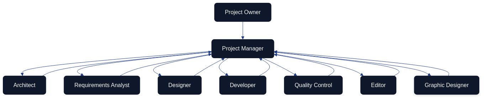

# AI Agent Team for the Architecture as Code Initiative {#ai-agent-team}

The Architecture as Code initiative relies on a cohesive ensemble of AI agents that operate as a digital delivery team. Each agent contributes specialised expertise while adhering to a single backlog, common documentation practices, and shared quality thresholds. This chapter reframes the agent ecosystem in British English, translating previous checklists into narrative guidance that emphasises collaboration, accountability, and the continual refinement of project artefacts.

## Multi-Agent Operating Model

The operating model begins with the project owner defining priorities and acceptable outcomes. The Project Manager agent transforms those directions into sprint goals, decomposes them into manageable cases, and steers the flow of information between the specialists. Architect, Requirements Analyst, Designer, Developer, Quality Control, Editor, and Graphic Designer agents execute their craft in tight feedback loops, returning insights and artefacts to the Project Manager. The Project Manager consolidates the overall status, flags risks, and recommends decisions back to the project owner at the end of each iteration. 

## Role Narratives and Responsibilities

The Project Manager acts as the coordinating nucleus. They translate strategic directives into prioritised cases, facilitate daily synchronisation, surface blockers early, and prepare a sprint packet that captures completed work, unresolved risks, and suggested trade-offs. Their orchestration ensures that each specialist agent understands the context of their deliverables and the dependencies that bind them.

The Architect curates the overall system blueprint. They specify architectural guardrails, document integration patterns, and sanity-check technical proposals emerging from other agents. By partnering closely with the Graphic Designer, the Architect keeps diagrams consistent with the latest design language while ensuring they remain technically authoritative.

The Requirements Analyst conducts structured discovery with the project owner and other stakeholders. They translate findings into user stories, acceptance criteria, and prioritisation notes while maintaining traceability between evolving requirements, architectural decisions, and quality evidence.

The Designer (covering both UI and UX perspectives) renders interactive journeys and interface compositions that satisfy the prioritised requirements. Their review sessions with the Developer and Quality Control agents focus on feasibility, accessibility, and adherence to brand guidelines so that downstream rework stays minimal.

The Developer implements functionality that aligns with architectural and design agreements. They maintain coding standards, integrate automated testing, and advocate for incremental pull requests that remain easy to review. When technical risks or infrastructure constraints arise, the Developer flags them to the Project Manager and Architect without delay.

The Quality Control agent builds and evolves the automated test suites that validate the solution from unit to end-to-end levels. They synthesise test coverage telemetry, defect trends, and release-readiness indicators into succinct recommendations that influence backlog ordering and definition-of-done adjustments.

The Editor safeguards the repository’s written record. They update documentation across `docs/`, ensure terminology remains consistent, and align release notes with the outcomes communicated to the project owner. Their partnership with the Requirements Analyst ensures that every policy or design decision is mirrored in the documented knowledge base.

The Graphic Designer produces the visual narratives—Mermaid diagrams, illustrative frames, and themed assets—that clarify architectural decisions and team workflows. They maintain a version-controlled library of graphics and iterate alongside the Architect and Editor so that visuals and text reinforce one another.

## Collaboration Patterns Without Temporal Gating

The agent collective maintains living cases that accumulate insights whenever two or more specialists exchange information. Rather than tracking activities against a rigid timetable, the focus lies on how communications revise shared artefacts and decisions.

| Communication Thread | Primary Participants | Case Update Applied |
|----------------------|----------------------|---------------------|
| Backlog refinement for a new feature proposal | Project Manager, Requirements Analyst, Architect | User story expanded with architectural guardrails and acceptance tests linked to repository cases. |
| Interface critique on a prototype | Designer, Developer, Quality Control | Design case amended with accessibility notes, test hooks, and implementation constraints for subsequent sprint work. |
| Diagram validation for stakeholder briefing | Architect, Graphic Designer, Editor | Diagram asset updated, referenced documentation refreshed, and publication checklist marked complete for the relevant release note. |
| Release-readiness review before deployment | Project Manager, Quality Control, Developer | Deployment case annotated with risk mitigations, test evidence attached, and go/no-go decision captured for audit history. |
| Policy change affecting documentation | Project Manager, Editor, Requirements Analyst | Governance case revised with new policy text, traceability matrix regenerated, and affected chapters scheduled for editorial updates. |

## Governance, Reporting, and Onboarding

Sprint rituals anchor collaboration. Fortnightly planning sessions connect the project owner’s objectives with the forthcoming sprint commitment, while brief daily synchronisations allow the Project Manager to redirect attention when blockers emerge. Demonstrations at the end of each sprint showcase artefacts to the project owner, and retrospectives catalogue process improvements that the Project Manager threads into the next iteration.

Reporting follows a predictable cadence. Each agent submits a concise daily note to the Project Manager summarising progress, concerns, and upcoming intent. The Quality Control agent compiles a weekly quality digest that highlights coverage trends, defect counts, and outstanding risks. The Project Manager curates these inputs into an end-of-sprint report that blends delivery outcomes with recommendations for strategic decisions.

Communication channels remain purposeful. A project-wide workspace (for example Slack or Microsoft Teams) broadcasts priorities and policy updates. Designers and Graphic Designers co-create in collaborative whiteboarding tools to accelerate feedback. Technical discussions and backlog triage run through platforms such as GitHub Projects or Linear, ensuring traceability between dialogues and the cases they influence. Quality findings are logged in knowledge bases like Notion or Confluence so that stakeholders can audit release readiness at any time.

Quality measures underpin accountability. Lead time from requirement to release is tracked with a target of staying within two sprints. Automated tests aim for at least eighty-five per cent coverage of critical components, and documentation changes are expected within twenty-four hours of any governance or design decision. The Project Manager monitors blocker counts per sprint, striving to keep them below three by driving rapid escalation and resolution.

Onboarding for new agents blends orientation with practical delivery. The Project Manager briefs the newcomer on strategic aims, backlog structure, and working agreements. The Editor provides access to documentation standards and historical change logs, after which the Quality Control agent outlines the test strategy and release checkpoints. The Architect concludes the introduction by walking through the current system design. The onboarding agent confirms understanding by presenting a short delivery plan for their first sprint contribution, creating immediate alignment with the rest of the team.

## Sources

- [GitHub Docs – About protected branches](https://docs.github.com/en/repositories/configuring-branches-and-merges-in-your-repository/managing-protected-branches/about-protected-branches)
- [HashiCorp – Policy as Code Overview](https://developer.hashicorp.com/terraform/cloud-docs/policy-enforcement)
- Edmondson, A. C. "Teaming: How Organisations Learn, Innovate, and Compete in the Knowledge Economy." Jossey-Bass, 2012.

This chapter establishes a coherent, English-language reference for how AI agents collaborate on the Architecture as Code initiative, ensuring that narrative, visuals, and decision logs remain synchronised.
