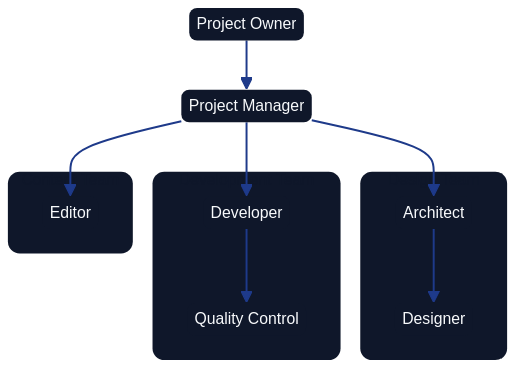

# AI Agent Team for the Architecture as Code Initiative {#ai-agent-team}

## Learning Objectives

By the end of this chapter, you will be able to:

- Describe the multi-agent operating model and explain how each specialist role contributes to the Architecture as Code initiative.
- Design collaboration patterns between agents that maintain living artefacts without imposing rigid temporal gating.
- Apply governance, reporting, and onboarding structures that make an AI agent team accountable and auditable.
- Integrate AI agents with Architecture as Code workflows through GitHub Actions, issue automation, and documentation pipelines.
- Identify the human oversight responsibilities that remain essential even when agents handle routine delivery activities.

The Architecture as Code initiative relies on a cohesive ensemble of AI agents that operate as a digital delivery team. Each agent contributes specialised expertise while adhering to a single backlog, common documentation practices, and shared quality thresholds. This chapter reframes the agent ecosystem in British English, translating previous checklists into narrative guidance that emphasises collaboration, accountability, and the continual refinement of project artefacts.

## Multi-Agent Operating Model

<!-- Note: This file uses a diagram_28_ prefix; rename to diagram_20_agent_team.png
     and update the .mmd source and PNG export to match Chapter 20 conventions. -->


The operating model begins with the project owner defining priorities and acceptable outcomes. The Project Manager agent transforms those directions into sprint goals, decomposes them into manageable cases, and steers the flow of information between the specialists. Architect, Requirements Analyst, Designer, Developer, Quality Control, Editor, and Graphic Designer agents execute their craft in tight feedback loops, returning insights and artefacts to the Project Manager. The Project Manager consolidates the overall status, flags risks, and recommends decisions back to the project owner at the end of each iteration.

> **Note:** Multi-agent AI workflows remain an active area of research. Teams adopting this pattern should plan for hallucination mitigation, output validation steps, cost monitoring, and iterative refinement of agent prompts. Treat this operating model as a starting framework requiring ongoing evaluation rather than a fully proven, production-ready blueprint.

## Role Narratives and Responsibilities

The Project Manager acts as the coordinating nucleus. They translate strategic directives into prioritised cases, facilitate daily synchronisation, surface blockers early, and prepare a sprint packet that captures completed work, unresolved risks, and suggested trade-offs. Their orchestration ensures that each specialist agent understands the context of their deliverables and the dependencies that bind them.

The Architect curates the overall system blueprint. They specify architectural guardrails, document integration patterns, and sanity-check technical proposals emerging from other agents. By partnering closely with the Graphic Designer, the Architect keeps diagrams consistent with the latest design language while ensuring they remain technically authoritative.

The Requirements Analyst conducts structured discovery with the project owner and other stakeholders. They translate findings into user stories, acceptance criteria, and prioritisation notes while maintaining traceability between evolving requirements, architectural decisions, and quality evidence.

The Designer (covering both UI and UX perspectives) renders interactive journeys and interface compositions that satisfy the prioritised requirements. Their review sessions with the Developer and Quality Control agents focus on feasibility, accessibility, and adherence to brand guidelines so that downstream rework stays minimal.

The Developer implements functionality that aligns with architectural and design agreements. They maintain coding standards, integrate automated testing, and advocate for incremental pull requests that remain easy to review. When technical risks or infrastructure constraints arise, the Developer flags them to the Project Manager and Architect without delay.

The Quality Control agent builds and evolves the automated test suites that validate the solution from unit to end-to-end levels. They synthesise test coverage telemetry, defect trends, and release-readiness indicators into succinct recommendations that influence backlog ordering and definition-of-done adjustments.

The Editor safeguards the repository’s written record. They update documentation across `docs/`, ensure terminology remains consistent, and align release notes with the outcomes communicated to the project owner. Their partnership with the Requirements Analyst ensures that every policy or design decision is mirrored in the documented knowledge base.

The Graphic Designer produces the visual narratives—Mermaid diagrams, illustrative frames, and themed assets—that clarify architectural decisions and team workflows. They maintain a version-controlled library of graphics and iterate alongside the Architect and Editor so that visuals and text reinforce one another.

## Collaboration Patterns Without Temporal Gating

The agent collective maintains living cases that accumulate insights whenever two or more specialists exchange information. Rather than tracking activities against a rigid timetable, the focus lies on how communications revise shared artefacts and decisions.

| Communication Thread | Primary Participants | Case Update Applied |
|----------------------|----------------------|---------------------|
| Backlog refinement for a new feature proposal | Project Manager, Requirements Analyst, Architect | User story expanded with architectural guardrails and acceptance tests linked to repository cases. |
| Interface critique on a prototype | Designer, Developer, Quality Control | Design case amended with accessibility notes, test hooks, and implementation constraints for subsequent sprint work. |
| Diagram validation for stakeholder briefing | Architect, Graphic Designer, Editor | Diagram asset updated, referenced documentation refreshed, and publication checklist marked complete for the relevant release note. |
| Release-readiness review before deployment | Project Manager, Quality Control, Developer | Deployment case annotated with risk mitigations, test evidence attached, and go/no-go decision captured for audit history. |
| Policy change affecting documentation | Project Manager, Editor, Requirements Analyst | Governance case revised with new policy text, traceability matrix regenerated, and affected chapters scheduled for editorial updates. |

## Governance, Reporting, and Onboarding

Sprint rituals anchor collaboration. Fortnightly planning sessions connect the project owner’s objectives with the forthcoming sprint commitment, while brief daily synchronisations allow the Project Manager to redirect attention when blockers emerge. Demonstrations at the end of each sprint showcase artefacts to the project owner, and retrospectives catalogue process improvements that the Project Manager threads into the next iteration.

Reporting follows a predictable cadence. Each agent submits a concise daily note to the Project Manager summarising progress, concerns, and upcoming intent. The Quality Control agent compiles a weekly quality digest that highlights coverage trends, defect counts, and outstanding risks. The Project Manager curates these inputs into an end-of-sprint report that blends delivery outcomes with recommendations for strategic decisions.

Communication channels remain purposeful. A project-wide workspace (for example Slack or Microsoft Teams) broadcasts priorities and policy updates. Designers and Graphic Designers co-create in collaborative whiteboarding tools to accelerate feedback. Technical discussions and backlog triage run through platforms such as GitHub Projects or Linear, ensuring traceability between dialogues and the cases they influence. Quality findings are logged in knowledge bases like Notion or Confluence so that stakeholders can audit release readiness at any time.

Quality measures underpin accountability. Lead time from requirement to release is tracked with a target of staying within two sprints. Automated tests aim for at least eighty-five per cent coverage of critical components, and documentation changes are expected within twenty-four hours of any governance or design decision. The Project Manager monitors blocker counts per sprint, striving to keep them below three by driving rapid escalation and resolution.

Onboarding for new agents blends orientation with practical delivery. The Project Manager briefs the newcomer on strategic aims, backlog structure, and working agreements. The Editor provides access to documentation standards and historical change logs, after which the Quality Control agent outlines the test strategy and release checkpoints. The Architect concludes the introduction by walking through the current system design. The onboarding agent confirms understanding by presenting a short delivery plan for their first sprint contribution, creating immediate alignment with the rest of the team.

## Integrating AI Agents with Architecture as Code Workflows

The agent team's value compounds when agents are tightly integrated with the repository and automation infrastructure rather than operating as isolated conversational tools.

### GitHub Actions as the agent execution layer

Many agent activities—generating documentation, validating diagrams, running quality checks—map directly onto GitHub Actions workflows. The following workflow demonstrates how the Editor agent's responsibilities can be partially automated:

```yaml
name: Editor Agent – Documentation Consistency Check

on:
  pull_request:
    paths:
      - 'docs/**.md'

jobs:
  editorial-review:
    runs-on: ubuntu-latest
    steps:
      - uses: actions/checkout@v4

      - name: Set up Python
        uses: actions/setup-python@v5
        with:
          python-version: '3.12'

      - name: Install editorial toolchain
        run: pip install vale pyspelling

      - name: Check British English spelling
        run: pyspelling --config .pyspelling.yml

      - name: Validate terminology consistency
        run: |
          python3 scripts/check_terminology.py docs/ \
            --rules docs/STYLE_GUIDE.md \
            --output reports/terminology-report.json

      - name: Check heading capitalisation
        run: python3 scripts/validate_heading_capitalization.py docs/

      # Note: The script paths above are illustrative. Create scripts/check_terminology.py
      # and scripts/validate_heading_capitalization.py (or equivalent) adapted to your
      # project's terminology standards before using this workflow.

      - name: Annotate pull request with findings
        uses: actions/github-script@v7
        with:
          script: |
            const fs = require('fs');
            const report = JSON.parse(fs.readFileSync('reports/terminology-report.json'));
            for (const finding of report.findings) {
              await github.rest.pulls.createReviewComment({
                owner: context.repo.owner,
                repo: context.repo.repo,
                pull_number: context.issue.number,
                body: `**Editorial finding:** ${finding.message}`,
                path: finding.file,
                line: finding.line
              });
            }
```

### Issue-driven agent activation

The repository's bot workflows demonstrate a practical pattern for activating specialist agents in response to labelled issues. When a contributor applies the `architecture` label to an issue, the Architect Bot workflow triggers, reads the issue body, and posts a structured architectural analysis as a comment. This pattern scales to any agent role:

| GitHub Label | Triggered Agent | Automated Response |
|---|---|---|
| `architecture` | Architect Bot | Architectural analysis, ADR template, diagram suggestions |
| `documentation` | Editor Bot | Style-guide checklist, terminology review, cross-reference suggestions |
| `qa` | QA Bot | Test coverage analysis, acceptance criteria review, risk assessment |
| `dev` | Developer Bot | Implementation plan, code scaffolding suggestions, dependency analysis |
| `design` | Designer Bot | Diagram review, visual consistency check, asset catalogue update |

### Prompt engineering for Architecture as Code agents

Effective agent behaviour depends on well-crafted system prompts that encode the team's working agreements. The following illustrates the kind of context an Architect agent requires:

```text
You are the Architect agent for the Architecture as Code initiative.
Your responsibilities are:
- Review architectural proposals for consistency with the system blueprint in docs/
- Validate that proposed changes align with existing ADRs in docs/examples/structurizr/adrs/
- Suggest new ADRs when significant decisions are implicit in a proposal
- Ensure all diagrams follow the Kvadrat theme defined in docs/VISUAL_ELEMENTS_GUIDE.md
- Write in Oxford-standard British English

When reviewing a pull request or issue:
1. Check the book_index.json for affected chapters
2. Identify any ADRs that apply or should be created
3. Assess the impact on the overall architecture narrative
4. Provide a structured review with: summary, concerns, recommendations, and required ADRs
```

## Human Oversight and Ethical Guardrails

AI agents amplify team capacity but do not eliminate the need for human judgement. Certain categories of decision must remain with human practitioners:

**Architectural commitments with long-term consequences.** When a proposed change locks in a technology platform, affects data residency, or introduces a significant operational dependency, the Architect agent identifies the decision and escalates it to the project owner rather than resolving it autonomously.

**Stakeholder communication.** External communication—progress reports to sponsors, responses to regulatory enquiries, public release notes—passes through human review before publication. Agents draft; humans approve.

**Security and compliance decisions.** Policy exceptions, risk acceptances, and decisions to override governance guardrails require named human approval captured in the audit trail. The Governance as Code workflow (see [Chapter 11](11_governance_as_code.md)) enforces this through protected branch rules and required reviewers.

**Conflict resolution.** When agents produce conflicting recommendations—for example, the Developer proposes an implementation that the Architect judges architecturally unsound—the Project Manager surfaces the conflict to the project owner with both perspectives clearly articulated. The human owner decides.

These guardrails ensure that the agent team remains a tool under human direction rather than an autonomous decision-making body. The Architecture as Code initiative's commitment to traceability—every decision linked to a commit, a pull request, and an accountable individual—applies equally to agent-assisted and human-authored work.

## Summary

The AI agent team model demonstrates that Architecture as Code principles—version control, automation, continuous validation, and explicit traceability—apply equally well to the management of a delivery team as to the management of infrastructure. By encoding each specialist's responsibilities in documented workflows, prompt libraries, and GitHub Actions automation, the team creates a repeatable, auditable operating model that improves with each iteration.

The key insight is that agents are most effective not as free-standing autonomous systems, but as structured participants in a governance framework that keeps humans informed and in control. Sprint rituals, daily reporting, quality thresholds, and onboarding procedures are not bureaucratic overhead—they are the mechanisms that make agent behaviour predictable, auditable, and improvable over time.

## Sources

- [GitHub Docs – About protected branches](https://docs.github.com/en/repositories/configuring-branches-and-merges-in-your-repository/managing-protected-branches/about-protected-branches)
- [HashiCorp – Policy as Code Overview](https://developer.hashicorp.com/terraform/cloud-docs/policy-enforcement)
- Edmondson, A. C. "Teaming: How Organisations Learn, Innovate, and Compete in the Knowledge Economy." Jossey-Bass, 2012.
- [Anthropic – Claude Agent SDK Documentation](https://docs.anthropic.com/)
