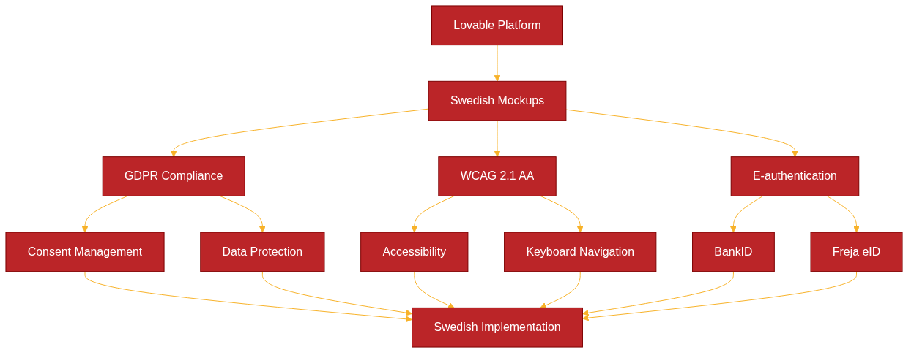

# Kapitel 20: Använd Lovable för att skapa mockups för svenska organisationer



## Inledning till Lovable

Lovable är en AI-driven utvecklingsplattform som revolutionerar hur svenska organisationer kan skapa interaktiva mockups och prototyper. Genom att kombinera naturlig språkbehandling med kodgenerering möjliggör Lovable snabb utveckling av användargränssnitt som är anpassade för svenska compliance-krav och användarförväntningar.

För svenska organisationer innebär detta en unik möjlighet att:
- Accelerera prototyputveckling med fokus på svenska språket och kulturella kontext
- Säkerställa compliance från början av designprocessen
- Integrera med svenska e-legitimationstjänster redan i mockup-fasen
- Skapa användargränssnitt som följer svenska tillgänglighetsstandarder

## Steg-för-steg guide för implementering i svenska organisationer

### Fas 1: Förberedelse och uppsättning

**1. Miljöförberedelse**
```bash
# Skapa utvecklingsmiljö för svenska organisationer
mkdir svenska-mockups
cd svenska-mockups
npm init -y
npm install @lovable/cli --save-dev
```

**2. Svensk lokaliseringskonfiguration**
```javascript
// lovable.config.js
module.exports = {
  locale: 'sv-SE',
  compliance: {
    gdpr: true,
    wcag: '2.1-AA',
    accessibility: true
  },
  integrations: {
    bankid: true,
    frejaeid: true,
    elegitimation: true
  },
  region: 'sweden'
};
```

### Fas 2: Design för svenska användarfall

**3. Definiera svenska användarresor**
```yaml
# svenska-userflows.yml
userflows:
  e_government:
    name: "E-tjänst för myndighet"
    steps:
      - identification: "BankID/Freja eID"
      - form_filling: "Digitalt formulär"
      - document_upload: "Säker filuppladdning"
      - status_tracking: "Ärendeuppföljning"
  
  financial_service:
    name: "Finansiell tjänst"
    steps:
      - kyc_check: "Kundkännedom"
      - risk_assessment: "Riskbedömning"
      - service_delivery: "Tjänsteleverans"
      - compliance_reporting: "Regelrapportering"
```

**4. Lovable prompt för svensk e-förvaltning**
```typescript
// Exempel på Lovable-prompt för svensk myndighetsportal
const sweGovPortalPrompt = `
Skapa en responsiv webbportal för svensk e-förvaltning med:
- Inloggning via BankID och Freja eID
- Flerspråkigt stöd (svenska, engelska, arabiska, finska)
- WCAG 2.1 AA-kompatibel design
- Tillgänglighetsfunktioner enligt svensk lag
- Säker dokumenthantering med e-signatur
- Integrerad ärendehantering
- Mobiloptimerad för svenska enheter
`;
```

### Fas 3: Teknisk integration

**5. TypeScript-implementering för svenska tjänster**
```typescript
// src/types/swedish-services.ts
export interface SwedishEIDProvider {
  provider: 'bankid' | 'frejaeid' | 'elegitimation';
  personalNumber: string;
  validationLevel: 'basic' | 'substantial' | 'high';
}

export interface SwedishComplianceConfig {
  gdpr: {
    consentManagement: boolean;
    dataRetention: number; // månader
    rightToErasure: boolean;
  };
  wcag: {
    level: '2.1-AA';
    screenReader: boolean;
    keyboardNavigation: boolean;
  };
  pul: { // Personuppgiftslagen
    dataProcessingPurpose: string;
    legalBasis: string;
  };
}

// src/services/swedish-auth.ts
export class SwedishAuthService {
  async authenticateWithBankID(personalNumber: string): Promise<AuthResult> {
    // BankID autentisering
    return await this.initiateBankIDAuth(personalNumber);
  }
  
  async authenticateWithFrejaEID(email: string): Promise<AuthResult> {
    // Freja eID autentisering
    return await this.initiateFrejaAuth(email);
  }
  
  async validateGDPRConsent(userId: string): Promise<boolean> {
    // GDPR-samtycke validering
    return await this.checkConsentStatus(userId);
  }
}
```

**6. JavaScript-integration för myndighetssystem**
```javascript
// public/js/swedish-mockup-enhancements.js
class SwedishAccessibilityManager {
  constructor() {
    this.initializeSwedishA11y();
  }
  
  initializeSwedishA11y() {
    // Implementera svenska tillgänglighetsriktlinjer
    this.setupKeyboardNavigation();
    this.setupScreenReaderSupport();
    this.setupHighContrastMode();
  }
  
  setupKeyboardNavigation() {
    // Tangentbordsnavigation enligt svenska standarder
    document.addEventListener('keydown', (e) => {
      if (e.key === 'Tab') {
        this.handleSwedishTabOrder(e);
      }
    });
  }
  
  setupScreenReaderSupport() {
    // Skärmläsarstöd för svenska
    const ariaLabels = {
      'logga-in': 'Logga in med BankID eller Freja eID',
      'kontakt': 'Kontakta myndigheten',
      'tillganglighet': 'Tillgänglighetsalternativ'
    };
    
    Object.entries(ariaLabels).forEach(([id, label]) => {
      const element = document.getElementById(id);
      if (element) element.setAttribute('aria-label', label);
    });
  }
}
```

## Praktiska exempel för svenska sektorer

### Exempel 1: E-förvaltningsportal för kommun

```typescript
// kommun-portal-mockup.ts
interface KommunPortal {
  services: {
    bygglov: BuildingPermitService;
    barnomsorg: ChildcareService;
    skola: SchoolService;
    socialstod: SocialSupportService;
  };
  authentication: SwedishEIDProvider[];
  accessibility: WCAGCompliance;
}

const kommunPortalMockup = {
  name: "Malmö Stad E-tjänster",
  design: {
    colorScheme: "high-contrast",
    fontSize: "adjustable",
    language: ["sv", "en", "ar"],
    navigation: "keyboard-friendly"
  },
  integrations: {
    bankid: true,
    frejaeid: true,
    mobilebanking: true
  }
};
```

### Exempel 2: Finansiell compliance-tjänst

```yaml
# financial-compliance-mockup.yml
financial_service:
  name: "Svensk Bank Digital Onboarding"
  compliance_requirements:
    - aml_kyc: "Anti-Money Laundering"
    - psd2: "Payment Services Directive 2"
    - gdpr: "General Data Protection Regulation"
    - fffs: "Finansinspektionens föreskrifter"
  
  user_journey:
    identification:
      method: "BankID"
      level: "substantial"
    
    risk_assessment:
      pep_screening: true
      sanctions_check: true
      source_of_funds: true
    
    documentation:
      digital_signature: true
      document_storage: "encrypted"
      retention_period: "5_years"
```

## Compliance-fokus för svenska organisationer

### GDPR-implementering i Lovable mockups

```typescript
// gdpr-compliance.ts
export class GDPRComplianceManager {
  async implementConsentBanner(): Promise<void> {
    const consentConfig = {
      language: 'sv-SE',
      categories: {
        necessary: {
          name: 'Nödvändiga cookies',
          description: 'Krävs för webbplatsens grundfunktioner',
          required: true
        },
        analytics: {
          name: 'Analyskakor',
          description: 'Hjälper oss förbättra webbplatsen',
          required: false
        },
        marketing: {
          name: 'Marknadsföringskakor',
          description: 'För personaliserad marknadsföring',
          required: false
        }
      }
    };
    
    await this.renderConsentInterface(consentConfig);
  }
  
  async handleDataSubjectRights(): Promise<void> {
    // Implementera rätt till radering, portabilitet etc.
    const dataRights = [
      'access', 'rectification', 'erasure', 
      'portability', 'restriction', 'objection'
    ];
    
    dataRights.forEach(right => {
      this.createDataRightEndpoint(right);
    });
  }
}
```

### WCAG 2.1 AA-implementering

```javascript
// wcag-compliance.js
class WCAGCompliance {
  constructor() {
    this.implementColorContrast();
    this.setupKeyboardAccess();
    this.addTextAlternatives();
  }
  
  implementColorContrast() {
    // Säkerställ minst 4.5:1 kontrast för normal text
    const colors = {
      primary: '#003366',      // Mörk blå
      secondary: '#0066CC',    // Ljusare blå  
      background: '#FFFFFF',   // Vit bakgrund
      text: '#1A1A1A'         // Nästan svart text
    };
    
    this.validateContrastRatios(colors);
  }
  
  setupKeyboardAccess() {
    // Alla interaktiva element ska vara tangentbordstillgängliga
    const interactiveElements = document.querySelectorAll(
      'button, a, input, select, textarea, [tabindex]'
    );
    
    interactiveElements.forEach(element => {
      if (!element.hasAttribute('tabindex')) {
        element.setAttribute('tabindex', '0');
      }
    });
  }
}
```

### Integration med svenska e-legitimationstjänster

```typescript
// e-legitimation-integration.ts
export class SwedishELegitimationService {
  async integrateBankID(): Promise<BankIDConfig> {
    return {
      endpoint: 'https://appapi2.test.bankid.com/rp/v5.1/',
      certificates: 'svenska-ca-certs',
      environment: 'production', // eller 'test'
      autoStartToken: true,
      qrCodeGeneration: true
    };
  }
  
  async integrateFrejaEID(): Promise<FrejaEIDConfig> {
    return {
      endpoint: 'https://services.prod.frejaeid.com',
      apiKey: process.env.FREJA_API_KEY,
      certificateLevel: 'EXTENDED',
      language: 'sv',
      mobileApp: true
    };
  }
  
  async handleELegitimation(): Promise<ELegitimationConfig> {
    // Integration med e-legitimationsnämndens tjänster
    return {
      samlEndpoint: 'https://eid.elegnamnden.se/saml',
      assuranceLevel: 'substantial',
      attributeMapping: {
        personalNumber: 'urn:oid:1.2.752.29.4.13',
        displayName: 'urn:oid:2.16.840.1.113730.3.1.241'
      }
    };
  }
}
```

## Teknisk integration och best practices

### Workflow-integration med svenska utvecklingsmiljöer

```yaml
# .github/workflows/swedish-compliance-check.yml
name: Svenska Compliance Check
on: [push, pull_request]

jobs:
  accessibility-test:
    runs-on: ubuntu-latest
    steps:
      - uses: actions/checkout@v3
      - name: Install dependencies
        run: npm install
      
      - name: Run WCAG tests
        run: |
          npm run test:accessibility
          npm run validate:contrast-ratios
      
      - name: Test Swedish language support
        run: |
          npm run test:i18n:sv
          npm run validate:swedish-content
      
      - name: GDPR compliance check
        run: |
          npm run audit:gdpr
          npm run check:data-protection
```

### Performance optimization för svenska användare

```typescript
// performance-optimization.ts
export class SwedishPerformanceOptimizer {
  async optimizeForSwedishNetworks(): Promise<void> {
    // Optimera för svenska nätverksförhållanden
    const optimizations = {
      cdn: 'stockholm-region',
      imageCompression: 'webp',
      minification: true,
      lazy_loading: true,
      service_worker: true
    };
    
    await this.applyOptimizations(optimizations);
  }
  
  async implementProgressiveLoading(): Promise<void> {
    // Progressiv laddning för långsamma anslutningar
    const criticalPath = [
      'authentication-components',
      'gdpr-consent-banner', 
      'accessibility-controls',
      'main-navigation'
    ];
    
    await this.loadCriticalComponents(criticalPath);
  }
}
```

## Sammanfattning och nästa steg

Lovable erbjuder svenska organisationer en kraftfull plattform för att skapa compliance-medvetna mockups och prototyper. Genom att integrera svenska e-legitimationstjänster, implementera WCAG 2.1 AA-standarder och följa GDPR-riktlinjer från början, kan organisationer:

1. **Accelerera utvecklingsprocessen** med AI-driven kodgenerering
2. **Säkerställa compliance** redan i mockup-fasen
3. **Förbättra tillgänglighet** för alla svenska användare
4. **Integrera svenska tjänster** som BankID och Freja eID

### Rekommenderade nästa steg:

1. **Pilotprojekt**: Starta med ett mindre projekt för att validera approach
2. **Teamutbildning**: Utbilda utvecklare i Lovable och svenska compliance-krav
3. **Processintegration**: Integrera Lovable i befintliga utvecklingsprocesser
4. **Kontinuerlig förbättring**: Etablera feedback-loopar för användbarhet och compliance

**Viktiga resurser:**
- [Digg - Vägledning för webbtillgänglighet](https://www.digg.se/webbtillganglighet)
- [Datainspektionen - GDPR-vägledning](https://www.datainspektionen.se/)
- [E-legitimationsnämnden](https://www.elegnamnden.se/)
- [WCAG 2.1 AA Guidelines](https://www.w3.org/WAI/WCAG21/quickref/)

Genom att följa denna guide kan svenska organisationer effektivt använda Lovable för att skapa mockups som inte bara är funktionella och användarvänliga, utan också uppfyller alla relevanta svenska och europeiska compliance-krav.