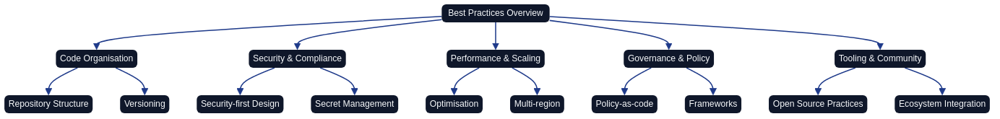
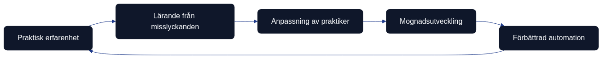

# Metodval och erfarenheter

*arkitektur som kod best practices för Infrastructure as Code (arkitektur som kod) utvecklas kontinuerligt genom practical experience, community feedback och evolving technology landscape. Diagrammet illustrerar den iterativa processen från initial arkitektur som kod-implementation till mature, optimized practices.*

## Best practices holistiska perspektiv

*Mindmappen presenterar det omfattande landskapet av best practices och lärda läxor inom Infrastructure as Code (arkitektur som kod). Den visar sambanden mellan kodorganisation, säkerhets- och compliance-mönster, performance-optimering, governance-ramverk och internationella erfarenheter. Denna holistiska syn hjälper organisationer att förstå hur olika best practices samspelar för att skapa framgångsrik Arkitektur som kod-arkitektur som kod-implementation.*

## Övergripande beskrivning

Infrastructure as Code best practices representerar culminationen av collective wisdom från tusentals organisationer som har genomgått arkitektur som kod transformation över det senaste decenniet. Dessa practices är inte statiska regler utan evolving guidelines som måste anpassas till specific organizational contexts, technological constraints och business requirements.

Svenska organisationer har bidragit significantly till global Arkitektur som kod best practice development genom innovative approaches till regulatory compliance, sustainable computing och collaborative development models. Companies som Spotify, Klarna och Ericsson har utvecklat patterns som nu används worldwide för scaling arkitektur som kod practices i large, complex organizations.

Lärda läxor från early Arkitektur som kod adopters reveal common pitfalls och anti-patterns som kan undvikas genom careful planning och gradual implementation. Understanding these lessons enables organizations att accelerate their IaC journey samtidigt som de avoid costly mistakes som previously derailed transformation initiatives.

Modern best practices emphasize sustainability, security-by-design och developer experience optimization alongside traditional concerns som reliability, scalability och cost efficiency. Svenska organizations med strong environmental consciousness och social responsibility values can leverage Arkitektur som kod för achieving both technical och sustainability goals.

## Kod organisation och modulstruktur

Effective code organization utgör foundationen för maintainable och scalable Infrastructure as Code implementations. Well-structured repositories med clear hierarchies, consistent naming conventions och logical module boundaries enable team collaboration och reduce onboarding time för new contributors.

Repository structure best practices recommend separation av concerns mellan shared modules, environment-specific configurations och application-specific infrastructure. Svenska government agencies have successfully implemented standardized repository structures som enable code sharing mellan different departments medan de maintain appropriate isolation för sensitive components.

Module design principles emphasize reusability, composability och clear interfaces som enable teams att build complex infrastructure från well-tested building blocks. Effective modules encapsulate specific functionality, provide clear input/output contracts och include comprehensive documentation för usage patterns och configuration options.

Versioning strategies för infrastructure modules must balance stability med innovation durch semantic versioning, immutable releases och clear upgrade paths. Swedish financial institutions have developed sophisticated module versioning approaches som ensure regulatory compliance medan de enable continuous improvement och security updates.

## Säkerhet och compliance patterns

Security-first design patterns have emerged as fundamental requirements för modern Infrastructure as Code implementations. These patterns emphasize defense-in-depth, principle of least privilege och zero-trust architectures som are implemented through code rather than manual configuration.

Compliance automation patterns för svenska regulatory requirements demonstrate how organizations can embed regulatory controls directly into infrastructure definitions. GDPR compliance patterns för data residency, encryption och audit logging can be codified in reusable modules som automatically enforce regulatory requirements across all deployments.

Secret management best practices have evolved from simple environment variable injection till sophisticated secret lifecycle management med automatic rotation, audit trails och principle of least privilege access. Swedish healthcare organizations have developed particularly robust patterns för protecting patient data enligt GDPR och sector-specific regulations.

Security scanning integration patterns demonstrate how security validation can be embedded throughout the infrastructure development lifecycle från development environments till production deployments. Automated security scanning with policy-as-code enforcement ensures consistent security posture utan compromising development velocity.

## Performance och skalning strategier

Infrastructure performance optimization patterns focus på cost efficiency, resource utilization och response time optimization. Swedish e-commerce companies have developed sophisticated patterns för handling traffic spikes, seasonal variations och flash sales genom predictive scaling och capacity planning.

Multi-region deployment patterns för global scalability must consider data sovereignty requirements, latency optimization och disaster recovery capabilities. Swedish SaaS companies serving global markets have pioneered approaches som balance performance optimization med svenska data protection requirements.

Database scaling patterns för Infrastructure as Code encompass both vertical och horizontal scaling strategies, read replica management och backup automation. Financial services organizations i Sverige have developed particularly robust patterns för managing sensitive financial data at scale medan de maintain audit trails och regulatory compliance.

Monitoring och observability patterns demonstrate how comprehensive system visibility can be embedded in infrastructure definitions. Swedish telecommunications companies have developed advanced monitoring patterns som provide real-time insights into system performance, user experience och business metrics through infrastructure-defined observability stacks.

## Governance och policy enforcement

Governance frameworks för Infrastructure as Code must balance developer autonomy med organizational control through clear policies, automated enforcement och exception handling processes. Swedish government organizations have developed comprehensive governance models som ensure compliance utan stifling innovation.

Policy-as-code implementation patterns demonstrate how organizational policies can be codified, version controlled och automatically enforced across all infrastructure deployments. These patterns enable consistent policy application samtidigt som de provide transparency och auditability för compliance purposes.

Budget management patterns för cloud infrastructure demonstrate how cost controls can be embedded in infrastructure definitions through resource limits, automated shutdown policies och spending alerts. Swedish startups have developed innovative patterns för managing cloud costs under tight budget constraints medan de scale rapidly.

Change management patterns för infrastructure evolution balance stability med agility genom feature flags, blue-green deployments och canary releases. Large Swedish enterprises have developed sophisticated change management approaches som enable continuous infrastructure evolution utan disrupting critical business operations.

## Internationella erfarenheter och svenska bidrag

Global best practice evolution has been significantly influenced av svenska innovations i organizational design, environmental consciousness och collaborative development approaches. Swedish contributions till open source Arkitektur som kod tools och practices have shaped international standards för sustainable computing och inclusive development practices.

Cross-cultural collaboration patterns från svenska multinational companies demonstrate how arkitektur som kod practices can be adapted till different cultural contexts medan de maintain technical consistency. These patterns är particularly valuable för global organizations som need to balance local regulations med standardized technical practices.

Sustainability patterns för green computing have been pioneered av svenska organizations med strong environmental commitments. These patterns demonstrate how Infrastructure as Code can optimize för carbon footprint reduction, renewable energy usage och efficient resource utilization utan compromising performance eller reliability.

Open source contribution patterns från swedish tech community showcase how organizations can benefit från och contribute till global Arkitektur som kod ecosystem development. Sustainable open source practices ensure long-term viability av critical infrastructure tools medan de foster innovation och knowledge sharing.

## Incident management och response patterns

Effektiv incidenthantering utgör en kritisk komponent för operational excellence inom Infrastructure as Code-miljöer. När infrastruktur definieras som kod, kräver incidentresponse nya approaches som kombinerar traditional operational practices med version control, automation och collaborative development workflows.

Svenska organisationer har utvecklat sophisticated incident management patterns som integrerar arkitektur som kod practices med emergency response procedures. Dessa patterns emphasize rapid response, transparent communication och systematic learning från varje incident för att strengthen overall system resilience.

Modern incident management for Arkitektur som kod environments requires automated detection, standardized response procedures och comprehensive post-incident analysis. Financial institutions i Sverige har pioneered approaches som maintain service availability medan de ensure regulatory compliance under pressure av emergency situations.

Incident response automation patterns enable organizations att respond rapidly till infrastructure failures, security breaches och compliance violations. These patterns incorporate automated rollback mechanisms, emergency approval workflows och real-time stakeholder communication to minimize business impact och recovery time.

### Proactive Incident Prevention

Proactive incident prevention strategies focus på identifying och addressing potential issues innan de become critical problems. Swedish healthcare organizations have developed comprehensive monitoring patterns som provide early warning signals för infrastructure drift, security vulnerabilities och performance degradation.

Risk assessment integration med Infrastructure as Code enables organizations att continuously evaluate potential failure scenarios och implement preventive measures. Automated compliance scanning, security vulnerability assessment och performance monitoring provide foundation för proactive incident prevention.

Emergency preparedness exercises specifically designed för Arkitektur som kod environments help teams practice response procedures, test automation workflows och identify improvement opportunities. Svenska government agencies conduct regular tabletop exercises som simulate complex infrastructure incidents och test coordinated response capabilities.

### Incident Response Automation

Automated incident response workflows reduce response time och ensure consistent handling av infrastructure emergencies. Swedish telecommunications companies have developed self-healing infrastructure patterns som automatically detect issues, attempt remediation och escalate to human operators när necessary.

Runbook automation for Infrastructure as Code environments codifies emergency procedures in executable scripts som can be triggered automatically eller manually during incidents. These automated runbooks ensure consistent response procedures och reduce human error under pressure.

Communication automation patterns ensure stakeholders receive timely updates during incidents through automated status pages, notification systems och escalation procedures. Svenska financial services organizations have implemented comprehensive communication workflows som maintain transparency medan de protect sensitive information.

## Dokumentation och knowledge management

Comprehensive documentation strategies för Infrastructure as Code environments must balance technical detail med accessibility för diverse stakeholders. Effective documentation serves as both reference material för daily operations och knowledge transfer mechanism för organizational continuity.

Svenska organizations have pioneered approaches till living documentation som automatically updates från infrastructure code, deployment logs och operational metrics. This dynamic documentation approach ensures accuracy medan reducing maintenance overhead associated with traditional documentation approaches.

Knowledge management patterns för arkitektur som kod practices encompass both explicit knowledge captured i documentation och tacit knowledge embedded i team practices och organizational culture. Successful knowledge management enables organizations att preserve institutional knowledge medan facilitating continuous learning och improvement.

Documentation automation patterns demonstrate how comprehensive documentation can be generated directly från infrastructure definitions, deployment procedures och operational runbooks. Swedish SaaS companies have developed sophisticated documentation workflows som maintain up-to-date reference materials without manual intervention.

### Architecture Decision Records för Arkitektur som kod

Architecture Decision Records (ADRs) specifically designed för Infrastructure as Code decisions provide valuable context för future teams och capture reasoning behind complex technical choices. Svenska government organizations have standardized ADR formats som align with regulatory documentation requirements.

ADR automation patterns enable teams att capture architectural decisions directly i code repositories alongside infrastructure definitions. This co-location approach ensures architectural context remains accessible och relevant för ongoing development activities.

Decision impact tracking genom ADRs helps organizations understand long-term consequences av architectural choices och identifies opportunities för optimization eller refactoring. Financial institutions i Sverige have developed sophisticated decision tracking approaches som support audit requirements och continuous improvement.

### Operational Runbook Management

Operational runbooks för Infrastructure as Code environments must be executable, testable och version controlled tillsammans med infrastructure definitions. Svenska healthcare organizations have developed comprehensive runbook management approaches som ensure procedures remain current och effective.

Runbook testing patterns enable organizations att validate operational procedures regularly genom automated testing, simulation exercises och real-world validation. These testing approaches help identify outdated procedures och maintain operational readiness.

Collaborative runbook development patterns encourage input från multiple stakeholders including development teams, operations staff och business representatives. This collaborative approach ensures runbooks address real operational needs och maintain broad organizational support.

## Utbildning och kompetensutveckling

Strategisk kompetensutveckling för Infrastructure as Code requires comprehensive training programs som address both technical skills och organizational transformation challenges. Svenska organizations have developed innovative training approaches som combine formal education med practical experience och peer learning.

Cross-functional training patterns break down traditional silos mellan development, operations och security teams genom shared learning experiences och collaborative skill development. These patterns facilitate cultural transformation alongside technical adoption av arkitektur som kod practices.

Continuous learning frameworks för rapidly evolving Arkitektur som kod technologies help teams stay current med emerging tools, techniques och best practices. Swedish tech companies have pioneered approaches som balance formal training med experimentation, community engagement och knowledge sharing.

Skills assessment och career development programs specifically designed för Arkitektur som kod practitioners help organizations identify skill gaps, plan targeted training interventions och support professional growth for team members.

### Praktisk färdighetsträning

Hands-on training environments that mirror production infrastructure enable safe experimentation och skill development utan risking operational systems. Svenska financial institutions have developed sophisticated training environments som replicate complex regulatory requirements och business constraints.

Simulation-based training scenarios provide realistic practice opportunities för incident response, deployment procedures och troubleshooting workflows. These scenarios help teams build confidence och competence innan facing real operational challenges.

Mentorship programs pair experienced Arkitektur som kod practitioners med team members developing new skills, facilitating knowledge transfer och accelerating professional development. Swedish government organizations have established formal mentorship structures som support systematic skill development.

### Certifiering och standarder

Professional certification paths för Infrastructure as Code practitioners help establish industry standards och provide career advancement opportunities. Svenska professional organizations have contributed till international certification standards som reflect Nordic approaches till sustainable technology practices.

Internal certification programs developed by large Swedish enterprises provide organization-specific training that aligns med company standards, tools och procedures. These programs ensure consistent skill levels across teams medan supporting individual professional development.

Skills validation frameworks enable organizations att assess competency levels, identify training needs och ensure teams have appropriate expertise för managing critical infrastructure. Regular skills assessment helps maintain high operational standards och identify areas för improvement.

## Verktygsval och leverantörshantering

Strategic tool selection för Infrastructure as Code environments requires careful evaluation av technical capabilities, vendor stability, community support och long-term viability. Svenska organizations have developed comprehensive evaluation frameworks som balance immediate needs med strategic considerations.

Multi-vendor strategies reduce dependency risks medan providing flexibility att adopt best-of-breed solutions för different infrastructure domains. Swedish telecommunications companies have pioneered vendor management approaches som maintain competitive negotiating positions medan ensuring operational continuity.

Tool standardization patterns balance organizational consistency med team autonomy genom establishing core toolsets medan allowing flexibility för specialized use cases. This approach reduces complexity medan enabling innovation och optimization för specific requirements.

Vendor relationship management för infrastructure tooling must consider both commercial relationships och open source community engagement. Svenska companies have developed sophisticated approaches som contribute till community development medan managing commercial vendor relationships strategically.

### Teknisk utvärdering

Comprehensive technical evaluation frameworks help organizations assess infrastructure tools against standardized criteria including functionality, performance, security, reliability och maintainability. Swedish financial services have developed rigorous evaluation processes som incorporate regulatory requirements och risk assessment.

Proof-of-concept development enables hands-on evaluation av tools under realistic conditions innan making significant investments. These POCs help identify potential integration challenges, performance limitations och operational considerations som might not be apparent från vendor documentation.

Performance benchmarking för infrastructure tools provides objective data för comparing alternatives och establishing baseline expectations för operational performance. Svenska government agencies have developed standardized benchmarking approaches som support fair evaluation och procurement decisions.

### Leverantörsrelationer

Strategic vendor partnership development enables organizations att influence product roadmaps, receive priority support och gain early access till new capabilities. Swedish enterprises have leveraged collective purchasing power genom industry consortiums för better vendor terms och shared development costs.

Contract negotiation strategies för infrastructure tooling must balance cost, functionality, support levels och exit provisions. Svenska legal frameworks provide specific considerations för data sovereignty, liability och dispute resolution som influence vendor contract terms.

Vendor performance monitoring och relationship management ensure ongoing value delivery från tooling investments. Regular vendor reviews, performance scorecards och strategic planning sessions help maintain productive partnerships och identify optimization opportunities.

## Kontinuerlig förbättring och innovation

Systematic continuous improvement programs för Infrastructure as Code environments drive ongoing optimization av processes, tools och outcomes genom data-driven decision making och regular retrospectives. Svenska organizations have pioneered improvement frameworks som balance stability med innovation.

Innovation management patterns help organizations balance exploration av new technologies med operational reliability requirements. These patterns provide structured approaches för evaluating emerging tools, techniques och practices medan maintaining system stability och business continuity.

Experimentation frameworks enable safe exploration av new IaC practices genom controlled pilot projects, isolated environments och gradual rollout procedures. Swedish research institutions have developed sophisticated experimentation approaches som accelerate learning medan managing risks.

Feedback loop optimization ensures rapid information flow från operational experiences back till development practices, enabling quick adaptation och continuous learning. These loops help organizations respond quickly till changing requirements och emerging opportunities.

### Mätning och utvärdering

Comprehensive metrics frameworks för Infrastructure as Code environments provide visibility into technical performance, business value och operational effectiveness. Svenska companies have developed balanced scorecards som track both technical metrics och business outcomes från Arkitektur som kod investments.

Performance trending analysis helps organizations identify improvement opportunities och measure progress towards strategic objectives. Historical data analysis reveals patterns, trends och correlations som inform future planning och optimization efforts.

Benchmarking programs both internal och external provide comparative context för performance evaluation och improvement target setting. Swedish industry associations have facilitated collaborative benchmarking initiatives som benefit entire sectors.

### Innovation management

Innovation pipeline management för Infrastructure as Code helps organizations systematically explore emerging technologies medan maintaining focus på proven practices för production systems. This balanced approach enables competitive advantage utan compromising operational reliability.

Research och development programs specifically focused på Arkitektur som kod innovations help organizations stay ahead av technology trends och contribute till industry advancement. Svenska universities have partnered med industry för collaborative research som benefits both academic understanding och practical application.

Technology scouting programs identify emerging tools, techniques och practices som might benefit organizational objectives. Regular technology reviews, conference participation och community engagement help organizations maintain awareness av innovation opportunities.

## Riskhantering och affärskontinuitet

Comprehensive risk management strategies för Infrastructure as Code environments must address both traditional operational risks och new risks introduced av code-defined infrastructure. Svenska organizations have developed sophisticated risk frameworks som integrate technical risks med business continuity planning.

Business continuity planning specifically adapted för Arkitektur som kod environments considers both infrastructure failure scenarios och risks associated med code repositories, deployment pipelines och automation systems. These plans ensure organizations can maintain operations även under complex failure conditions.

Risk assessment integration med Infrastructure as Code development processes enables proactive identification och mitigation av potential issues innan de impact production systems. Automated risk scanning, compliance checking och security assessment provide continuous risk visibility.

Disaster recovery patterns för code-defined infrastructure demonstrate how traditional DR approaches must evolve för environments där infrastructure kan be recreated från code repositories. Swedish financial institutions have pioneered DR approaches som leverage Arkitektur som kod för rapid environment reconstruction.

### Affärsimpaktanalys

Business impact analysis för Infrastructure as Code environments must consider both direct operational impacts och secondary effects från automation failures, code repository compromise eller deployment pipeline disruption. Svenska government agencies have developed comprehensive impact assessment frameworks.

Recovery time objectives (RTO) och recovery point objectives (RPO) för Arkitektur som kod environments require careful consideration av code repository recovery, automation system restoration och infrastructure recreation procedures. These objectives drive design decisions för backup strategies och recovery procedures.

Critical process identification helps organizations prioritize protection efforts och recovery procedures för most essential business functions. This prioritization ensures limited resources focus på maintaining core business operations under adverse conditions.

### Krishantering

Crisis management procedures specifically designed för Infrastructure as Code environments integrate technical response capabilities med business communication requirements. Svenska enterprises have developed comprehensive crisis management frameworks som coordinate technical och business responses.

Emergency communication plans ensure stakeholders receive appropriate information during infrastructure crises utan compromising security eller creating additional confusion. These plans include both internal communication protocols och external customer communication strategies.

Crisis leadership structures define clear decision-making authority och escalation procedures för complex infrastructure emergencies. This clarity enables rapid response när traditional approval processes might delay critical recovery actions.

## Community engagement och open source bidrag

Strategic community engagement för Infrastructure as Code enables organizations att both benefit från och contribute till broader ecosystem development. Svenska companies have established leadership positions i global Arkitektur som kod communities genom consistent, valuable contributions och collaborative partnership approaches.

Open source contribution strategies help organizations share innovations, attract talent och influence technology direction medan building industry relationships och enhancing organizational reputation. These contributions position Swedish organizations som thought leaders i global infrastructure automation community.

Knowledge sharing patterns demonstrate how organizations can participate i community development utan compromising competitive advantages eller intellectual property. Svenska government agencies have pioneered open source approaches som promote transparency och collaboration enligt public sector values.

Community partnership development enables access till broader expertise, shared development costs och collective problem-solving capabilities. Swedish enterprises have leveraged community relationships för accelerated innovation och reduced technology risks.

### Bidragsstrategi

Systematic contribution planning helps organizations identify valuable ways att contribute till open source projects medan advancing their own technical objectives. Svenska tech companies have developed contribution strategies som align community engagement med business goals och technical roadmaps.

Intellectual property management för open source contributions requires clear policies och procedures som protect organizational interests medan enabling community participation. These policies provide guidelines för what can be shared, how contributions are licensed och how potential conflicts are resolved.

Employee engagement i open source communities provides professional development opportunities, industry visibility och access till cutting-edge knowledge. Swedish companies have established programs som encourage och support employee community participation.

### Samarbete och partnerskap

Industry collaboration initiatives enable svenska organizations att collectively address common challenges, share development costs och influence standards development. These partnerships leverage collective expertise för solving complex problems som individual organizations might struggle med alone.

Research partnerships med academic institutions provide access till advanced research, student talent och long-term perspective på technology evolution. Svenska universities have established strong collaboration programs med industry partners för mutual benefit.

International collaboration enables Swedish organizations att participate i global standards development, share Nordic perspectives och build relationships med international partners. This global engagement enhances Swedish influence i international technology development och provides access till worldwide expertise.

## Kontinuerlig förbättring och utveckling

*Kontinuerlig förbättring av Infrastructure as Code-praktiker kräver systematisk approach till learning, adaptation och evolution. Diagrammet illustrerar feedback loops mellan praktisk erfarenhet, teknologisk utveckling och organisatorisk mognad som driver sustainable arkitektur som kod transformation.*

Framgångsrik Infrastructure as Code-implementation är inte ett one-time projekt utan en continuous journey av learning, adaptation och refinement. Svenska organisationer som har achieved sustainable Arkitektur som kod success understand att best practices must evolve continuously baserat på changing technology landscape, business requirements och lessons learned från real-world implementation challenges.

### Lärande från misslyckanden och incidenter

Organisatorisk mognad inom arkitektur som kod development kommer främst från systematic learning från failures, incidents och unexpected challenges som uppstår under practical implementation. Svenska tech companies som Spotify och Klarna har developed sophisticated incident response frameworks som treat infrastructure failures som valuable learning opportunities rather than simple problems att fix.

Incident retrospectives för infrastructure-related issues should focus på root cause analysis av both technical och process failures. Common patterns som emerge från svenska organizations include inadequate testing i staging environments, insufficient monitoring av infrastructure changes och poor communication between development och operations teams during critical deployments.

Blameless postmortem culture, pioneered av svenska tech organizations, enables teams att share failure experiences openly och extract valuable insights utan fear av retribution. These cultural practices have proven essential för building organizational confidence i complex infrastructure automation while maintaining high reliability standards för customer-facing services.

Documentation av failure patterns och their solutions creates organizational knowledge base som enables future teams att avoid repeating samme mistakes. Svenska government agencies have developed particularly robust failure analysis processes som ensure critical infrastructure lessons are captured och shared across different departments och projects.

### Anpassning till nya teknologier

Technology evolution inom cloud computing och infrastructure automation requires organizations att continuously evaluate och integrate new tools, services och methodologies into their existing arkitektur som kod practices. Svenska organizations must balance innovation adoption med stability requirements, particularly i regulated industries där change control processes are strictly enforced.

Technology evaluation frameworks help organizations assess new Arkitektur som kod tools och platforms based på criteria som include technical capabilities, security implications, cost considerations och integration complexity med existing systems. Early adopter programs inom svenska tech companies enable careful experimentation med emerging technologies innan broad organizational adoption.

Gradual technology migration strategies minimize risk during platform transitions medan de enable organizations att benefit från technological improvements. Svenska financial institutions have developed particularly sophisticated migration approaches som ensure regulatory compliance och operational continuity during major infrastructure platform changes.

Community engagement med open source projects och technology vendors provides svenska organizations med early insights into emerging trends och upcoming capabilities. Active participation i technology communities also enables svenska companies att influence technology development directions baserat på their specific requirements och use cases.

### Mognadsnivåer för Arkitektur som kod-implementation

Organizational maturity models för Infrastructure as Code help teams understand their current capabilities och plan systematic improvement paths toward more sophisticated implementation practices. Svenska organizations have contributed significantly till these maturity frameworks through their emphasis på sustainability, collaboration och long-term thinking.

**Initial Level** organizations typically begin med manual infrastructure management och limited automation. Focus på this level är establishing basic version control, simple automation scripts och foundational monitoring capabilities. Svenska government agencies often start här when transitioning från traditional IT management approaches.

**Developing Level** organizations implement comprehensive Infrastructure as Code practices med automated deployment pipelines, systematic testing och basic policy enforcement. Most svenska medium-sized companies reach this level within their first year av serious arkitektur som kod adoption, typically achieving 70-80% infrastructure automation coverage.

**Advanced Level** organizations achieve full automation coverage med sophisticated governance frameworks, comprehensive security automation och advanced monitoring capabilities. Large svenska enterprises som Ericsson och H&M have reached this level genom multi-year transformation programs och significant investment i tooling och training.

**Optimizing Level** organizations demonstrate self-improving infrastructure systems med predictive monitoring, automatic optimization och advanced AI-driven operations. Only a few svenska organizations have achieved this level, typically large-scale cloud-native companies med substantial investment i cutting-edge automation technologies.

### Förändringshantering för utvecklande praktiker

Change management för evolving IaC practices requires careful balance mellan innovation adoption och operational stability. Svenska organizations excel på collaborative change management approaches som emphasize consensus building, gradual implementation och comprehensive stakeholder engagement throughout transformation processes.

Communication strategies för infrastructure changes must accommodate different stakeholder groups med varying technical backgrounds och risk tolerances. Swedish consensus culture provides natural framework för building broad organizational support för Arkitektur som kod evolution, though it sometimes slows rapid technology adoption compared till more hierarchical organizational structures.

Training och competence development programs ensure att team members can effectively utilize evolving Arkitektur som kod tools och practices. Svenska organizations typically invest heavily i employee development, med comprehensive training programs som combine technical skills med organizational change management capabilities.

Feedback mechanisms från development teams, operations teams och business stakeholders provide essential insights för refining arkitektur som kod practices och identifying areas för further improvement. Regular retrospectives, surveys och collaborative review sessions help svenska organizations maintain alignment mellan technical capabilities och business requirements as both evolve över time.

### Gemenskapsengagemang och kunskapsdelning

Active participation i global Arkitektur som kod communities enables svenska organizations att benefit från collective wisdom medan de contribute their own innovations och insights. Svenska tech community har traditionally been very active i open source contribution och knowledge sharing, particularly i areas som environmental sustainability och inclusive development practices.

Internal communities of practice within larger svenska organizations facilitate knowledge sharing mellan different teams och business units. These communities help propagate successful patterns, share lessons learned och coordinate technology adoption decisions across organizational boundaries.

External knowledge sharing through conferences, blog posts och open source contributions strengthens svenska tech community och enhances the country's reputation för innovation i infrastructure automation. Companies som publish their arkitektur som kod practices och tools contribute till global best practice development medan de attract talent och partnerships.

Mentorship programs för Arkitektur som kod practitioners help accelerate individual skill development och ensure knowledge transfer mellan experienced och emerging infrastructure professionals. Svenska organizations have developed particularly effective mentorship approaches som combine technical training med broader professional development support.

### Svenska organisationsexempel på kontinuerlig förbättring

**Klarna** has demonstrated exceptional commitment till continuous Arkitektur som kod improvement genom their evolution från traditional deployment practices till fully automated, scalable infrastructure management. Their journey illustrates how financial services companies can achieve both regulatory compliance och rapid innovation genom systematic infrastructure automation maturity development.

**Spotify** exemplifies how continuous improvement culture extends till infrastructure practices genom their famous "fail fast, learn fast" philosophy. Their approach till infrastructure experimentation och rapid iteration has influenced global best practices för balancing innovation med reliability i large-scale consumer-facing services.

**Ericsson** showcases how traditional technology companies can successfully transform their infrastructure practices genom multi-year maturity development programs. Their experience demonstrates that even large, established organizations can achieve significant arkitektur som kod transformation genom sustained commitment till gradual improvement och employee development.

**Swedish Government Digital Service** (DIGG) illustrates how public sector organizations can implement modern arkitektur som kod practices medan maintaining strict security och compliance requirements. Their approach demonstrates that government agencies can achieve both operational efficiency och regulatory compliance genom thoughtful IaC adoption och continuous improvement practices.

## Sammanfattning

Den moderna arkitektur som kod-metodiken representerar framtiden för infrastrukturhantering i svenska organisationer.
Best practices för Infrastructure as Code representerar accumulated wisdom från global community av practitioners som har navigerat challenges av scaling infrastructure management at enterprise level. Svenska organisationer har contributed significantly till these practices through innovative approaches till compliance, sustainability och collaborative development.

Effective implementation av Arkitektur som kod best practices requires balanced consideration av technical excellence, business value, regulatory compliance och environmental responsibility. Svenska organizations som embrace comprehensive best practice frameworks position themselves för sustainable long-term success i rapidly evolving technology landscape.

Continuous evolution av best practices through community contribution, experimentation och learning från failures ensures that Arkitektur som kod implementations remain relevant och effective as technology och business requirements continue to evolve. Investment i best practice adoption och contribution delivers compounding value through improved operational efficiency, reduced risk och enhanced innovation capability.

## Källor och referenser

- Cloud Native Computing Foundation. "Infrastructure as Code Best Practices." CNCF, 2023.
- HashiCorp. "Terraform Best Practices Guide." HashiCorp Documentation, 2023.
- AWS. "Well-Architected Framework för Infrastructure as Code." Amazon Web Services, 2023.
- Google. "Site Reliability Engineering Best Practices." Google SRE Team, 2023.
- Puppet. "Infrastructure Automation Best Practices." Puppet Labs, 2023.
- Swedish Cloud Association. "Cloud Best Practices för Svenska Organisationer." SWCA, 2023.