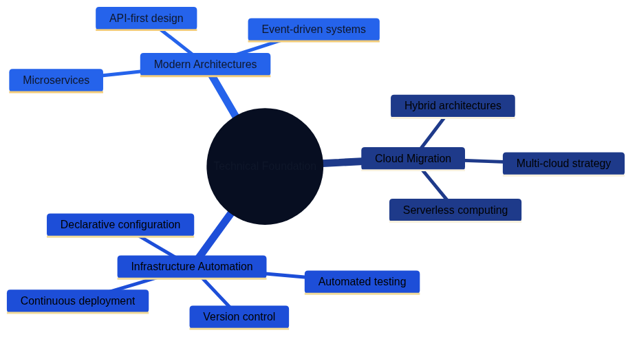

# Digital Transformation through Code-Based Infrastructure


*Figure 21.1 highlights how Architecture as Code supports modern digital transformation initiatives by enabling rapid, scalable, and cost-effective evolution of IT environments from manual processes to automated, declarative infrastructure management.*

## Digital Transformation Landscape



*Figure 21.2 shows the technical dimensions of digital transformation, including cloud migration, infrastructure automation, and modern architecture patterns.*


*Figure 21.3 illustrates the organisational changes required, including team structures, governance, and change management practices.*


*Figure 21.4 demonstrates how Architecture as Code delivers business value through improved delivery, risk management, and continuous innovation.*

## Overview

Digital transformation represents more than the introduction of new technology—it embodies a fundamental shift in how organisations deliver value to customers and stakeholders. Architecture as Code plays a central role in this transformation by enabling agile, cloud-based solutions that adapt to evolving business needs whilst maintaining robust governance, security, and compliance frameworks.

### Digital Transformation Challenges and Opportunities

Public and private sector organisations worldwide face significant digital transformation challenges where legacy IT structures often form bottlenecks for innovation and efficiency. According to recent industry reports, organisations globally have invested over £500 billion in digital transformation initiatives in the past five years, yet many projects fail due to inadequate infrastructure governance and accumulating technical debt.

Architecture as Code-based solutions offer opportunities to break these limitations through automation, standardisation, and scalability that specifically address common transformation challenges:

**Regulatory Compliance**: Organisations must navigate complex EU-wide legislation including GDPR under guidance from the European Data Protection Board (EDPB), the NIS2 Directive for critical infrastructure cybersecurity, sector-specific regulations, and data sovereignty requirements across member states. Architecture as Code enables automated compliance checking and audit trails that ensure continuous regulatory adherence across distributed European environments whilst meeting the expectations of European regulatory authorities.

**Cost Efficiency**: With rising operational costs and competitive pressure, Architecture as Code automation becomes critical for maintaining competitiveness. Studies demonstrate that Infrastructure as Code reduces manual effort by up to 70%, enabling organisations to reallocate skilled personnel to higher-value activities whilst reducing operational expenses.

**Skills Challenges**: The IT industry experiences persistent shortages of specialist talent, making it critical to standardise and automate infrastructure management. Architecture as Code enables smaller, specialised teams to manage complex environments through reusable templates, proven patterns, and community best practices.

**Security and Data Governance**: Organisations across the EU prioritise security and data control in an increasingly regulated landscape, guided by the EDPB's enforcement of GDPR and the NIS2 Directive for critical infrastructure protection. Architecture as Code enables consistent security configurations, encryption-at-rest as standard, and policy-as-code enforcement aligned with EDPB guidelines that builds trust with customers, regulators, and stakeholders throughout the European Union.

Code-based infrastructure enables DevOps methodologies that unite development and operations, resulting in faster delivery cycles and higher quality. This proves particularly vital for organisations competing in global markets whilst maintaining compliance with diverse EU member state regulations and harmonised European security requirements.

### Digital Transformation Dimensions

The digital transformation process through Architecture as Code encompasses multiple dimensions that organisations must address holistically:

**Technical Transformation**: Migration from on-premise data centres to hybrid and multi-cloud architectures that respect EU data residency requirements. This includes implementing microservices, containerisation, and API-first architectures that enable rapid innovation whilst maintaining operational resilience across member states.

**Organisational Change**: Introduction of cross-functional teams aligned with agile principles, balancing autonomous delivery with necessary oversight. Organisations must adapt hierarchical structures whilst preserving essential governance, risk management, and compliance frameworks.

**Cultural Evolution**: Shift towards data-driven decision-making and experimental learning whilst maintaining appropriate risk awareness and long-term strategic thinking. This requires careful change management that respects organisational values around stability, transparency, and stakeholder engagement.

**Competence Development**: Systematic upskilling of existing personnel in Architecture as Code technologies, combining theoretical knowledge with practical application through hands-on training, mentorship programmes, and community collaboration.

Successful Architecture as Code implementation requires balance between these aspects, with particular focus on organisational needs for transparency, stakeholder consensus, and sustainable transformation that delivers lasting value.

### Digital Transformation Success Stories

Several global organisations have executed exemplary digital transformations that demonstrate Architecture as Code's potential:

**Spotify**: Revolutionised the music industry through cloud-native architecture from inception, with Infrastructure as Code enabling scaling from a European start-up to a global platform serving over 500 million users. Their "Spotify Model" for agile organisation has inspired companies worldwide, demonstrating how technical excellence and organisational design reinforce one another.

**Stripe**: Transformed the payments industry through API-first architecture built on Infrastructure as Code, enabling expansion to 46 countries with consistent security and compliance. Their approach to regulated fintech innovation has become a model for other technology companies entering highly regulated sectors.

**Netflix**: Executed comprehensive digital transformation from traditional content distributor to global streaming platform through an extensive cloud platform based on Infrastructure as Code. This enabled development of personalised recommendation systems and content delivery networks that serve hundreds of millions of subscribers across diverse geographic regions.

**Capital One**: Pioneered cloud adoption in the financial services sector through a cloud-first strategy with Infrastructure as Code, achieving 99.99% uptime for critical banking systems whilst reducing infrastructure costs by 40% and accelerating feature deployment by 70%.

These success stories demonstrate that organisations can achieve world-leading digital transformation through strategic use of Architecture as Code combined with organisational strengths in innovation, design thinking, and sustainable business practices.

## Cloud-First Strategies for Digital Transformation

Organisations across the European Union have developed strong positions within cloud technology, driven by ambitious digitalisation goals across public and private sectors. Cloud-first strategies mean that organisations primarily choose cloud-based solutions for new initiatives, requiring comprehensive Architecture as Code competence adapted to EU regulatory frameworks, security requirements, and operational standards.

### Enterprise Digital Strategy and Architecture as Code

Modern digital strategies across the EU emphasise cloud technology's role in achieving goals for integrated, efficient service delivery. Leading organisations specify that teams should:

- Prioritise cloud-first solutions complying with EU data sovereignty regulations
- Implement automated architecture enabling shared IT services across organisational units
- Develop common platforms for user services based on open-source technologies
- Ensure cybersecurity and resilience through Infrastructure as Code-based controls aligned with EDPB guidance and NIS2 directive requirements

This creates demand for Architecture as Code solutions that handle sensitive data according to GDPR and sector-specific EU regulations whilst enabling innovation and efficiency. Practically, this means:


```hcl
# Enterprise Architecture as Code Template for GDPR-Compliant Cloud
terraform {
  required_version = ">= 1.5"
  
  required_providers {
    aws = {
      source  = "hashicorp/aws"
      version = "~> 5.0"
    }
  }
  
  # State storage with encryption for compliance
  backend "s3" {
    bucket         = "enterprise-terraform-state"
    key            = "production/terraform.tfstate"
    region         = var.eu_region  # Parameterized EU region selection
    encrypt        = true
    kms_key_id     = var.kms_key_id
    dynamodb_table = "terraform-locks"
    
    # Audit logging for compliance
    versioning = true
  }
}

# Enterprise resource tags for governance
locals {
  enterprise_tags = {
    Organisation      = var.organisation_name
    Environment       = var.environment
    CostCentre        = var.cost_centre
    DataClassification = var.data_classification
    ComplianceLevel   = var.compliance_level
    EUCompliance      = "GDPR"
    CreatedDate       = formatdate("YYYY-MM-DD", timestamp())
  }
}

# VPC for enterprise workloads with security zones
resource "aws_vpc" "enterprise_vpc" {
  cidr_block           = var.vpc_cidr
  enable_dns_hostnames = true
  enable_dns_support   = true
  
  tags = merge(local.enterprise_tags, {
    Name = "${var.organisation_name}-vpc"
    Purpose = "Enterprise VPC for digital services"
  })
}

# Security zones following best practices
resource "aws_subnet" "public_zone" {
  count = length(var.availability_zones)
  
  vpc_id            = aws_vpc.enterprise_vpc.id
  cidr_block        = cidrsubnet(var.vpc_cidr, 8, count.index)
  availability_zone = var.availability_zones[count.index]
  
  map_public_ip_on_launch = false  # No automatic public IP for security
  
  tags = merge(local.enterprise_tags, {
    Name         = "${var.organisation_name}-public-${count.index + 1}"
    SecurityZone = "Public"
    Tier         = "DMZ"
  })
}

resource "aws_subnet" "application_zone" {
  count = length(var.availability_zones)
  
  vpc_id            = aws_vpc.enterprise_vpc.id
  cidr_block        = cidrsubnet(var.vpc_cidr, 8, count.index + 10)
  availability_zone = var.availability_zones[count.index]
  
  tags = merge(local.enterprise_tags, {
    Name         = "${var.organisation_name}-app-${count.index + 1}"
    SecurityZone = "Application"
    Tier         = "Internal"
  })
}

resource "aws_subnet" "data_zone" {
  count = length(var.availability_zones)
  
  vpc_id            = aws_vpc.enterprise_vpc.id
  cidr_block        = cidrsubnet(var.vpc_cidr, 8, count.index + 20)
  availability_zone = var.availability_zones[count.index]
  
  tags = merge(local.enterprise_tags, {
    Name         = "${var.organisation_name}-data-${count.index + 1}"
    SecurityZone = "Data"
    Tier         = "Restricted"
  })
}
```


### Enterprise Cloud-First Success Stories

Global enterprises such as Spotify, Netflix, and Capital One have demonstrated leadership by building their technical platforms on cloud-based infrastructure from inception. Their success demonstrates how Architecture as Code enables rapid scaling and global expansion whilst minimising technical debt and maintaining organisational values around sustainability and innovation.

**Spotify's Infrastructure as Code Architecture for Global Scaling:**
Spotify developed their own Infrastructure as Code platform called "Backstage" which enabled scaling from 1 million to over 500 million users without linear increases in infrastructure complexity. Their approach includes:

- Microservices with dedicated infrastructure definitions per service
- Automated compliance checking for GDPR and intellectual property rights
- Cost-aware scaling that supports sustainability objectives
- Developer self-service portals that reduce time-to-market from weeks to hours

**Capital One's Regulated Financial Infrastructure as Code:**
As a licensed financial institution, Capital One must follow strict regulatory requirements whilst innovating rapidly. Their Infrastructure as Code strategy includes:

- Automated audit trails for all infrastructure changes
- Real-time compliance monitoring according to PCI-DSS and financial regulatory guidelines
- Immutable infrastructure enabling point-in-time recovery
- Multi-region deployment for business continuity according to industry standards

### Cloud Provider Ecosystem

Cloud-first implementation requires careful planning of hybrid and multi-cloud strategies. Organisations must navigate between different cloud providers whilst ensuring data sovereignty and regulatory compliance across EU member states.

Sovereignty guardrails described in Chapter 15 and the Future Trends chapter demand explicit provider selection policies. Platform teams should codify which services qualify as "EU-trusted"—covering both EU-headquartered providers and EU-specific offerings from global hyperscalers—and enforce those decisions through policy-as-code. This keeps residency, lawful access controls, and the GAIA-X or EU Cloud Code of Conduct commitments consistent across delivery teams.

Policy catalogues should therefore differentiate between providers that are inherently sovereign and those that become acceptable only when their EU-only controls are in force. EU-headquartered platforms form the default choice for workloads bound by strict sovereignty clauses. Global hyperscalers remain viable when their EU sovereign programmes (such as AWS European Sovereign Cloud, Azure EU Data Boundary, or Google Cloud Sovereign Controls) deliver European legal entities, locally staffed operations, and independent encryption key custody. Standard global services that fall outside those safeguards should fail policy-as-code checks so that teams avoid contradictory guidance.

**AWS European Sovereign Cloud and EU Regions:**
When AWS is approved through the European Sovereign Cloud roadmap or EU regional deployments, Architecture as Code guardrails must confirm the following conditions:

- Physical data sovereignty within EU regional boundaries
- Low-latency connectivity across EU availability zones and Local Zones
- Comprehensive compliance certifications including ISO 27001, SOC 2, and PCI-DSS
- Dedicated support with European expertise, GDPR compliance guidance, and the upcoming sovereign controls programme

**Microsoft Azure EU Data Boundary:**
Azure's EU Data Boundary commitments provide a compliant route when policies verify that workloads remain inside the boundary and sovereign controls programme:

- Azure regions across multiple EU member states for data residency
- Integration with enterprise identity providers
- Compliance with EU governance standards, EDPB guidelines, and Azure confidential computing controls
- Partnership ecosystem with European system integrators

**Google Cloud Sovereign Controls:**
Google Cloud's sovereign controls, implemented with partners such as T-Systems and Thales, qualify when technical and organisational safeguards are enforced:

- EU-based data processing for GDPR compliance across all member states
- Carbon-neutral operations aligned with EU sustainability goals
- Advanced AI/ML capabilities for research and innovation
- Integration with open-source ecosystems

**European Sovereign Cloud Providers:**
European-native providers deliver offerings that satisfy strict localisation requirements and public sector procurement rules:

- **OVHcloud** provides GAIA-X aligned services with full EU legal jurisdiction and SecNumCloud certification for French public sector workloads.
- **Scaleway** delivers sovereign cloud regions, Bare Metal, and Kubernetes platforms operated entirely within the EU with transparent supply-chain disclosure.
- **Open Telekom Cloud** combines Deutsche Telekom operations with T-Systems sovereign controls, ensuring German and broader EU data residency for regulated industries.

Architecture as Code pipelines should allow these providers to be selected as first-class modules. Policy-as-code guardrails can then ensure that workloads default to an EU-native provider when contractual or regulatory obligations prohibit the use of global hyperscalers, or verify that hyperscaler services are constrained to their EU sovereign offerings.

## Digital Transformation in Enterprises

Organisations worldwide are undergoing comprehensive digital transformation processes. Architecture as Code forms the technical foundation enabling this transformation by creating flexible, scalable, and cost-effective IT environments.

Traditional industrial companies such as General Electric, Siemens, and ABB have redefined their business models through digital initiatives built on modern cloud infrastructure. Architecture as Code has enabled these companies to develop IoT platforms, AI services, and data analytics solutions that create new revenue streams.

Public sector organisations have also embraced Architecture as Code as a tool to modernise citizen services. Digital platforms for e-services, open data, and smart city initiatives build on code-based infrastructure that adapts to different organisational needs and resources.

Challenges within digital transformation include skills shortages, cultural resistance, and complex legacy systems. Architecture as Code helps address these challenges by standardising processes, enabling iterative development, and reducing technical complexity.

## Practical Examples


### Multi-Cloud Enterprise Strategy
```yaml
# terraform/main.tf - Multi-cloud setup for global enterprise
terraform {
  required_providers {
    aws = {
      source  = "hashicorp/aws"
      version = "~> 5.0"
    }
    azurerm = {
      source  = "hashicorp/azurerm"
      version = "~> 3.0"
    }
  }
}

# AWS for global services with EU data residency
provider "aws" {
  region = var.aws_eu_region  # Configurable EU region (e.g., eu-west-1, eu-central-1, eu-north-1)
}

# Azure for Microsoft integrations with EU compliance
provider "azurerm" {
  features {}
  location = var.azure_eu_region  # Configurable EU region (e.g., West Europe, North Europe)
}

# Common resource tagging for cost management and EU compliance
locals {
  common_tags = {
    Organisation = "Global Enterprise Ltd"
    Environment  = var.environment
    Project      = var.project_name
    CostCentre   = var.cost_centre
    DataClass    = var.data_classification
    EUCompliance = "GDPR"
    Regulator    = "EDPB"
  }
}

module "aws_infrastructure" {
  source = "./modules/aws"
  tags   = local.common_tags
}

module "azure_infrastructure" {
  source = "./modules/azure"
  tags   = local.common_tags
}

# Optional: add EU-native providers (e.g., OVHcloud, Scaleway) via additional modules
```

### Automated Compliance Pipeline
```yaml
# .github/workflows/compliance-check.yml
name: EU Compliance and Security Check

on:
  pull_request:
    paths: ['infrastructure/**']

jobs:
  gdpr-compliance:
    runs-on: ubuntu-latest
    steps:
      - uses: actions/checkout@v4
      
      - name: GDPR Data Mapping (EDPB Guidelines)
        run: |
          # Verify all databases have encryption enabled per EDPB requirements
          terraform plan | grep -E "(encrypt|encryption)" || exit 1
          
      - name: NIS2 Directive Compliance
        if: contains(github.event.pull_request.title, 'critical-infrastructure')
        run: |
          # Validate NIS2 requirements for essential and important entities
          ./scripts/nis2-compliance-check.sh
          
      - name: PCI-DSS Checks
        if: contains(github.event.pull_request.title, 'payment')
        run: |
          # Validate PCI-DSS requirements for payment infrastructure
          ./scripts/pci-compliance-check.sh
          
      - name: EU Security Requirements Validation
        run: |
          # EU-wide security requirements for critical infrastructure
          ./scripts/eu-security-validation.sh
```

### Self-Service Developer Portal
```python
# developer_portal/infrastructure_provisioning.py
from flask import Flask, request, jsonify
from terraform_runner import TerraformRunner
import kubernetes.client as k8s

app = Flask(__name__)

@app.route('/provision/environment', methods=['POST'])
def provision_development_environment():
    """
    Automatic provisioning of development environment
    for enterprise development teams with EU compliance
    """
    team_name = request.json.get('team_name')
    project_type = request.json.get('project_type')
    compliance_level = request.json.get('compliance_level', 'standard')
    eu_region = request.json.get('eu_region', 'eu-central-1')  # Parameterized EU region
    
    # Validate organisational structure
    if not validate_team_structure(team_name):
        return jsonify({'error': 'Invalid team structure'}), 400
    
    # Configure environment based on EU regulatory requirements
    config = {
        'team': team_name,
        'region': eu_region,  # User-selected EU region for data residency
        'encryption': True,
        'audit_logging': True,
        'gdpr_compliance': True,
        'edpb_guidelines': True,
        'nis2_compliance': compliance_level in ['critical', 'essential'],
        'retention_policy': '7_years' if compliance_level == 'financial' else '3_years'
    }
    
    # Run Terraform for infrastructure provisioning
    tf_runner = TerraformRunner()
    result = tf_runner.apply_configuration(
        template='enterprise_development_environment',
        variables=config
    )
    
    return jsonify({
        'environment_id': result['environment_id'],
        'endpoints': result['endpoints'],
        'compliance_report': result['compliance_status'],
        'eu_region': eu_region,
        'edpb_compliant': True
    })

def validate_team_structure(team_name):
    """Validate team name according to organisational standard"""
    # Implementation for validation of team structure
    return True
```


## Summary

Digital transformation through code-based infrastructure represents a fundamental shift in how organisations deliver IT services and create business value. Architecture as Code enables the flexibility, scalability, and security required for successful digital transformation whilst maintaining robust governance frameworks.

Success factors include strategic planning of cloud-first initiatives, comprehensive automation of delivery processes, and continuous competence development within organisations. Organisations that embrace these principles position themselves strongly for sustainable growth and competitive advantage.

Key lessons from digital transformation initiatives demonstrate that technical transformation must combine with organisational and cultural change to achieve lasting results. Architecture as Code forms the technical foundation, but success requires a holistic perspective on transformation that engages people, processes, and technology in concert.

## From Implementation to Integration

The organisational transformation explored in this part—from [changing team structures](17_organisational_change.md) to [Management as Code](19_management_as_code.md) and digitalisation—provides the human and process foundations for Architecture as Code success. However, these disciplines achieve their full potential when they work together rather than in isolation.

Part F explores the interplay between different "as Code" practices and distils best practices from organisations that have successfully integrated Architecture as Code across their operations. [Chapter 23 on the Interplay Between Soft As Code Disciplines](23_soft_as_code_interplay.md) reveals how Documentation as Code, Requirements as Code, Policy as Code, and other practices create synergies that amplify value. [Chapter 24 on Best Practices](24_best_practices.md) synthesises lessons learned from diverse contexts into practical, actionable guidance.

## Sources and References

- Gartner. "Cloud Adoption Strategies for Enterprises." Gartner Research, 2023.
- McKinsey Digital. "Digital Transformation: A Global Perspective." McKinsey & Company, 2023.
- AWS. "Cloud Adoption Framework for Enterprises." Amazon Web Services, 2023.
- Microsoft. "Azure for Enterprise Digital Transformation." Microsoft Azure, 2023.
- HashiCorp. "Infrastructure as Code Best Practices." HashiCorp Learn, 2023.
- SANS Institute. "Cloud Security for Enterprise Organisations." SANS Security Research, 2023.
