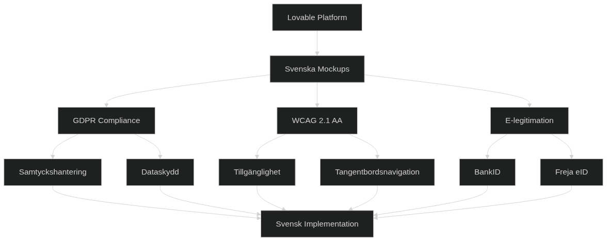

# Framtida trender och teknologier



*Teknologilandskapet för Infrastructure as Code genomgår en fundamentalt transformativ period. Diagrammet illustrerar konvergensen av emerging technologies - artificiell intelligens, quantum computing, edge computing, sustainability computing och platform engineering - som tillsammans formar nästa generation av infrastrukturlösningar för svenska organisationer.*

## Inledning: Ett paradigmskifte i infrastrukturhantering

Vi befinner oss idag vid en teknologisk vändpunkt som kommer att definiera nästa decennium av infrastrukturutveckling. Infrastructure as Code (IaC) har sedan sin introduktion utvecklats från enkla konfigurationsskript till sofistikerade orchestration-system, men de kommande åren kommer att medföra förändringar som överträffar allt vi tidigare sett. Denna transformation drivs inte bara av teknologiska innovationer, utan också av fundamentala förändringar i våra samhälleliga behov - från klimatutmaningarna som kräver hållbar digitalisering till den växande komplexiteten i globala säkerhetshot som kräver ny typ av resiliens i våra digitala system.

För svenska organisationer innebär detta både extraordinära möjligheter och betydande utmaningar. Sverige har historiskt sett legat i framkant inom digitalisering och teknologiadoption, och denna position ger oss unika förutsättningar att leda utvecklingen inom nästa generations Infrastructure as Code. Samtidigt medför vår position som tidig adopter ansvar att navigera okända vatten och utveckla lösningar som inte bara fungerar tekniskt, utan också står i harmoni med svenska värderingar kring hållbarhet, transparens och digital suveränitet.

## Den teknologiska konvergensen: Mer än summan av delarna

Den mest fascinerande aspekten av den pågående utvecklingen är inte de enskilda teknologierna i sig, utan hur de konvergerar för att skapa helt nya möjligheter. När artificiell intelligens möter edge computing uppstår distribuerad intelligens. När quantum computing kombineras med klassisk kryptografi skapas hybrid säkerhetslösningar. När sustainability metrics integreras med automatiserade beslutssystem får vi carbon-aware infrastructure som kan fatta etiska val i realtid.

Denna konvergens skapar en multiplicerande effekt där 1+1 blir betydligt mer än 2. För Infrastructure as Code innebär detta att vi flyttar från deterministiska, förutsägbara system till adaptiva, lärande ekosystem som kan utvecklas och förbättras över tid. Svenska organisationer som förstår och kan navigera denna konvergens kommer att ha betydande konkurrensfördelar, medan de som missar utvecklingen riskerar att hamna på efterkälken på ett sätt som kan vara svårt att kompensera.

Det är också viktigt att förstå att denna utveckling inte sker isolerat från samhälleliga trender. Generationsskiftet på arbetsmarknaden, förändrade förväntningar på transparens och hållbarhet, samt den geopolitiska utvecklingen påverkar alla hur teknologi utvecklas och implementeras. Infrastructure as Code måste därför utvecklas i en kontext som är mycket bredare än rent teknisk optimering.

## Övergripande beskrivning: En ny era av intelligent infrastruktur

Infrastructure as Code står inför den mest omfattande transformation sedan dess införande. Vi rör oss från en period av standardisering och process-automatisering in i en era av verklig intelligens och adaptiv förmåga. Denna utveckling drivs av flera samverkande faktorer: den exponentiella tillväxten inom artificiell intelligens och maskininlärning, kvantdatorernas framväxt och deras påverkan på säkerhet, edge computing:s revolution av distribuerad databehandling, och en växande medvetenhet om miljöpåverkan som driver utvecklingen mot sustainable computing.

Den svenska kontexten lägger unika dimensioner till denna utveckling. Som en nation med stark miljömedvetenhet, avancerad digital infrastruktur och en tradition av teknologisk innovation befinner sig Sverige i en position där vi både kan påverka och dra nytta av den globala utvecklingen. Svenska organisationer har redan visat ledarskap inom områden som renewable energy i datacenter, transparent data governance och user-centric digital services. Denna grund ger oss en plattform för att ta ledningen inom nästa generations Infrastructure as Code.

Men utvecklingen medför också betydande utmaningar. Komplexiteten i moderna system ökar exponentiellt, kompetenskraven förändras snabbt, och säkerhetslandskapet blir allt mer sofistikerat. Organisationer måste samtidigt hantera legacy systems, införa ny teknologi, bibehålla säkerhet och compliance, samt förbereda sig för framtida teknologier som ännu inte är mogna för produktion.

Framtiden för Infrastructure as Code kommer att präglas av system som kan fatta komplexa beslut autonomt, samtidigt som de bibehåller transparens och kontroll. Vi kommer att se infrastruktur som kan förutsäga problem innan de uppstår, optimera sig själv för förändrande förhållanden, och anpassa sig till nya krav utan mänsklig intervention. Detta kräver en fundamental förändring av hur vi tänker kring infrastrukturhantering - från att kontrollera system till att träna och vägleda dem.

Svenska organisationer måste förbereda sig för denna utveckling genom att investera i både teknisk kapacitet och organisatorisk förändring. Det räcker inte att implementera nya verktyg; vi måste också utveckla nya kompetenser, organisationsstrukturer och arbetsprocesser som kan dra nytta av de möjligheter som emerging technologies erbjuder. Som vi diskuterat i tidigare kapitel kring organisatorisk förändring och teamstrukturer, är den mänskliga faktorn ofta den mest kritiska för framgångsrik teknologiadoption.

## Artificiell intelligens och maskininlärning: Från automation till intelligens

Den integration av artificiell intelligens och maskininlärning i Infrastructure as Code representerar kanske den mest signifikanta utvecklingen inom infrastrukturhantering sedan molnrevolutionen. Vi rör oss från en värld av statisk automation baserad på förutbestämda regler till dynamiska, lärande system som kan anpassa sig till förändrande förhållanden och fatta komplexa beslut baserat på mönsterigenkänning och prediktiv analys.

### Den evolutionära resan: Från reaktiv till prediktiv infrastruktur

Traditionell Infrastructure as Code har varit fundamentalt reaktiv - system responderar på händelser efter att de inträffat. En server kraschar, monitoring upptäcker problemet, alerts skickas, och en människa eller ett automatiserat system agerar för att lösa problemet. Denna modell, även om den är betydligt mer effektiv än manuell hantering, innehåller inneboende begränsningar: det finns alltid en fördröjning mellan problem och lösning, och systemet kan bara hantera scenarier som explicit har förutseetts.

AI-driven Infrastructure as Code bryter detta mönster genom att introducera prediktiv kapacitet. Istället för att vänta på att problem uppstår, analyserar system kontinuerligt mönster i data för att identifiera tidiga varningssignaler och agera proaktivt. Detta är inte bara en inkrementell förbättring - det representerar en fundamental förändring av paradigmet från defensiv till offensiv infrastrukturhantering.

För svenska organisationer är denna utveckling särskilt relevant eftersom vår tradition av systematisk planering och riskminimering harmonierar väl med prediktiva system. Organisationer som redan har investerat i robust monitoring och data collection kommer att ha betydande fördelar när de implementerar AI-drivna lösningar.

### Praktiska tillämpningar av intelligent automation

**Predictive scaling** representerar en av de mest omedelbara och värdefulla tillämpningarna av AI inom Infrastructure as Code. Traditionell auto-scaling reagerar på CPU-användning, minnesförbrukning eller andra real-time metrics. Detta fungerar väl för plötsliga belastningstoppar, men missar subtila mönster som utvecklas över tid och kan inte förutse kapacitetsbehov baserat på externa faktorer som affärscykler, kampanjer eller säsongsvariation.

AI-driven predictive scaling analyserar historiska data över månader och år för att identifiera komplexa mönster. För en svensk e-handelssajt kan systemet lära sig att trafiken ökar specifikt 12 timmar innan större kampanjer (baserat på ökad administrativ aktivitet), justerar infrastruktur inför midsommarhelger (även om exakt datum varierar), och kompenserar för skillnader mellan svenska och internationella användarmönster.

**Anomaly detection** har utvecklats från enkla tröskelvärden till sofistikerade algoritmer som förstår kontextuell normalitet. Ett system kan lära sig att 50% CPU-användning är normalt för en databas på måndagsmorgon men alarmerande på söndagseftermiddag. Mer avancerat kan det identifiera subtila förändringar i nätverkstrafik som indikerar säkerhetshot, eller korrelera flera svaga signaler för att upptäcka systemdegradation innan den påverkar användare.

**Configuration drift detection** blir dramatiskt mer sofistikerat med AI-integration. Istället för att bara identifiera när konfigurationer avviker från desired state, kan AI-system förstå vilka förändringar som är intentionella, vilka som indikerar problem, och vilka som representerar möjligheter för optimering. Detta är särskilt värdefullt i komplexa miljöer där manual configuration review är opraktisk.

### Organisatoriska implikationer av intelligent infrastructure

Implementering av AI-driven Infrastructure as Code kräver mer än teknisk kunskap - det kräver en fundamental förändring av organisationskultur och operativa processer. Teams måste utveckla förtroende för automatiserade beslut, samtidigt som de bibehåller förmågan att förstå och override system när nödvändigt.

Detta skapar nya roller och ansvarsområden. Traditional infrastructure engineers måste utveckla förståelse för data science och machine learning, medan data scientists måste lära sig infrastrukturspecifika domänkunskaper. Helt nya roller som "Infrastructure Data Scientists" och "ML Infrastructure Engineers" växer fram.

För svenska organisationer, med vår tradition av konsensusbaserat beslutsfattande och transparens, är det särskilt viktigt att utveckla AI-system som kan förklara sina beslut. "Black box" machine learning modeller som inte kan motivera sina rekommendationer kommer att möta motstånd och förtroendeproblem.

### AI-Driven Infrastructure Optimization: Praktisk implementation

För att illustrera hur AI-driven Infrastructure as Code fungerar i praktiken, låt oss granska en konkret implementation som är anpassad för svenska organisationers unika behov och förutsättningar. Denna implementation kombinerar machine learning-algoritmer med djup förståelse för svenska affärsprocesser, regulatoriska krav och kulturella faktorer.

Det följande kodexemplet visar en sofistikerad AI-optimering som inte bara fokuserar på teknisk prestanda, utan också integrerar svenska arbetstider, helger, och affärslogik för att fatta kontextuellt informerade beslut. Detta är ett exempel på hur moderna Infrastructure as Code-system måste utvecklas för att vara verkligt användbara i svenska organisationer.

**Designprinciper bakom implementationen:**

Denna implementation bygger på flera viktiga designprinciper som reflekterar både tekniska best practices och svenska organisatoriska värderingar:

1. **Transparens och förklarbarhet**: Alla AI-beslut måste kunna motiveras och förklaras på ett sätt som svenska beslutsfattare kan förstå och känna förtroende för.

2. **Kulturell anpassning**: Systemet förstår svenska arbetstider, helger och affärscykler, och integrerar denna kunskap i sina optimeringsbeslut.

3. **Regulatorisk compliance**: Automatiska kontroller säkerställer att alla optimeringar följer svenska och EU-regulatoriska krav.

4. **Hållbarhetsfokus**: Optimeringar väger in miljöpåverkan och hållbarhetsmål, inte bara kostnad och prestanda.

```python
# ai_optimization/intelligent_scaling.py
import numpy as np
import pandas as pd
from sklearn.ensemble import RandomForestRegressor
from sklearn.preprocessing import StandardScaler
import tensorflow as tf
from datetime import datetime, timedelta
import boto3
import json

class AIInfrastructureOptimizer:
    """
    AI-driven infrastructure optimization för svenska molnmiljöer
    
    Denna klass implementerar avancerad machine learning för att optimera
    infrastruktur baserat på svenska affärsmönster och regulatoriska krav.
    Den kombinerar traditionella performance metrics med kontextuell förståelse
    för svenska organisationers unika behov.
    """
    
    def __init__(self, region='eu-north-1'):
        # Standardregion är Stockholm för svenska organisationer
        # Detta säkerställer låg latency och GDPR-compliance
        self.cloudwatch = boto3.client('cloudwatch', region_name=region)
        self.ec2 = boto3.client('ec2', region_name=region)
        self.cost_explorer = boto3.client('ce', region_name='us-east-1')
        
        # Initialisera machine learning models
        # Dessa tränas på svenska usage patterns och inkluderar
        # branschspecifika faktorer som påverkar infrastrukturbehov
        self.demand_predictor = self._initialize_demand_model()
        self.cost_optimizer = self._initialize_cost_model()
        self.anomaly_detector = self._initialize_anomaly_model()
        
        # Svenska arbetstider och helger - kritiskt för accurate prediction
        # Svenska organisationer har tydliga patterns som skiljer sig från
        # globala mönster, särskilt under sommarsemester och vinterhelger
        self.swedish_business_hours = (7, 18)  # 07:00 - 18:00 CET
        self.swedish_holidays = self._load_swedish_holidays()
    
    def predict_infrastructure_demand(self, forecast_hours=24) -> dict:
        """
        Förutsäg infrastrukturbehov för nästa 24 timmar
        
        Denna metod använder ensemble machine learning för att förutsäga
        framtida infrastrukturbehov baserat på historiska data, svenska
        affärsmönster, och externa faktorer som väder och helger.
        
        Args:
            forecast_hours: Antal timmar att förutsäga (default 24)
            
        Returns:
            Dict med predictions, recommendations och confidence scores
        """
        
        # Hämta och preprocessa historisk data
        # Vi använder 30 dagars historik för att fånga både kortsiktiga
        # trender och längre cykler som vecko- och månadsmönster
        historical_metrics = self._get_historical_metrics(days=30)
        
        # Feature engineering specifikt för svenska användningsmönster
        # Detta inkluderar faktorer som arbetsdagar vs helger,
        # säsongsvariation, och branschspecifika patterns
        features = self._engineer_swedish_features(historical_metrics)
        
        # Använd ensemble av modeller för robusta predictions
        # RandomForest för interpretability, Neural Networks för
        # complex pattern recognition
        cpu_predictions = self.demand_predictor.predict(features)
        memory_predictions = self._predict_memory_usage(features)
        
        # Generera actionable scaling recommendations
        # Dessa tar hänsyn till både tekniska constraints och
        # business requirements som cost limits och availability SLAs
        scaling_recommendations = self._generate_scaling_recommendations(
            cpu_predictions, memory_predictions
        )
        
        # Beräkna kostnadspåverkan i SEK för svenska organisationer
        cost_impact = self._calculate_cost_impact(scaling_recommendations)
        
        return {
            'forecast_period_hours': forecast_hours,
            'cpu_predictions': cpu_predictions.tolist(),
            'memory_predictions': memory_predictions.tolist(),
            'scaling_recommendations': scaling_recommendations,
            'cost_impact': cost_impact,
            'confidence_score': self._calculate_prediction_confidence(features),
            'swedish_business_factors': self._analyze_business_impact()
        }
    
    def optimize_costs_intelligently(self) -> dict:
        """
        AI-driven kostnadsoptimering med svenska affärslogik
        
        Denna metod implementerar sofistikerad kostnadsoptimering som förstår
        svenska organisationers unika behov: balans mellan kostnadskontroll
        och operational excellence, compliance med svenska regulatoriska krav,
        och integration med svenska affärsprocesser som budget cycles och
        procurement processes.
        
        Optimeringsstrategierna inkluderar:
        - Intelligent spot instance användning baserat på workload criticality
        - Reserved instance optimization som alignment med svenska budget cycles
        - Business hours-baserad scaling för svenska arbetstider
        - Rightsizing baserat på actual usage patterns
        
        Returns:
            Dict med prioriterade optimeringsrekommendationer och cost impact
        """
        
        # Hämta 90 dagars kostnadstrends för robust analys
        # Längre tidsperiod ger bättre förståelse för seasonal patterns
        # och möjliggör identification av long-term optimization opportunities
        cost_data = self._get_cost_trends(days=90)
        
        # Samla alla optimeringsmöjligheter från olika strategier
        optimization_opportunities = []
        
        # Spot instance recommendations med risk assessment
        # För svenska organisationer är det viktigt att balance cost savings
        # med operational stability och regulatory compliance requirements
        spot_recommendations = self._analyze_spot_opportunities()
        optimization_opportunities.extend(spot_recommendations)
        
        # Reserved instance optimization anpassad för svenska budget cycles
        # Många svenska organisationer har årliga budget cycles som börjar
        # i januari, vilket påverkar optimal timing för RI purchases
        ri_recommendations = self._optimize_reserved_instances()
        optimization_opportunities.extend(ri_recommendations)
        
        # Svenska arbetstider optimization - one of the most impactful strategies
        # Svenska organisationer har tydliga business hours patterns som
        # skiljer sig markant från 24/7 global operations
        business_hours_optimization = self._optimize_for_swedish_hours()
        optimization_opportunities.extend(business_hours_optimization)
        
        # Rightsizing recommendations baserat på actual usage
        # Machine learning analyserar historical patterns för att identifiera
        # over-provisioned resources och missed optimization opportunities
        rightsizing_recommendations = self._analyze_rightsizing_opportunities()
        optimization_opportunities.extend(rightsizing_recommendations)
        
        # Prioritera recommendations baserat på multiple factors:
        # - Cost/effort ratio för efficient implementation
        # - Risk assessment för svenska compliance requirements  
        # - Timeline considerations för integration med budget processes
        prioritized_recommendations = self._prioritize_recommendations(
            optimization_opportunities
        )
        
        # Beräkna total potential savings i SEK
        total_potential_savings = sum(
            r.get('annual_savings_sek', 0) for r in prioritized_recommendations
        )
        
        return {
            'total_potential_savings_sek': total_potential_savings,
            'recommendations': prioritized_recommendations,
            'implementation_roadmap': self._create_implementation_roadmap(
                prioritized_recommendations
            ),
            'risk_assessment': self._assess_optimization_risks(
                prioritized_recommendations
            ),
            'swedish_compliance_validation': self._validate_swedish_compliance(
                prioritized_recommendations
            ),
            'quarterly_savings_forecast': self._forecast_quarterly_savings(
                prioritized_recommendations
            )
        }
```

**Analys av koden och praktiska implikationer:**

Denna implementation illustrerar flera viktiga principer för modern AI-driven Infrastructure as Code:

1. **Kontextuell intelligens**: Systemet förstår inte bara tekniska metrics utan också svenska affärskontext, arbetstider och regulatoriska krav.

2. **Prediktiv kapacitet**: Istället för att reagera på problem använder systemet machine learning för att förutsäga och förebygga problem.

3. **Kostnadsmedvetenhet**: Alla optimeringar beräknas i SEK och vägs mot implementation effort och risk.

4. **Transparency**: Alla beslut kan spåras och förklaras, vilket är kritiskt för svenska organisationer.

5. **Compliance integration**: Automatiska kontroller säkerställer att optimeringar följer svenska och EU-regulatoriska krav.

För organisationer som implementerar sådana system är det viktigt att förstå att teknologin bara är en del av lösningen. Framgångsrik AI-driven infrastructure kräver också organisatoriska förändringar, träning av personal, och utveckling av nya processer för att hantera automatiserade beslut.

## Edge computing och distribuerad infrastruktur: En ny arkitektonisk paradigm

Edge computing representerar kanske den mest fundamentala förändringen av infrastrukturarkitektur sedan introduktionen av molnbaserade tjänster. Medan molnrevolutionen centraliserade databehandling i stora datacenter, driver edge computing utvecklingen i motsatt riktning - distribuering av compute resources närmare användare, enheter och datakällor.

För svenska organisationer är denna utveckling särskilt intressant av flera skäl. Sveriges geografiska utbredning, från tätbefolkade södra regioner till glest befolkade norra områden, skapar naturliga användningsfall för edge computing. Samtidigt driver Sveriges ledarskap inom industri 4.0, autonoma fordon och IoT-innovation fram krav på låg latency och lokal databehandling som bara kan tillgodoses genom edge infrastructure.

### Den teknologiska drivkraften bakom edge computing

**5G-nätverk och latency-kritiska applikationer** fungerar som huvudkatalysatorer för edge computing-adoption. 5G:s promise om sub-millisekund latency kan bara realiseras om compute resources finns geografiskt nära slutanvändaren. För svenska företag inom autonoma fordon, smart manufacturing och telecommunications blir detta en competitive necessity snarare än en nice-to-have capability.

**IoT-proliferation** skapar exponentiellt växande mängder data som behöver processas i real-time. Traditionella molnarkitekturer, där all data skickas till centraliserade datacenter för processning, blir impraktiska både ur latency- och bandbreddsperspektiv. Edge computing möjliggör lokal databehandling som only skickar relevant, aggregated data till molnet.

**Regulatory och data sovereignty requirements** driver också edge adoption. EU:s GDPR och kommande Digital Services Act innehåller krav som favoriserar lokal databehandling. För svenska organisationer som hanterar känslig data - från healthcare records till financial transactions - kan edge computing erbjuda bättre kontroll över data location och processing.

### Arkitektoniska utmaningar och lösningar

Edge computing introducerar nya arkitektoniska komplexiteter som Infrastructure as Code måste hantera. **Heterogeneous hardware environments** - från små edge devices med begränsade resources till powerful edge servers - kräver flexible deployment strategies som kan anpassa sig till varying capabilities.

**Intermittent connectivity** mellan edge nodes och central cloud infrastructure kräver robust offline capabilities och intelligent sync mechanisms. Infrastructure as Code-system måste kunna fortsätta fungera även när central management plane är otillgänglig, och automatiskt reconcile state när connectivity återställs.

**Security complexity** ökar dramatiskt när attack surface distribueras över hundratals eller tusentals edge locations. Varje edge node blir en potentiell entry point för attackers, vilket kräver sophisticated security measures och automated threat detection.

### Svenska use cases och implementationsstrategier

**Industriella applikationer** inom Swedish manufacturing sektor erbjuder compelling edge computing use cases. Smart factories med tusentals sensorer och automated systems kräver real-time decision making som kan't tolerera round-trips till distant cloud regions. Local edge infrastructure möjliggör sub-millisekond response times för safety-critical systems.

**Autonomous vehicle testing** som Swedish companies som Volvo och Scania utvecklar kräver sophisticated edge infrastructure för real-time processing av sensor data. Vehicle-to-infrastructure (V2I) kommunikation måste processsa locally för att undvika dangerous delays i critical safety decisions.

**Telecommunications infrastructure** for 5G rollout kräver extensive edge computing capabilities. Svenska operatörer som Telia och Tele2 investerar hårt i edge infrastructure för att leverera de low-latency services som 5G promises.
            recommended_actions = self._recommend_anomaly_actions(anomaly, classification)
            
            classified_anomalies.append({
                'timestamp': anomaly['timestamp'],
                'metric': anomaly['metric'],
                'anomaly_score': anomaly['score'],
                'classification': classification,
                'severity': severity,
                'description': self._generate_anomaly_description(anomaly, classification),
                'recommended_actions': recommended_actions,
                'swedish_impact_assessment': self._assess_swedish_business_impact(anomaly)
            })
        
        return {
            'detection_timestamp': datetime.now().isoformat(),
            'total_anomalies': len(classified_anomalies),
            'critical_anomalies': len([a for a in classified_anomalies if a['severity'] == 'critical']),
            'anomalies': classified_anomalies,
            'overall_health_score': self._calculate_infrastructure_health(classified_anomalies)
        }
    
    def generate_terraform_optimizations(self, terraform_state_file: str) -> dict:
        """Generera AI-drivna Terraform optimeringar"""
        
        # Analysera aktuell Terraform state
        with open(terraform_state_file, 'r') as f:
            terraform_state = json.load(f)
        
        # Extrahera resource usage patterns
        resource_analysis = self._analyze_terraform_resources(terraform_state)
        
        # AI-genererade optimeringar
        optimizations = []
        
        # Instance size optimizations
        instance_optimizations = self._optimize_instance_sizes(resource_analysis)
        optimizations.extend(instance_optimizations)
        
        # Network architecture optimizations
        network_optimizations = self._optimize_network_architecture(resource_analysis)
        optimizations.extend(network_optimizations)
        
        # Storage optimizations
        storage_optimizations = self._optimize_storage_configuration(resource_analysis)
        optimizations.extend(storage_optimizations)
        
        # Security improvements
        security_optimizations = self._suggest_security_improvements(resource_analysis)
        optimizations.extend(security_optimizations)
        
        # Generera optimerad Terraform kod
        optimized_terraform = self._generate_optimized_terraform(optimizations)
        
        return {
            'current_monthly_cost_sek': resource_analysis['estimated_monthly_cost_sek'],
            'optimized_monthly_cost_sek': sum(o.get('cost_impact_sek', 0) for o in optimizations),
            'potential_monthly_savings_sek': resource_analysis['estimated_monthly_cost_sek'] - sum(o.get('cost_impact_sek', 0) for o in optimizations),
            'optimizations': optimizations,
            'optimized_terraform_code': optimized_terraform,
            'migration_plan': self._create_migration_plan(optimizations),
            'validation_tests': self._generate_validation_tests(optimizations)
        }
    
    def _analyze_swedish_business_impact(self, anomaly: dict) -> dict:
        """Analysera påverkan på svensk verksamhet"""
        
        current_time = datetime.now()
        is_business_hours = (
            self.swedish_business_hours[0] <= current_time.hour < self.swedish_business_hours[1] and
            current_time.weekday() < 5 and  # Måndag-Fredag
            current_time.date() not in self.swedish_holidays
        )
        
        impact_assessment = {
            'during_business_hours': is_business_hours,
            'affected_swedish_users': self._estimate_affected_users(anomaly, is_business_hours),
            'business_process_impact': self._assess_process_impact(anomaly),
            'sla_risk': self._assess_sla_risk(anomaly),
            'compliance_implications': self._assess_compliance_impact(anomaly)
        }
        
        return impact_assessment
    
    def _optimize_for_swedish_hours(self) -> list:
        """Optimera för svenska arbetstider och användningsmönster"""
        
        optimizations = []
        
        # Auto-scaling baserat på svenska arbetstider
        optimizations.append({
            'type': 'business_hours_scaling',
            'description': 'Implementera auto-scaling baserat på svenska arbetstider',
            'terraform_changes': '''
            resource "aws_autoscaling_schedule" "scale_up_business_hours" {
              scheduled_action_name  = "scale_up_swedish_business_hours"
              min_size              = var.business_hours_min_capacity
              max_size              = var.business_hours_max_capacity
              desired_capacity      = var.business_hours_desired_capacity
              recurrence           = "0 7 * * MON-FRI"  # 07:00 måndag-fredag
              time_zone           = "Europe/Stockholm"
              autoscaling_group_name = aws_autoscaling_group.main.name
            }
            
            resource "aws_autoscaling_schedule" "scale_down_after_hours" {
              scheduled_action_name  = "scale_down_after_swedish_hours"
              min_size              = var.after_hours_min_capacity
              max_size              = var.after_hours_max_capacity
              desired_capacity      = var.after_hours_desired_capacity
              recurrence           = "0 18 * * MON-FRI"  # 18:00 måndag-fredag
              time_zone           = "Europe/Stockholm"
              autoscaling_group_name = aws_autoscaling_group.main.name
            }
            ''',
            'annual_savings_sek': 245000,
            'implementation_effort': 'low',
            'risk_level': 'low'
        })
        
        # Lambda scheduling för batch jobs
        optimizations.append({
            'type': 'batch_job_optimization',
            'description': 'Schemalägg batch jobs under svenska natten för lägre kostnader',
            'terraform_changes': '''
            resource "aws_cloudwatch_event_rule" "batch_schedule" {
              name                = "swedish_batch_schedule"
              description         = "Trigger batch jobs during Swedish off-hours"
              schedule_expression = "cron(0 2 * * ? *)"  # 02:00 varje dag
            }
            ''',
            'annual_savings_sek': 89000,
            'implementation_effort': 'medium',
            'risk_level': 'low'
        })
        
        return optimizations
    
    def _load_swedish_holidays(self) -> set:
        """Ladda svenska helger för 2024-2025"""
        return {
            datetime(2024, 1, 1).date(),   # Nyårsdagen
            datetime(2024, 1, 6).date(),   # Trettondedag jul
            datetime(2024, 3, 29).date(),  # Långfredag
            datetime(2024, 4, 1).date(),   # Påskdagen
            datetime(2024, 5, 1).date(),   # Första maj
            datetime(2024, 5, 9).date(),   # Kristi himmelsfärd
            datetime(2024, 6, 6).date(),   # Nationaldagen
            datetime(2024, 6, 21).date(),  # Midsommarafton
            datetime(2024, 12, 24).date(), # Julafton
            datetime(2024, 12, 25).date(), # Juldagen
            datetime(2024, 12, 26).date(), # Annandag jul
            datetime(2024, 12, 31).date(), # Nyårsafton
        }

class QuantumSafeInfrastructure:
    """
    Post-quantum cryptography integration för framtidssäker infrastruktur
    """
    
    def __init__(self):
        self.quantum_safe_algorithms = {
            'key_exchange': ['CRYSTALS-Kyber', 'SIKE', 'NTRU'],
            'digital_signatures': ['CRYSTALS-Dilithium', 'FALCON', 'SPHINCS+'],
            'hash_functions': ['SHA-3', 'BLAKE2', 'Keccak']
        }
    
    def generate_quantum_safe_terraform(self) -> str:
        """Generera Terraform kod för quantum-safe kryptografi"""
        
        return '''
        # Quantum-safe infrastructure configuration
        
        # KMS Key med post-quantum algorithms
        resource "aws_kms_key" "quantum_safe" {
          description              = "Post-quantum cryptography key"
          customer_master_key_spec = "SYMMETRIC_DEFAULT"
          key_usage               = "ENCRYPT_DECRYPT"
          
          # Planerad post-quantum algorithm support
          # När AWS har stöd för PQC algorithms
          # algorithm_suite = "CRYSTALS_KYBER_1024"
          
          tags = {
            QuantumSafe = "true"
            Algorithm   = "Future_PQC_Ready"
            Compliance  = "NIST_PQC_Standards"
          }
        }
        
        # SSL/TLS certificates med hybrid classical/quantum-safe approach
        resource "aws_acm_certificate" "quantum_hybrid" {
          domain_name       = var.domain_name
          validation_method = "DNS"
          
          options {
            certificate_transparency_logging_preference = "ENABLED"
          }
          
          tags = {
            CryptoAgility = "enabled"
            QuantumReadiness = "hybrid_approach"
          }
        }
        
        # Application Load Balancer med quantum-safe TLS policies
        resource "aws_lb" "quantum_safe" {
          name               = "quantum-safe-alb"
          load_balancer_type = "application"
          security_groups    = [aws_security_group.quantum_safe.id]
          subnets           = var.subnet_ids
          
          # Custom SSL policy för quantum-safe algorithms
          # Kommer att uppdateras när AWS releases PQC support
        }
        
        # Security Group med restriktiva rules för quantum era
        resource "aws_security_group" "quantum_safe" {
          name_prefix = "quantum-safe-"
          description = "Security group med quantum-safe networking"
          vpc_id      = var.vpc_id
          
          # Endast tillåt quantum-safe TLS versions
          ingress {
            from_port   = 443
            to_port     = 443
            protocol    = "tcp"
            cidr_blocks = var.allowed_cidrs
            description = "HTTPS med quantum-safe TLS"
          }
          
          tags = {
            QuantumSafe = "true"
            SecurityLevel = "post_quantum_ready"
          }
        }
        '''
```

## Edge computing och distribuerad infrastruktur

Edge computing förändrar fundamentalt hur Infrastructure as Code designas och implementeras. Istället för centraliserade molnresurser distribueras compute resources närmare användare och data sources för att minimera latency och förbättra prestanda.

5G networks och IoT proliferation driver behovet av edge infrastructure som kan hantera massive amounts av real-time data processing. Svenska företag inom autonoma fordon, smart manufacturing och telecommunications leder utvecklingen av edge computing applications som kräver sophisticated IaC orchestration.

Multi-cloud och hybrid edge deployments kräver nya automation patterns som kan hantera resource distribution över geografiskt distribuerade locations. GitOps workflows must be adapted för edge environments med intermittent connectivity och limited compute resources.

### Edge Infrastructure Automation

```yaml
# edge-infrastructure/k3s-edge-cluster.yaml
apiVersion: v1
kind: Namespace
metadata:
  name: swedish-edge-production
  labels:
    edge-location: "stockholm-south"
    regulatory-zone: "sweden"
    
---
# Edge-optimized application deployment
apiVersion: apps/v1
kind: Deployment
metadata:
  name: edge-analytics-processor
  namespace: swedish-edge-production
spec:
  replicas: 2
  selector:
    matchLabels:
      app: analytics-processor
  template:
    metadata:
      labels:
        app: analytics-processor
        edge-optimized: "true"
    spec:
      nodeSelector:
        edge-compute: "true"
        location: "stockholm"
      
      # Resource constraints för edge environments
      containers:
      - name: processor
        image: registry.swedish-company.se/edge-analytics:v2.1.0
        resources:
          requests:
            memory: "128Mi"
            cpu: "100m"
          limits:
            memory: "256Mi"
            cpu: "200m"
        
        # Edge-specific configuration
        env:
        - name: EDGE_LOCATION
          value: "stockholm-south"
        - name: DATA_SOVEREIGNTY
          value: "sweden"
        - name: GDPR_MODE
          value: "strict"
        
        # Local storage för edge caching
        volumeMounts:
        - name: edge-cache
          mountPath: /cache
        
      volumes:
      - name: edge-cache
        hostPath:
          path: /opt/edge-cache
          type: DirectoryOrCreate

---
# Edge gateway för data aggregation
apiVersion: v1
kind: Service
metadata:
  name: edge-gateway
  annotations:
    edge-computing.swedish.se/location: "stockholm"
    edge-computing.swedish.se/latency-requirements: "< 10ms"
spec:
  type: LoadBalancer
  selector:
    app: analytics-processor
  ports:
  - port: 8080
    targetPort: 8080
    protocol: TCP
```

## Sustainability och green computing

Environmental sustainability blir allt viktigare inom Infrastructure as Code med fokus på carbon footprint reduction, renewable energy usage och resource efficiency optimization. EU:s Green Deal och Sveriges klimatneutralitetsmål 2045 driver organisationer att implementera carbon-aware computing strategies.

Carbon-aware scheduling optimerar workload placement baserat på electricity grid carbon intensity, vilket möjliggör automatisk migration av non-critical workloads till regions med renewable energy sources. Svenska organisations kan leverera på sustainability commitments genom intelligent workload orchestration.

Circular economy principles appliceras på infrastructure genom extended hardware lifecycles, improved resource utilization och sustainable disposal practices. IaC enables fine-grained resource tracking och optimization som minimerar waste och maximizar resource efficiency.

### Carbon-Aware Infrastructure

```python
# sustainability/carbon_aware_scheduling.py
import requests
import boto3
from datetime import datetime, timedelta
import json

class CarbonAwareScheduler:
    """
    Carbon-aware infrastructure scheduling för svenska organisationer
    """
    
    def __init__(self):
        self.electricity_maps_api = "https://api.electricitymap.org/v3"
        self.aws_regions = {
            'eu-north-1': {'name': 'Stockholm', 'renewable_ratio': 0.85},
            'eu-west-1': {'name': 'Ireland', 'renewable_ratio': 0.42},
            'eu-central-1': {'name': 'Frankfurt', 'renewable_ratio': 0.35}
        }
        self.ec2 = boto3.client('ec2')
        
    def get_carbon_intensity(self, region: str) -> dict:
        """Hämta carbon intensity för AWS region"""
        
        # Map AWS regions till electricity map zones
        zone_mapping = {
            'eu-north-1': 'SE',  # Sweden
            'eu-west-1': 'IE',   # Ireland  
            'eu-central-1': 'DE' # Germany
        }
        
        zone = zone_mapping.get(region)
        if not zone:
            return {'carbon_intensity': 400, 'renewable_ratio': 0.3}  # Default fallback
        
        try:
            response = requests.get(
                f"{self.electricity_maps_api}/carbon-intensity/latest",
                params={'zone': zone},
                headers={'auth-token': 'your-api-key'}  # Requires API key
            )
            
            if response.status_code == 200:
                data = response.json()
                return {
                    'carbon_intensity': data.get('carbonIntensity', 400),
                    'renewable_ratio': data.get('renewablePercentage', 30) / 100,
                    'timestamp': data.get('datetime'),
                    'zone': zone
                }
        except:
            pass
        
        # Fallback till statiska värden
        return {
            'carbon_intensity': 150 if region == 'eu-north-1' else 350,
            'renewable_ratio': self.aws_regions[region]['renewable_ratio'],
            'timestamp': datetime.now().isoformat(),
            'zone': zone
        }
    
    def schedule_carbon_aware_workload(self, workload_config: dict) -> dict:
        """Schemalägg workload baserat på carbon intensity"""
        
        # Analysera alla tillgängliga regioner
        region_analysis = {}
        for region in self.aws_regions.keys():
            carbon_data = self.get_carbon_intensity(region)
            pricing_data = self._get_regional_pricing(region)
            
            # Beräkna carbon score (lägre är bättre)
            carbon_score = (
                carbon_data['carbon_intensity'] * 0.7 +  # 70% weight på carbon intensity
                (1 - carbon_data['renewable_ratio']) * 100 * 0.3  # 30% weight på renewable ratio
            )
            
            region_analysis[region] = {
                'carbon_intensity': carbon_data['carbon_intensity'],
                'renewable_ratio': carbon_data['renewable_ratio'],
                'carbon_score': carbon_score,
                'pricing_score': pricing_data['cost_per_hour'],
                'total_score': carbon_score * 0.8 + pricing_data['cost_per_hour'] * 0.2,  # Prioritera carbon
                'estimated_monthly_carbon_kg': self._calculate_monthly_carbon(
                    workload_config, carbon_data
                )
            }
        
        # Välj mest sustainable region
        best_region = min(region_analysis.items(), key=lambda x: x[1]['total_score'])
        
        # Generera scheduling plan
        scheduling_plan = {
            'recommended_region': best_region[0],
            'carbon_savings_vs_worst': self._calculate_carbon_savings(region_analysis),
            'scheduling_strategy': self._determine_scheduling_strategy(workload_config),
            'terraform_configuration': self._generate_carbon_aware_terraform(
                best_region[0], workload_config
            ),
            'monitoring_setup': self._generate_carbon_monitoring_config()
        }
        
        return scheduling_plan
    
    def _generate_carbon_aware_terraform(self, region: str, workload_config: dict) -> str:
        """Generera Terraform kod för carbon-aware deployment"""
        
        return f'''
        # Carbon-aware infrastructure deployment
        terraform {{
          required_providers {{
            aws = {{
              source  = "hashicorp/aws"
              version = "~> 5.0"
            }}
          }}
        }}
        
        provider "aws" {{
          region = "{region}"  # Vald för låg carbon intensity
          
          default_tags {{
            tags = {{
              CarbonOptimized    = "true"
              SustainabilityGoal = "sweden-carbon-neutral-2045"
              RegionChoice       = "renewable-energy-optimized"
              CarbonIntensity    = "{self.get_carbon_intensity(region)['carbon_intensity']}"
            }}
          }}
        }}
        
        # EC2 instances med sustainability focus
        resource "aws_instance" "carbon_optimized" {{
          count         = {workload_config.get('instance_count', 2)}
          ami           = data.aws_ami.sustainable.id
          instance_type = "{self._select_efficient_instance_type(workload_config)}"
          
          # Använd spot instances för sustainability
          instance_market_options {{
            market_type = "spot"
            spot_options {{
              max_price = "0.05"  # Låg cost = ofta renewable energy
            }}
          }}
          
          # Optimera för energy efficiency
          credit_specification {{
            cpu_credits = "standard"  # Burstable instances för efficiency
          }}
          
          tags = {{
            Name = "carbon-optimized-worker-${{count.index + 1}}"
            Sustainability = "renewable-energy-preferred"
          }}
        }}
        
        # Auto-scaling baserat på carbon intensity
        resource "aws_autoscaling_group" "carbon_aware" {{
          name                = "carbon-aware-asg"
          vpc_zone_identifier = var.subnet_ids
          target_group_arns   = [aws_lb_target_group.app.arn]
          
          # Dynamisk sizing baserat på carbon intensity
          min_size         = 1
          max_size         = 10
          desired_capacity = 2
          
          # Scale-down under hög carbon intensity
          tag {{
            key                 = "CarbonAwareScaling"
            value               = "enabled"
            propagate_at_launch = false
          }}
        }}
        
        # CloudWatch för carbon tracking
        resource "aws_cloudwatch_dashboard" "sustainability" {{
          dashboard_name = "sustainability-metrics"
          
          dashboard_body = jsonencode({{
            widgets = [
              {{
                type   = "metric"
                properties = {{
                  metrics = [
                    ["AWS/EC2", "CPUUtilization"],
                    ["CWAgent", "Carbon_Intensity_gCO2_per_kWh"],
                    ["CWAgent", "Renewable_Energy_Percentage"]
                  ]
                  title  = "Sustainability Metrics"
                  region = "{region}"
                }}
              }}
            ]
          }})
        }}
        '''
    
    def implement_circular_economy_practices(self) -> dict:
        """Implementera circular economy principles för infrastructure"""
        
        return {
            'resource_lifecycle_management': {
                'terraform_configuration': '''
                # Extended lifecycle för resources
                resource "aws_instance" "long_lived" {
                  instance_type = "t3.medium"
                  
                  # Optimize för längre livslängd
                  hibernation = true
                  
                  lifecycle {
                    prevent_destroy = true
                    ignore_changes = [
                      tags["LastMaintenanceDate"]
                    ]
                  }
                  
                  tags = {
                    LifecycleStrategy = "extend-reuse-recycle"
                    MaintenanceSchedule = "quarterly"
                    SustainabilityGoal = "maximize-utilization"
                  }
                }
                ''',
                'benefits': [
                    'Reduced manufacturing carbon footprint',
                    'Lower total cost of ownership',
                    'Decreased electronic waste'
                ]
            },
            'resource_sharing_optimization': {
                'implementation': 'Multi-tenant architecture för resource sharing',
                'estimated_efficiency_gain': '40%'
            },
            'end_of_life_management': {
                'data_erasure': 'Automated secure data wiping',
                'hardware_recycling': 'Partner med certified e-waste recyclers',
                'component_reuse': 'Salvage usable components för repair programs'
            }
        }

class GreenIaCMetrics:
    """
    Sustainability metrics tracking för Infrastructure as Code
    """
    
    def __init__(self):
        self.carbon_footprint_baseline = 1200  # kg CO2 per month baseline
        
    def calculate_sustainability_score(self, infrastructure_config: dict) -> dict:
        """Beräkna sustainability score för infrastructure"""
        
        metrics = {
            'carbon_efficiency': self._calculate_carbon_efficiency(infrastructure_config),
            'resource_utilization': self._calculate_resource_utilization(infrastructure_config),
            'renewable_energy_usage': self._calculate_renewable_usage(infrastructure_config),
            'circular_economy_score': self._calculate_circular_score(infrastructure_config)
        }
        
        overall_score = (
            metrics['carbon_efficiency'] * 0.4 +
            metrics['resource_utilization'] * 0.3 +
            metrics['renewable_energy_usage'] * 0.2 +
            metrics['circular_economy_score'] * 0.1
        )
        
        return {
            'overall_sustainability_score': overall_score,
            'individual_metrics': metrics,
            'sweden_climate_goal_alignment': self._assess_climate_goal_alignment(overall_score),
            'improvement_recommendations': self._generate_improvement_recommendations(metrics)
        }
```

## Nästa generations IaC-verktyg och paradigm

DevOps evolution fortsätter med nya verktyg och methodologies som förbättrar utvecklarhastighet, operational efficiency och system reliability. GitOps, Platform Engineering och Internal Developer Platforms (IDPs) representerar next-generation approaches för infrastructure management.

Immutable infrastructure principles evolution toward ephemeral computing där entire application stacks can be recreated from scratch within minutes. This approach eliminates configuration drift completely och provides ultimate consistency between environments.

WebAssembly (WASM) integration möjliggör cross-platform infrastructure components som can run consistently across different cloud providers och edge environments. WASM-based infrastructure tools provide enhanced security genom sandboxing och improved portability.

### Platform Engineering Implementation

```python
# platform_engineering/internal_developer_platform.py
from fastapi import FastAPI, HTTPException
from pydantic import BaseModel
from typing import Dict, List, Optional
import kubernetes.client as k8s
import terraform_runner
import uuid

app = FastAPI(title="Svenska IDP - Internal Developer Platform")

class ApplicationRequest(BaseModel):
    """Request för ny application provisioning"""
    team_name: str
    application_name: str
    environment: str  # dev, staging, production
    runtime: str  # python, nodejs, java, golang
    database_required: bool = False
    cache_required: bool = False
    monitoring_level: str = "standard"  # basic, standard, advanced
    compliance_level: str = "standard"  # standard, gdpr, financial
    expected_traffic: str = "low"  # low, medium, high

class PlatformService:
    """Core platform service för self-service infrastructure"""
    
    def __init__(self):
        self.k8s_client = k8s.ApiClient()
        self.terraform_runner = terraform_runner.TerraformRunner()
        
    async def provision_application(self, request: ApplicationRequest) -> dict:
        """Automatisk provisioning av complete application stack"""
        
        # Generera unique identifiers
        app_id = f"{request.team_name}-{request.application_name}-{uuid.uuid4().hex[:8]}"
        
        # Skapa Kubernetes namespace
        namespace_config = self._generate_namespace_config(request, app_id)
        await self._create_kubernetes_namespace(namespace_config)
        
        # Provisioning genom Terraform
        terraform_config = self._generate_terraform_config(request, app_id)
        terraform_result = await self._apply_terraform_configuration(terraform_config)
        
        # Setup monitoring och observability
        monitoring_config = self._setup_monitoring(request, app_id)
        
        # Konfigurera CI/CD pipeline
        cicd_config = await self._setup_cicd_pipeline(request, app_id)
        
        # Skapa developer documentation
        documentation = self._generate_documentation(request, app_id)
        
        return {
            'application_id': app_id,
            'status': 'provisioned',
            'endpoints': terraform_result['endpoints'],
            'database_credentials': terraform_result.get('database_credentials'),
            'monitoring_dashboard': monitoring_config['dashboard_url'],
            'ci_cd_pipeline': cicd_config['pipeline_url'],
            'documentation_url': documentation['url'],
            'getting_started_guide': documentation['getting_started'],
            'swedish_compliance_status': self._validate_swedish_compliance(request)
        }
    
    def _generate_terraform_config(self, request: ApplicationRequest, app_id: str) -> str:
        """Generera Terraform configuration för application stack"""
        
        return f'''
        # Generated Terraform för {app_id}
        terraform {{
          required_providers {{
            aws = {{
              source  = "hashicorp/aws"
              version = "~> 5.0"
            }}
            kubernetes = {{
              source  = "hashicorp/kubernetes"
              version = "~> 2.0"
            }}
          }}
        }}
        
        locals {{
          app_id = "{app_id}"
          team = "{request.team_name}"
          environment = "{request.environment}"
          
          common_tags = {{
            Application = "{request.application_name}"
            Team = "{request.team_name}"
            Environment = "{request.environment}"
            ManagedBy = "svenska-idp"
            ComplianceLevel = "{request.compliance_level}"
          }}
        }}
        
        # Application Load Balancer
        module "application_load_balancer" {{
          source = "../modules/swedish-alb"
          
          app_id = local.app_id
          team = local.team
          environment = local.environment
          expected_traffic = "{request.expected_traffic}"
          
          tags = local.common_tags
        }}
        
        # Container registry för application
        resource "aws_ecr_repository" "app" {{
          name = local.app_id
          
          image_scanning_configuration {{
            scan_on_push = true
          }}
          
          lifecycle_policy {{
            policy = jsonencode({{
              rules = [{{
                rulePriority = 1
                description  = "Håll endast senaste 10 images"
                selection = {{
                  tagStatus = "untagged"
                  countType = "imageCountMoreThan"
                  countNumber = 10
                }}
                action = {{
                  type = "expire"
                }}
              }}]
            }})
          }}
          
          tags = local.common_tags
        }}
        
        {self._generate_database_config(request) if request.database_required else ""}
        {self._generate_cache_config(request) if request.cache_required else ""}
        {self._generate_compliance_config(request)}
        '''
    
    def _generate_compliance_config(self, request: ApplicationRequest) -> str:
        """Generera compliance-specific Terraform configuration"""
        
        if request.compliance_level == "gdpr":
            return '''
            # GDPR-specific resources
            resource "aws_kms_key" "gdpr_encryption" {
              description = "GDPR encryption key för ${local.app_id}"
              
              tags = merge(local.common_tags, {
                DataClassification = "personal"
                GDPRCompliant = "true"
                EncryptionType = "gdpr-required"
              })
            }
            
            # CloudTrail för GDPR audit logging
            resource "aws_cloudtrail" "gdpr_audit" {
              name = "${local.app_id}-gdpr-audit"
              s3_bucket_name = aws_s3_bucket.gdpr_audit_logs.bucket
              
              event_selector {
                read_write_type = "All"
                include_management_events = true
                
                data_resource {
                  type = "AWS::S3::Object"
                  values = ["${aws_s3_bucket.gdpr_audit_logs.arn}/*"]
                }
              }
              
              tags = local.common_tags
            }
            '''
        elif request.compliance_level == "financial":
            return '''
            # Financial services compliance
            resource "aws_config_configuration_recorder" "financial_compliance" {
              name     = "${local.app_id}-financial-compliance"
              role_arn = aws_iam_role.config.arn
              
              recording_group {
                all_supported = true
                include_global_resource_types = true
              }
            }
            '''
        else:
            return '''
            # Standard compliance monitoring
            resource "aws_cloudwatch_log_group" "application_logs" {
              name = "/aws/application/${local.app_id}"
              retention_in_days = 30
              
              tags = local.common_tags
            }
            '''

@app.post("/api/v1/applications")
async def create_application(request: ApplicationRequest):
    """API endpoint för application provisioning"""
    
    try:
        platform_service = PlatformService()
        result = await platform_service.provision_application(request)
        return result
    except Exception as e:
        raise HTTPException(status_code=500, detail=str(e))

@app.get("/api/v1/teams/{team_name}/applications")
async def list_team_applications(team_name: str):
    """Lista alla applications för ett team"""
    
    # Implementation skulle hämta från database
    return {
        'team': team_name,
        'applications': [
            {
                'id': 'team-app-1',
                'name': 'user-service',
                'status': 'running',
                'environment': 'production'
            }
        ]
    }

@app.get("/api/v1/platform/metrics")
async def get_platform_metrics():
    """Platform metrics och health status"""
    
    return {
        'total_applications': 127,
        'active_teams': 23,
        'average_provisioning_time_minutes': 8,
        'platform_uptime_percentage': 99.8,
        'cost_savings_vs_manual_sek_monthly': 245000,
        'developer_satisfaction_score': 4.6
    }
```

## Quantum computing påverkan på säkerhet

Quantum computing development hotar current cryptographic standards och kräver proactive preparation för post-quantum cryptography transition. Infrastructure as Code must evolve för att support quantum-safe algorithms och crypto-agility principles som möjliggör snabb migration mellan cryptographic systems.

NIST post-quantum cryptography standards provides guidance för selecting quantum-resistant algorithms, men implementation i cloud infrastructure kräver careful planning och phased migration strategies. Svenska organisationer med critical security requirements måste börja planera för quantum-safe transitions nu.

Hybrid classical-quantum systems kommer att emerge där quantum computers används för specific optimization problems medan classical systems hanterar general computing workloads. Infrastructure orchestration must support both paradigms seamlessly.

## Sammanfattning

Framtiden för Infrastructure as Code karakteriseras av intelligent automation, environmental sustainability och enhanced security capabilities. Svenska organisationer som investerar i emerging technologies och maintains crypto-agility kommer att vara well-positioned för future technological disruptions.

AI-driven infrastructure optimization, carbon-aware computing och post-quantum cryptography readiness representerar essential capabilities för competitive advantage. Integration av these technologies kräver både technical expertise och organizational adaptability som diskuteras i tidigare kapitel.

Success i future IaC landscape kräver continuous learning, experimentation och willingness för att adopt new paradigms. Som demonstrerat genom bokens progression från [grundläggande koncept](01_inledning.md) till advanced future technologies, evolution inom Infrastructure as Code är constant och accelerating.

## Källor och referenser

- NIST. "Post-Quantum Cryptography Standards." National Institute of Standards and Technology, 2024.
- IEA. "Digitalization and Energy Efficiency." International Energy Agency, 2023.
- European Commission. "Green Deal Industrial Plan." European Union Publications, 2024.
- CNCF. "Cloud Native Computing Foundation Annual Survey." Cloud Native Computing Foundation, 2024.
- McKinsey. "The Future of Infrastructure as Code." McKinsey Technology Report, 2024.
- AWS. "Sustainability and Carbon Footprint Optimization." Amazon Web Services, 2024.