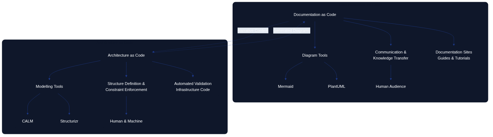

# Documentation as Code vs Architecture as Code

## Introduction

Although Documentation as Code (DaC) and Architecture as Code (AaC) share similar principles—version control, automation, and treating artefacts as code—they serve fundamentally different purposes within the software development lifecycle. Understanding these differences is essential for organisations seeking to implement both practices effectively and avoid conflating their distinct roles.

Documentation as Code focuses on capturing and communicating knowledge about systems in a maintainable, version-controlled format. Architecture as Code, by contrast, defines the actual structure, relationships, and constraints of systems in executable or enforceable formats that can drive automation and validation. This chapter explores the key distinctions between these two disciplines and examines how the choice of tooling reflects their different objectives.



*Figure 22.1 illustrates the fundamental differences between Documentation as Code and Architecture as Code, showing how each discipline serves distinct purposes in the software development ecosystem.*

## Purpose and Scope

### Documentation as Code: Communication and Knowledge Transfer

Documentation as Code treats documentation as a first-class artefact within the codebase. Its primary goal is to communicate how systems work, why certain decisions were made, and how teams should interact with the technology. Documentation answers questions such as:

- How do I configure this service?
- What are the deployment procedures?
- Why was this architectural decision made?
- How do I troubleshoot common issues?

Documentation as Code emphasises readability, accessibility, and maintainability. It targets human audiences—developers, operators, stakeholders—and focuses on narrative explanations, guides, tutorials, and reference material. The success of Documentation as Code is measured by how well it reduces onboarding time, prevents misunderstandings, and keeps information current.

### Architecture as Code: Structure and Enforcement

Architecture as Code defines the system's structure in a machine-readable format that can be validated, tested, and automated. Its primary goal is to ensure that the actual implementation matches the intended design and that architectural constraints are enforced programmatically. Architecture as Code answers questions such as:

- What components make up this system?
- How do services communicate with each other?
- Are all data flows compliant with security policies?
- Does the current infrastructure match the approved architecture?

Architecture as Code emphasises precision, executability, and verification. It targets both humans and machines, focusing on models, schemas, and definitions that can be processed by tools to generate diagrams, validate compliance, and drive infrastructure provisioning. The success of Architecture as Code is measured by how well it prevents architectural drift, enables automation, and ensures consistency between design and implementation.

## Tooling Paradigms: Modelling Tools vs Diagram Tools

The distinction between Documentation as Code and Architecture as Code becomes particularly clear when examining the tools each discipline employs.

### Modelling Tools: CALM and Structurizr

**CALM (Common Architecture Language Model)** and **Structurizr** represent the modelling tool paradigm central to Architecture as Code. These tools enable architects to define system structures in standardised, machine-readable formats.

#### CALM: Standardised Architecture Language

CALM is an open-source specification developed by the Architecture as Code community under FINOS. It provides a standardised, machine-readable format for defining software architectures through three primary components:

- **Nodes**: Individual elements such as services, databases, networks, and people
- **Relationships**: Connections, data flows, and dependencies between nodes
- **Metadata**: Compliance tags, operational data, and custom attributes

CALM's JSON-based schema makes it compatible with existing tools and enables integration into CI/CD workflows. Architecture defined in CALM can be:

- **Validated automatically**: Compliance checks run against the model to verify policy conformance
- **Visualised dynamically**: Diagrams are generated from the model, ensuring they always reflect the current architecture
- **Traced historically**: Changes to the architecture are version-controlled alongside code, providing a complete audit trail

Example CALM definition:

```json
{
  "nodes": [
    {
      "unique-id": "payment-service",
      "node-type": "service",
      "name": "Payment Service",
      "description": "Processes payment transactions"
    },
    {
      "unique-id": "payment-db",
      "node-type": "database",
      "name": "Payment Database",
      "description": "Stores payment records"
    }
  ],
  "relationships": [
    {
      "unique-id": "payment-service-db-connection",
      "relationship-type": "connects",
      "parties": ["payment-service", "payment-db"],
      "protocol": "PostgreSQL",
      "description": "Payment service connects to database"
    }
  ]
}
```

#### Structurizr: C4 Model Implementation

Structurizr provides a domain-specific language (DSL) for creating C4 models—Context, Container, Component, and Code diagrams—that describe system architecture at multiple levels of abstraction. Unlike static diagramming tools, Structurizr models are code-based definitions from which diagrams are generated automatically.

Example Structurizr DSL:

```
workspace {
    model {
        user = person "Customer"
        paymentSystem = softwareSystem "Payment System" {
            api = container "API" "REST API"
            database = container "Database" "PostgreSQL"
        }
        
        user -> api "Makes payments"
        api -> database "Reads/writes"
    }
    
    views {
        systemContext paymentSystem {
            include *
            autolayout
        }
    }
}
```

The key advantage of modelling tools like CALM and Structurizr is that the **model is the source of truth**. Diagrams, documentation, and compliance reports are all derived from the same underlying model, ensuring consistency and enabling automated validation.

### Diagram Tools: Mermaid and PlantUML

**Mermaid** and **PlantUML** represent the diagram tool paradigm often used in Documentation as Code. These tools enable the creation of diagrams through textual syntax, making diagrams version-controllable and reviewable through pull requests.

#### Mermaid: Lightweight Diagram as Code

Mermaid is a JavaScript-based diagramming tool that uses simple text syntax to create various diagram types. It is widely supported in documentation platforms, including GitHub, GitLab, and many static site generators.

Example Mermaid diagram:


Mermaid excels at quickly creating visual explanations within documentation. Its lightweight syntax makes it accessible to non-technical contributors, and its widespread integration means diagrams can be embedded directly in Markdown files without external tools.

#### PlantUML: Comprehensive UML Diagramming

PlantUML provides extensive support for UML diagrams and other technical diagrams. It uses a text-based syntax to define diagrams that are then rendered into images.

Example PlantUML sequence diagram:


PlantUML is particularly strong for detailed technical diagrams such as sequence diagrams, class diagrams, and deployment diagrams. Its comprehensive UML support makes it suitable for complex technical documentation.

#### Limitations of Diagram Tools for Architecture as Code

While diagram tools are excellent for Documentation as Code, they have significant limitations when used for Architecture as Code:

1. **Diagrams as the source of truth**: The diagram itself is the primary artefact. There is no underlying model that can be queried, validated, or used to drive automation.

2. **Limited metadata**: Diagram tools typically capture only visual relationships. They cannot easily express compliance requirements, operational constraints, or complex metadata that architectural models require.

3. **No automated validation**: Because diagrams lack the structured metadata of architectural models, they cannot be validated against policies or used to enforce architectural constraints automatically.

4. **Manual synchronisation**: When using diagram tools, keeping diagrams synchronised with actual implementation requires manual effort. There is no automatic bidirectional synchronisation between the diagram and the running system.

This book uses Mermaid for creating illustrative diagrams because its primary purpose is **documentation**—communicating concepts to readers. The diagrams are not intended to be executable architectural models but rather visual aids that support the narrative.

## Key Differences: A Comparative Framework

| Aspect | Documentation as Code | Architecture as Code |
|--------|----------------------|---------------------|
| **Primary Purpose** | Communicate knowledge and explain systems | Define structure and enforce constraints |
| **Target Audience** | Primarily humans (developers, operators, stakeholders) | Both humans and machines (tools, validators, generators) |
| **Artefact Type** | Narratives, guides, tutorials, reference material | Models, schemas, definitions, constraints |
| **Source of Truth** | Documentation files (Markdown, reStructuredText) | Architectural models (CALM, Structurizr DSL) |
| **Tool Examples** | MkDocs, GitBook, Sphinx, Jekyll | CALM, Structurizr, Terraform modules, OPA policies |
| **Diagram Tools** | Mermaid, PlantUML (for illustration) | CALM visualisers, Structurizr (generated from model) |
| **Validation Focus** | Link checking, spelling, grammar, consistency | Compliance verification, policy enforcement, drift detection |
| **Automation Outputs** | Published documentation sites, PDFs, guides | Infrastructure provisioning, compliance reports, architecture diagrams |
| **Update Frequency** | When knowledge changes or gaps are identified | When architectural decisions change or systems evolve |
| **Success Metrics** | Reduced onboarding time, fewer support questions, current information | Prevented architectural drift, automated compliance, consistency |

## The Relationship Between Documentation as Code and Architecture as Code

While distinct, Documentation as Code and Architecture as Code are complementary disciplines that reinforce each other:

### Architecture as Code Feeds Documentation as Code

Architectural models serve as a rich source of content for documentation. When architecture is defined in code, documentation can be generated automatically:

- **Automatically generated diagrams**: C4 diagrams, dependency graphs, and data flow diagrams can be produced from architectural models and embedded in documentation.
- **Component catalogues**: Lists of services, databases, and infrastructure components can be extracted from models and published as reference documentation.
- **Compliance statements**: Policy validation results from Architecture as Code can be published in documentation to demonstrate adherence to standards.

This approach ensures that architectural documentation stays synchronised with the actual architecture, reducing the risk of outdated or incorrect information.

### Documentation as Code Explains Architecture as Code

Documentation provides the narrative context that architectural models alone cannot convey:

- **Decision rationale**: Architecture Decision Records (ADRs) explain why certain architectural choices were made, providing context that models do not capture.
- **Usage guides**: Documentation explains how to work with the architecture—how to deploy services, how to add new components, how to troubleshoot issues.
- **Conceptual overviews**: High-level explanations help stakeholders understand the system's purpose and design philosophy, complementing the precise technical details in architectural models.

This narrative layer makes architectural models accessible to broader audiences and facilitates knowledge transfer across teams.

## Practical Recommendations

### When to Use Documentation as Code

Use Documentation as Code when the goal is to:

- **Explain how to use systems**: User guides, API documentation, deployment procedures
- **Capture decision context**: Architecture Decision Records, design rationale, trade-off analysis
- **Support onboarding**: Tutorials, getting-started guides, conceptual overviews
- **Maintain operational knowledge**: Runbooks, troubleshooting guides, incident response procedures

**Recommended tools**: MkDocs, Docusaurus, GitBook, Sphinx, Jekyll with Mermaid or PlantUML for illustrative diagrams.

### When to Use Architecture as Code

Use Architecture as Code when the goal is to:

- **Define system structure**: Components, services, infrastructure, and their relationships
- **Enforce architectural constraints**: Security policies, compliance rules, design principles
- **Prevent architectural drift**: Automated validation of actual implementation against intended design
- **Drive infrastructure automation**: Generate infrastructure definitions, deployment configurations, and compliance reports

**Recommended tools**: CALM for standardised architectural models, Structurizr for C4 models, Terraform/CloudFormation modules for infrastructure patterns, Open Policy Agent for policy enforcement.

### Integrating Both Disciplines

Organisations benefit most when they integrate Documentation as Code and Architecture as Code into a cohesive ecosystem:

1. **Store both in version control**: Keep architectural models and documentation in the same repository to facilitate cross-referencing and coordinated updates.

2. **Automate diagram generation**: Use architectural models to generate diagrams that are embedded in documentation, ensuring visual representations always match the model.

3. **Link documentation to models**: Reference specific architectural components in documentation, creating traceability between narrative explanations and formal definitions.

4. **Establish review processes**: Use pull requests to review both documentation updates and architectural changes, ensuring quality and consistency across both disciplines.

5. **Measure both outcomes**: Track documentation quality (readability, accuracy, usage) and architectural integrity (compliance, drift, consistency) as distinct but related metrics.

## Conclusion

Documentation as Code and Architecture as Code are complementary disciplines that serve different but equally important purposes. Documentation as Code focuses on communicating knowledge to human audiences, using tools like Mermaid and PlantUML to create illustrative diagrams embedded in narrative content. Architecture as Code focuses on defining and enforcing system structure, using modelling tools like CALM and Structurizr to create executable models that drive automation and validation.

Understanding the distinction between these disciplines enables organisations to choose the right tools for the right purposes. Diagram tools excel at creating visual explanations within documentation but lack the structured metadata and validation capabilities required for architectural enforcement. Modelling tools provide the precision and executability needed for Architecture as Code but require more investment in tooling and expertise.

By integrating both disciplines—using Architecture as Code to define the system and Documentation as Code to explain it—organisations create a comprehensive knowledge ecosystem where automated validation ensures consistency and narrative context enables understanding. The result is a system where architectural integrity is maintained programmatically while human knowledge is preserved and communicated effectively.

## Sources

- FINOS. "CALM: Common Architecture Language Model." FINOS Architecture as Code Community, 2024. https://calm.finos.org/
- Brown, Simon. "The C4 Model for Visualising Software Architecture." C4 Model Documentation, 2024. https://c4model.com/
- Structurizr. "Structurizr DSL Language Reference." Structurizr Documentation, 2024. https://structurizr.com/
- Mermaid. "Mermaid: Diagramming and Charting Tool." Mermaid Documentation, 2024. https://mermaid.js.org/
- PlantUML. "PlantUML: Open-source Tool for Creating UML Diagrams." PlantUML Documentation, 2024. https://plantuml.com/
- Open Policy Agent. "Policy as Code: Expressing Requirements as Code." CNCF OPA Project, 2024.
- Richardson, Chris. "Microservices Patterns: With Examples in Java." Manning Publications, 2018.
- Ford, Neal, et al. "Building Evolutionary Architectures." O'Reilly Media, 2017.
