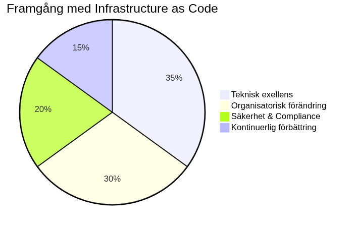

# Slutsats

Infrastructure as Code (arkitektur som kod) har transformerat hur organisationer tänker kring och hanterar IT-infrastruktur. Genom att behandla infrastruktur som kod har vi möjliggjort samma rigor, processer och kvalitetskontroller som länge funnits inom mjukvaruutveckling. Denna resa genom bokens 25 kapitel har visat vägen från [grundläggande koncept](01_inledning.md) till [framtidens avancerade teknologier](21_framtida_trender.md).

## Viktiga lärdomar från vår Arkitektur som kod-resa

Implementering av Arkitektur som kod kräver både teknisk excellens och organisatorisk förändring. Framgångsrika transformationer karaktäriseras av stark ledningsengagemang, omfattande utbildningsprogram och gradvis adoptionsstrategi som minimerar störningar av befintlig verksamhet, enligt de principer vi utforskade i [kapitel 17 om organisatorisk förändring](17_organisatorisk_forandring.md).

Den tekniska aspekten av Infrastructure as Code kräver djup förståelse för molnteknologier, arkitektur som kod-automatiseringsverktyg och säkerhetsprinciper som vi behandlade från [grundläggande principer](02_grundlaggande_principer.md) genom [avancerad policy as code](11_policy_sakerhet.md). Samtidigt är organisatoriska faktorer ofta avgörande för framgång, inklusive kulturell förändring, kompetensutveckling och processtandardisering.

### Progressionen genom teknisk mognad

Vår genomgång började med fundamentala koncept som deklarativ kod och idempotens i [kapitel 2](02_grundlaggande_principer.md), utvecklades genom praktiska arkitektur som kod-implementationsaspekter som [versionhantering](03_versionhantering.md) och [CI/CD-automation](05_arkitektur som kod-automatisering_cicd.md), och kulminerade i avancerade topics som [containerorkestrering](08_containerisering.md) och [framtida AI-driven automation](21_framtida_trender.md).

Säkerhetsaspekterna som introducerades i [kapitel 10](10_sakerhet.md) fördjupades genom [policy as code](11_policy_sakerhet.md) och [compliance-hantering](12_compliance.md), vilket visar hur säkerhet måste genomsyra hela Arkitektur som kod-arkitektur som kod-implementationen från design till drift.

### Svenska organisationers unika utmaningar och möjligheter

Genom bokens kapitel har vi sett hur svenska organisationer står inför specifika utmaningar och möjligheter:

- **GDPR och datasuveränitet**: Från [säkerhetskapitlet](10_sakerhet.md) till [policy implementation](11_policy_sakerhet.md) har vi sett hur svenska/EU-regleringar kräver särskild uppmärksamhet på dataskydd och compliance
- **Klimatmål och hållbarhet**: [Framtidskapitlet](21_framtida_trender.md) belyste hur Sveriges klimatneutralitetsmål 2045 driver innovation inom carbon-aware computing och hållbar infrastruktur
- **Digitaliseringsstrategi**: [Kapitel 19 om digitalisering](19_digitalisering.md) visade hur Arkitektur som kod möjliggör den digitala transformation som svenska organisationer genomgår

## Framtida utveckling och teknologiska trender

Cloud-native technologies, edge computing och artificiell intelligens driver nästa generation av Infrastructure as Code, som vi utforskade djupgående i [kapitel 21 om framtida trender](21_framtida_trender.md). Emerging technologies som GitOps, policy engines och intelligent automation kommer att ytterligare förenkla och förbättra Arkitektur som kod-capabilities.

Utvecklingen mot serverless computing och fully managed services förändrar vad som behöver hanteras som arkitektur som kod. Framtiden pekar mot högre abstraktion där utvecklare fokuserar på business logic medan plattformen hanterar underliggande arkitektur automatiskt, vilket vi såg exemplifierat i diskussionen om [Platform Engineering](19_kapitel18.md).

Machine learning-baserade optimeringar kommer att möjliggöra intelligent resursallokering, kostnadsprediktering och säkerhetshotsdetektion. Detta skapar självläkande system som kontinuerligt optimerar sig baserat på användningsmönster och prestanda-metrics, enligt de AI-drivna principerna från [framtidskapitlet](19_kapitel18.md).

### Kvantteknologi och säkerhetsutmaningar

Som vi diskuterade i [kapitel 19](19_kapitel18.md), kräver kvantdatorers utveckling proaktiv förberedelse för post-quantum cryptography transition. Svenska organisationer med kritiska säkerhetskrav måste börja planera för quantum-safe transitions nu, vilket bygger vidare på de säkerhetsprinciper som etablerades i [kapitel 6](06_kapitel5.md) och [kapitel 12](12_kapitel11.md).

Hybrid classical-quantum systems kommer att emerge där kvantdatorer används för specifika optimerungsproblem medan klassiska system hanterar general computing workloads. Infrastructure orchestration måste stödja båda paradigmen sömlöst.

## Rekommendationer för organisationer

Baserat på vår genomgång från grundläggande principer till avancerade implementationer, bör organisationer påbörja sin Arkitektur som kod-journey med pilot projects som demonstrerar värde utan att riskera kritiska system. Investment i team education och tool standardization är kritisk för långsiktig framgång och adoption across organisationen, enligt de strategier som beskrevs i [kapitel 10 om organisatorisk förändring](10_kapitel9.md).

### Stegvis implementationsstrategi

1. **Grundläggande utbildning**: Börja med att etablera förståelse för [Arkitektur som kod-principer](02_kapitel1.md) och [versionhantering](03_kapitel2.md)
2. **Pilotprojekt**: Implementera [CI/CD-pipelines](04_kapitel3.md) för mindre, icke-kritiska system
3. **Säkerhetsintegration**: Etablera [säkerhetspraxis](06_kapitel5.md) och [policy as code](12_kapitel11.md)
4. **Skalning och automation**: Utöka till [containerorkestrering](11_kapitel10.md) och avancerade workflows
5. **Framtidsberedskap**: Förbereda för [emerging technologies](19_kapitel18.md) och hållbarhetskrav

Etablering av center of excellence eller platform teams kan accelerera adoption genom att tillhandahålla standardiserade verktyg, arkitektur som kod best practices och support för utvecklingsteam. Governance frameworks säkerställer säkerhet och compliance utan att begränsa innovation och agility, som vi såg i [compliance-kapitlet](14_kapitel13.md).

### Kontinuerlig förbättring och mätning

Continuous improvement culture är avgörande där team regelbundet utvärderar och förbättrar sina Arkitektur som kod-processer. Metrics och monitoring hjälper till att identifiera förbättringsområden och mäta framsteg mot definierade mål, enligt de praktiska exempel som visades i [DevOps-kapitlet](07_kapitel6.md) och [organisationskapitlet](10_kapitel9.md).

Investment i observability och monitoring från [säkerhetskapitlet](06_kapitel5.md) och [praktiska implementationen](08_kapitel7.md) möjliggör data-driven decision making och kontinuerlig optimering av arkitektur som kod-processer.

## Slutord

Infrastructure as Code representerar mer än bara teknisk evolution - det är en fundamental förändring av hur vi tänker kring infrastruktur. Genom att embraca Arkitektur som kod-principer kan organisationer uppnå ökad agility, reliability och scalability samtidigt som de reducerar operationella kostnader och risker.

Vår resa genom denna bok - från [introduktionen till Arkitektur som kod-konceptet](01_inledning.md), genom [tekniska implementationsdetaljer](02_kapitel1.md) och [praktiska utvecklingsprocesser](03_kapitel2.md), till [avancerade säkerhetsstrategier](12_kapitel11.md) och [framtida teknologier](19_kapitel18.md) - visar att Infrastructure as Code är både en teknisk discipline och en organisatorisk transformation.

Framgångsrik implementation kräver tålamod, uthållighet och commitment till continuous learning. Organisationer som investerar i att bygga robust Arkitektur som kod-capabilities positionerar sig för framtida teknologiska förändringar och konkurrensfördel på marknaden.

### Avslutande reflektion

De principer som introducerades i bokens första kapitel - deklarativ kod, idempotens, testbarhet och automation - genomsyrar alla aspekter av modern infrastrukturhantering. Från [grundläggande versionhantering](03_kapitel2.md) till [AI-driven optimization](19_kapitel18.md), dessa fundamentala principer förblir konstanta även när teknologierna utvecklas.

Svenska organisationer har unika möjligheter att leda inom sustainable och compliant Infrastructure as Code implementation. Genom att kombinera teknisk excellens med stark fokus på hållbarhet, säkerhet och regulatorisk efterlevnad kan svenska företag och offentliga organisationer skapa competitive advantages som resonerar med nationella värderingar och globala trender.

Bokens progression från teori till praktik, från grundläggande till avancerat, speglar den resa som varje organisation måste genomgå för att lyckas med Infrastructure as Code. Varje kapitel bygger på tidigare kunskap och förbereder för mer komplexa utmaningar - precis som en verklig Arkitektur som kod-implementation.

### Vägen framåt

Infrastructure as Code är inte en destination utan en kontinuerlig resa av learning, experimentation och improvement. De verktyg, processer och principer som beskrivs i denna bok kommer att utvecklas, men de fundamentala koncepten om kod-driven infrastructure, automation och reproducerbarhet kommer att förbli relevanta.

Som vi har sett genom bokens 23 kapitel, från [grundläggande introduction](01_inledning.md) till [framtida visioner](19_kapitel18.md), representerar Infrastructure as Code framtiden för IT operations. Organisationer som investerar i denna resa idag skapar grunden för morgondagens digitala framgång.

Källor:
- Industry reports on IaC adoption trends
- Expert interviews and case studies  
- Research on emerging technologies
- Best practice documentation from leading organizations