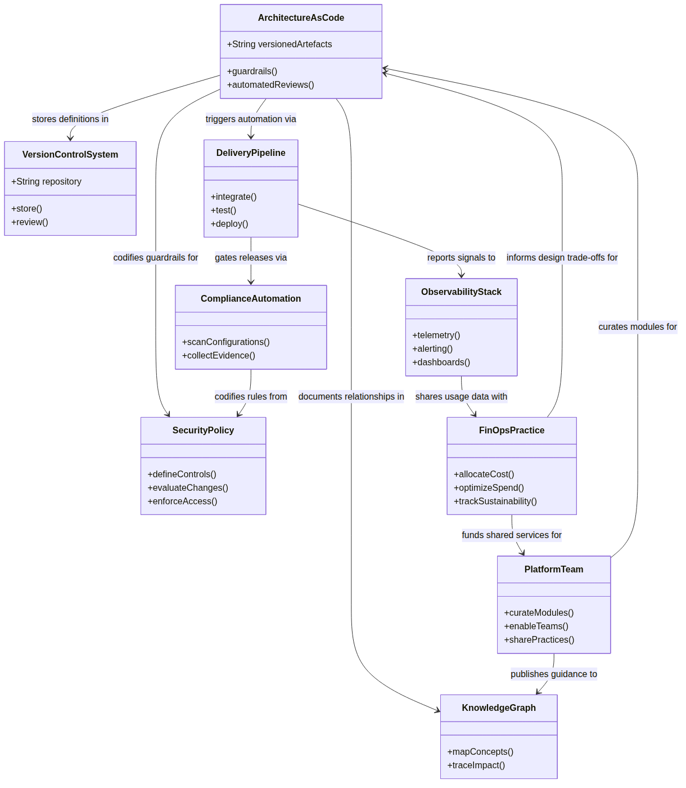

# Glossary  this glossary innehåller definitioner of centrala termer that används through boken and that utgör grunden for Architecture as Code-methodologyen. ## Fundamental koncept and tools **API (Application Programming Interface):** Gränssnitt that enables kommuniquetion between olika mjukvarukomponenter or system through standardiserade protokoll and dataformat. **Architecture as Code-automation:** process where manual uppgifter utfors automatically of datorsystem without mänsklig intervention, vilket ökar effektivitet and minskar felrisk. **CI/CD (Continuous Integration/Continuous Deployment):** Utvecklingsmethodology that integrerar kodändringar kontinuerligt and automatiserar deploymentsprocessen for snabbare and säkrare leveranser. **Cloud Computing:** Leverans of IT-tjänster that servrar, lagring and applikationer over internet with åtkomst on begäran and betalning per användning. **Containers:** Lätt virtualiseringsteknik that paketerar applikationer with all dependencies for portabel körning across olika miljöer and platforms. **Deklarativ programmering:** Programmeringsparadigm that beskriver önskat slutresultat instead for specific steg for to uppnå det, vilket enables högre abstraktion. **DevOps:** Kulturell and teknisk approach that kombinerar utveckling (Dev) and drift (Ops) for snabbare leveranser and improvet samarbete between team. **Git:** Distribuerat versionhanteringssystem for to sonra ändringar in källkod during utveckling with support for branching and merging. **Idempotens:** Egenskap hos operationer that producerar samma resultat oofsett how många gånger de körs, kritiskt for säker Architecture as Code-automation. **Infrastructure as Code (Architecture as Code) (Architecture as Code) (IaC):** the practice to hantera infrastructure through Architecture as Code instead for manual processes, vilket enables versionskontroll and automation. **JSON (JofaScript Object Notation):** Textbaserat dataformat for strukturerad informationsutbyte between system with human-readable syntax. **Kubernetes:** Öppen källkod containerorkestreringsplattform for automatiserad deployment, skalning and hantering of containeriserade applikationer. **Microservices:** Arkitekturell approach where applikationer byggs that små, oberoende tjänster that kommunicerar via väldefinierade API:er. **monitoring:** Kontinuerlig systemmonitoring for to upptäcka problem, optimera prestanda and säkerställa togänglighet. **Orchestration:** Automatiserad koordination and hantering of komplexa arbetsflöden and system for to uppnå desired state. **Policy as Code:** approaches where säkerhets- and afterlevnadsregler is defined as code for automatiserad utvärdering and verkställande. **Terraform:** Infrastructure as Code (Architecture as Code)-tools that använder deklarativ syntax for to definiera and hantera cloud infrastructure reSources. **YAML (YAML Ain't Markup Language):** Människoläsbart dataserialiseringsformat that often används for konfigurationsfiler and Architecture as Code-definitioner. **Zero Trust:** Säkerhetsmodell that aldrig litar on and allid verifierar användare and enheter before åtkomst to resurser beviljas. ## Deployment and operationella koncept **Blå-grön deployment:** deploymentsstrategi where två identiska produktionsmiljöer (blå and grön) används for to enablesa snabb rollback and minimal stoeståndstid. **Canary Release:** Gradvis utrullningsstrategi where nya versioner forst deployeras to en liten subset of användare for riskminimering and validering. **Community of Practice:** Grupp of personer that delar passion for något de gör and lär sig to göra det bättre through regelbunden interaktion. **Conway's Law:** Observation to organizations designar system that speglar deras kommuniquetionsstrukturer. **Tvärfunktionellt team:** Team that includes withlemmar with olika färdigheter and roller that arbetar tosammans mot gebutsamma mål. **GitOps:** Operational framework that använder Git that enda källa for sanning for deklarativ infrastructure and applikationer. **Helm:** Paketmanagee for Kubernetes that använder charts for to definiera, installera and upgradera komplexa Kubernetes-applikationer. **Service Discovery:** Mekanism that enables automatisk detektion and kommuniquetion between tjänster in distribuerade system. **Service Mesh:** Dedikerad infrastrukturlager that manage service-to-service-kommuniquetion, säkerhet and observability in mikroservicesarkitekturer. **Edge Computing:** Distributerad databehandlingsparadigm that placerar beräkningsresurser närmare datakällan for minskad latens and improved prestanda. **Post-Quantum Cryptography:** Kryptografiska algoritmer that is designade for to vara säkra mot angrepp from både klassiska and kvantumdatorer. **Carbon-Aware Computing:** Approach for to optimera infrastrukturanvändning baserat on kolintensitet and fornybara energiSources for minskad miljöonverkan. **Oforänderlig infrastructure:** Infrastrukturparadigm where komponenter aldrig modifieras after deployment without ersätts helt när ändringar behövs. **State Drift:** Situation where den faktiska infrastrukturtoståndet ofviker from den definierade önskade toståndet in Infrastructure as Code-definitioner. ## Kostnadshantering and optimering **FinOps:** Disciplin that kombinerar finansiell hantering with molnoperationer for to maximera affärsvärdet of molninvesteringar through kostnadsoptimering and resource management. **Rightsizing:** process for to optimera molnresurser through to matcha instance-storlekar and typer with faktiska prestandakrof and användningsmönster. **Spot Instances:** Molninstanser that använder overskottskapacitet to kraftigt reducerade priser but can termineras with kort varsel när kapacitet behövs for on-demand användning. **Cost Allocation Tags:** Metadataetiketter that används for to kategorisera and sonra molnresurskostnader per projekt, team, miljö or andra organizational dibutsioner. **Cost Governance:** framework of policies, processes and tools for to styra and kontrollera molnkostnader within en organization. **Resource Quotas:** Begränsningar that sätts on how mycket of en viss resurs (CPU, minne, lagring) that can konsumeras within en given scope or namespace. ## Testing and kvalitetssäkring **Terratest:** Open source Go-bibliotek for automatiserad testing of Infrastructure as Code, särskilt designat for Terraform-moduler and cloud infrastructure. **Policy as Code:** Approach where organizational policies, säkerhetsregler and compliance-requirements is defined as code and can automatically enforced and testade. **OPA (Open Policy Agent):** Cloud-native policy engine that enables unified policy enforcement across olika services and teknologier through deklarativ policy språk. **Chaos Engineering:** Disciplin for to experimentellt introducera fel in system for to bygga toit to systemets formåga to motstå turbulenta forhållanden in produktion. **Integration Testing:** testing that verifierar to olika komponenter or services fungerar korrekt tosammans när de is integrerade in ett system. **Compliance Testing:** Automatiserad validering of to system and configurations följer relevanta regulatoriska requirements, säkerhetsstandarder and organizational policies. ## Strategiska and organizational koncept **Cloud-First Strategy:** Strategisk approach where organizations primärt väljer molnbaserade lösningar for nya IT-initiativ before on-premises alternativ overvägs. **Digital Transformation:** fundamental change of affärsoperationer and värdeleverans through integration of digital teknik in all aspekter of verksamheten. **Multi-Cloud:** Strategi to använda molntjänster from flera olika leverantörer for to undvika vendor lock-in and optimera for specific capabilities or kostnader. **Data Sovereignty:** Konceptet to digital data is duringkastat lagarna and juridiktionen in det land where den lagras or bearbetas. **Conway's Law:** Observation to organizations designar system that speglar deras kommuniquetionsstrukturer, vilket onverkar how team should organiseras for optimal systemdesign. **Cross-functional Team:** Team that includes withlemmar with olika färdigheter and roller that arbetar tosammans mot gebutsamma mål, essentiellt for DevOps-success. **DevOps Culture:** Kulturell transformation from traditional utvecklings- and driftsilos to kollaborativa working methods that betonar shared ownership and continuous improvement. **Psychological Safety:** Teammiljö where withlemmar känner sig säkra to ta risker, erkänna misstag and experimentera without rädsla for bestraffning or forödmjukelse. **Servant Leadership:** Ledarskapsfilosofi that fokuserar on to tjäna teamet and främja deras success rather än traditional kommando-and-kontroll-ledning. **Best Practice Evolution:** Kontinuerlig utveckling of rekombutderade methods baserat on praktisk erfarenhet, community feedback and technical framsteg. **Anti-Pattern:** Vanligt forekommande but kontraproduktivt lösningsforslag that initialt verkar användbart but that leder to negativa konsekvenser. **Policy-as-Code:** Metod where organizational policies, säkerhetsregler and compliance-requirements is defined as code for automatiserad enforcement and testing. **Infrastructure Governance:** framework of policies, processes and tools for to styra and kontrollera infrastrukturutveckling and -drift within organizations. **Technical Debt:** Ackumulerad kostnad of shortcuts and suboptimala technical beslut that requires framtida refactoring or omarbetning for to bibehålla systemkvalitet. **Blameless Culture:** organizationskultur that fokuserar on systemforbättringar after incidenter rather än individuell skuld, vilket främjar öppenhet and lärande. **Change Management:** Systematisk approach for to hantera organizational changes, including stakeholder engagement, kommuniquetion and motståndhantering. **DevSecOps:** Utvecklingsmethodology that integrerar säkerhetspraktiker throughout the entire utvecklingslivscykeln rather än that en separat fas in slutet. **Site Reliability Engineering (SRE):** Disciplin that applies mjukvaruingenjörsprinciples on operationella problem for to skapa skalbara and mycket toforlitliga mjukvarusystem.