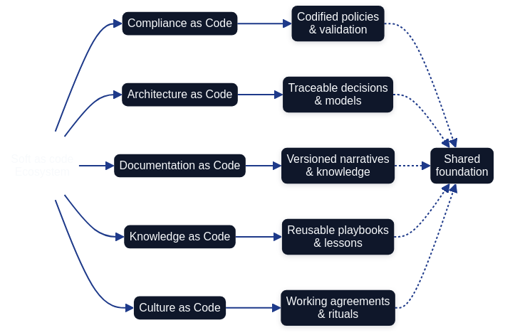
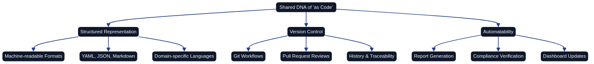
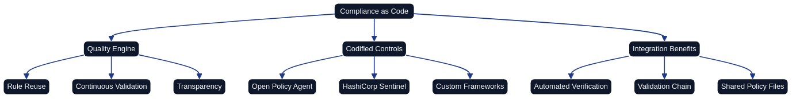
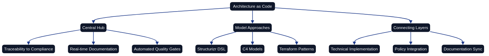
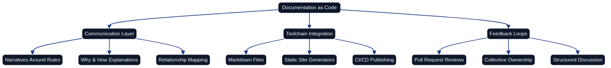
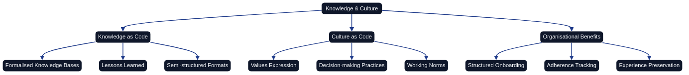
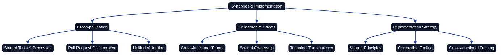

# The Interplay Between Soft "as code" Disciplines {#soft-as-code-interplay}

## Introduction

For years, the phrase "as code" has been tightly associated with hard, technically defined artifacts such as infrastructure, pipelines, and configurations. In recent years the same operating model has entered the softer domains of an organisation. When we speak about compliance as code, architecture as code, documentation as code, knowledge as code, and culture as code, we point to the same underlying ambition: describing complex, often human-dependent processes in machine-readable, version-controlled, and executable formats. This chapter explores how the disciplines overlap, the synergies they create, and how organisations can benefit from their combined strength.

## Learning Objectives

By the end of this chapter, you will be able to:

- Describe the shared DNA—structured representation, version control, and automatability—that unifies all soft 'as Code' disciplines.
- Explain how Compliance as Code acts as a quality engine by providing continuous validation across architectural and documentation artefacts.
- Demonstrate how Architecture as Code serves as the central hub connecting technical implementation with policy and documentation layers.
- Recognise how Knowledge as Code and Culture as Code preserve organisational memory through version-controlled knowledge registries and team-norm files.
- Identify the practical synergies generated when multiple soft 'as Code' disciplines are combined within a single toolchain.
- Apply adoption strategies—including shared principles, compatible tooling, and cross-functional training—to plan an incremental soft 'as Code' programme.



The following mind maps illustrate the key concepts and relationships within the soft "as code" ecosystem. They visualise how the different disciplines connect through their shared DNA, each playing distinct roles while reinforcing one another to create organisational synergies.



*Figure 23.1 shows the foundational elements shared across all "as code" disciplines: structured representation, version control, and automatability.*



*Figure 23.2 illustrates how compliance as code provides quality engines, codified controls, and integration benefits.*



*Figure 23.3 demonstrates Architecture as Code serving as the central hub connecting technical implementation, policy, and documentation.*



*Figure 23.4 shows documentation as code providing communication layers, toolchain integration, and feedback loops.*



*Figure 23.5 presents how knowledge and culture can be codified to enable structured onboarding and experience preservation.*



*Figure 23.6 highlights the synergies created through cross-pollination and the implementation strategy for adopting these practices.*

**Key takeaways from the mind map:**

- **One toolchain, many disciplines:** Because every soft 'as Code' practice stores artefacts in Git and runs through CI/CD, lawyers reviewing a policy change and architects merging a CALM schema update are working in the same pull-request workflow—removing the translation layer that usually separates these communities.
- **Compliance as Code raises the floor for all other disciplines:** The chapter shows how a single policy change propagates automatically to flag non-compliant architectural components and regenerate relevant documentation sections, turning what was once a manual audit into a continuous background check.
- **Architecture as Code's hub role creates real traceability:** Rather than relying on documentation that describes an architecture from memory, teams can link commit hashes, policy identifiers, and issue numbers directly to infrastructure definitions, giving incident investigators an unambiguous chain of evidence.
- **Knowledge and Culture as Code move norms from tribal memory to version history:** The chapter demonstrates this with a `team-norms.yaml` example in which working agreements, review expectations, and cultural principles are tracked through pull requests—making it possible to audit when a norm changed and why.
- **Cross-disciplinary synergies compound over time:** The chapter's two scenarios—a policy change and a new product launch—illustrate how each discipline accelerates the others: faster compliance feedback shortens architecture review cycles, which in turn keeps documentation current with less manual effort.
- **Adoption requires deliberate strategy, not just tooling:** The chapter's five-step adoption guide emphasises that shared principles, compatible tooling choices, and cross-functional training matter more than the specific tools chosen, and that an iterative pilot approach reduces the risk of overwhelming teams with simultaneous change.

This visualisation reinforces the chapter's central message: soft "as code" disciplines compound their value when combined rather than deployed in isolation, creating an ecosystem where human creativity is amplified by the precision and reliability of code.

## A Shared DNA

Even though the disciplines address different problem spaces, they share a common DNA. The goal is to take soft artifacts—policies, architectural principles, design descriptions, documentation, governance models—and convert them into:

1. **Structured representation.** Machine-readable formats such as YAML, JSON, Markdown, domain-specific languages, or models within code libraries make it possible to validate, test, and connect information to automation.
2. **Version control.** Git or similar systems provide history, traceability, and the ability to collaborate through pull requests, code reviews, and release processes.
3. **Automatability.** When soft artifacts are expressed as code they can feed tools that generate reports, verify compliance, update dashboards, or trigger workflows.

This combination opens the door to a shared way of working across disciplines. Once an organisation has established a culture of version control, code review, and automated testing, it becomes natural to let compliance rules, architectural guidelines, and documentation structures live in the same ecosystem.

## Compliance as Code as the Quality Engine

Compliance as code focuses on translating regulations, standards, and internal policies into codified controls. Tools such as Open Policy Agent, HashiCorp Sentinel, or custom rule frameworks can ingest policy definitions and evaluate them against system configurations, CI/CD pipelines, or infrastructure definitions. When the discipline is connected to other soft areas several effects emerge:

- **Rule reuse.** Documentation and architectural principles can directly reference policy definitions, reducing the risk of diverging interpretations. An architect writing a blueprint can link to the same policy files the security team uses in their controls.
- **Continuous validation.** Documentation as code makes it possible to describe which controls exist and how they are executed, while automations from Architecture as Code can trigger compliance checks for every change. The result is an unbroken chain between intent and verification.
- **Transparency and education.** When the rule set is versioned and open to inspection, teams can teach themselves what is required. Pull requests on policy code become educational moments where lawyers, security experts, and developers meet and explain their reasoning.

Compliance as code thus becomes a quality engine that reinforces the other disciplines. When architectural or documentation artifacts are updated, automated controls can ensure that changes still fall within approved boundaries. If a rule changes, the update propagates to every system that uses it—from architectural diagrams to external reports.

Practical tools such as the [Governance and Security Controls as Code Backlog](11_governance_as_code.md#governance-and-security-controls-as-code-backlog) show how this quality engine manifests in day-to-day delivery. Each backlog item ties policy definitions to Terraform modules, documentation updates, and evidence packs, helping teams demonstrate that soft "as code" practices have tangible outputs and measurable coverage.

## Architecture as Code as the Hub

Architecture as Code means expressing architectural decisions, reference architectures, and target architectures in code. This might take the form of models in DSLs such as Structurizr, C4 models generated from Markdown, or Terraform/CloudFormation modules representing architectural patterns. Once the architecture exists in code, a natural hub for the other disciplines emerges:

- **Traceability to compliance.** The architecture can reference compliance rules that explain why a given pattern must include logging, encryption, or redundancy. By linking to rule definitions it becomes clear how design decisions support adherence.
- **Real-time documentation.** Documentation as code can be generated directly from architectural models and provide up-to-date manuals, diagrams, and guides. Documentation stays in sync with the "living" architecture.
- **Automated quality gates.** When architectural models are versioned, compliance and quality checks can run automatically before an architectural change is approved. This offers objective support for architecture boards and decision forums.

The hub metaphor holds: Architecture as Code connects technical implementations with policy and documentation layers. Dialogue across expert roles becomes easier when everyone looks at the same source of truth.

## Documentation as Code as the Communication Layer

Documentation as code is about writing, storing, and publishing documentation with the same toolchain used for other code. Markdown files are versioned in Git, generated via static site generators, and distributed through CI/CD pipelines. In the interplay between soft "as code" disciplines, documentation as code is the glue that binds the ecosystem together:

- **Narratives around rules and architecture.** Documentation does not only describe "how" but also "why." By referencing compliance rules and architectural models, documentation explains the relationships and helps teams understand the bigger picture.
- **Self-service.** When documentation is easily accessible and up to date, teams can find answers themselves. That reduces the need for manual handovers and accelerates onboarding.
- **Feedback loops.** Pull requests on documentation create space for review, discussion, and improvement. Knowledge no longer gets stuck with a single individual; it becomes collectively owned.

Documentation as code also acts as a layer of visibility. Architectural principles, compliance rules, and process descriptions become transparent and can be discussed in a structured way. Learning and improvement are therefore strengthened across the organisation.

## Knowledge as Code and Culture as Code

To capture the full spectrum of soft artefacts we can also include knowledge as code and culture as code. Knowledge as code formalises knowledge bases and lessons learned in code or semi-structured formats, while culture as code expresses values, decision-making practices, and ways of working in versioned playbooks. When experiences, norms, and policies can be linked to architectural models and documentation, insights become reusable, tracking adherence to working norms becomes easier, and onboarding grows more structured. The organisation can iterate quickly while still preserving its experience and values.

### Culture as Code in Practice

Culture as code moves team agreements and working norms out of slide decks and corridor conversations into version-controlled files that are reviewed, debated, and updated just like any other artefact. A simple `team-norms.yaml` file can make this concrete:

```yaml
# team-norms.yaml
# Version-controlled team agreements for the Platform Engineering team
# Last reviewed: 2026-03-01
# Owners: platform-engineering@example.org

team_name: Platform Engineering
version: "2.4"

working_agreements:
  pull_requests:
    review_sla_hours: 24
    required_reviewers: 2
    self_merge_allowed: false
    draft_pr_encouraged: true
  communication:
    async_first: true
    response_sla_hours: 8
    meeting_free_days: ["Wednesday"]
  on_call:
    rotation_cadence: weekly
    handover_format: "structured_runbook"

cultural_principles:
  - id: CP-01
    principle: "Blameless post-mortems"
    description: >
      Incidents are learning opportunities. Root-cause analysis focuses on
      systemic factors, not individual blame. Action items target tooling,
      processes, and documentation—not people.
  - id: CP-02
    principle: "Document decisions, not just outcomes"
    description: >
      Every significant architectural or process decision is recorded as an ADR
      or a pull-request description so that future team members understand
      the context, not just the conclusion.
  - id: CP-03
    principle: "Psychological safety over speed"
    description: >
      Team members are encouraged to raise concerns, propose experiments, and
      admit uncertainty without fear of judgement. A culture of openness
      produces better long-term outcomes than one optimised for short-term velocity.

onboarding_checklist:
  - "Read and acknowledge team-norms.yaml"
  - "Complete Architecture as Code learning path"
  - "Shadow one on-call rotation before taking primary"
  - "Open a pull request to propose at least one improvement to this file"
```

Storing `team-norms.yaml` in Git means that every change is traceable. A pull request to adjust the review SLA records who proposed the change, what the discussion looked like, and when the new norm took effect. Onboarding engineers can read the commit history to understand how the team's culture has evolved—context that would otherwise live only in the memories of long-serving colleagues.

### Knowledge as Code in Practice

Knowledge as code applies the same principle to the organisation's accumulated expertise. Rather than relying on wikis that drift out of date or institutional memory that walks out the door when people leave, structured knowledge registries make lessons and patterns queryable, linkable, and automatically validated.

One approach uses a YAML-based knowledge registry alongside a Git-hosted knowledge graph tool such as Obsidian with Git synchronisation:

```yaml
# knowledge-registry/lessons-learned/LL-0042.yaml
id: LL-0042
title: "Multi-region Terraform state locking failures under concurrent pipelines"
status: active
tags: [terraform, state-management, multi-region, concurrency]
related_adrs: [ADR-0017, ADR-0031]
related_chapters: ["03_version_control.md", "14_practical_implementation.md"]

problem: >
  When three or more concurrent pipeline runs targeted the same Terraform
  state bucket, DynamoDB lock contention caused random failures with
  LockTimeoutError. The issue was intermittent and difficult to reproduce
  in lower environments with fewer concurrent runners.

root_cause: >
  The DynamoDB lock table was provisioned with default read/write capacity
  units insufficient for more than two simultaneous lock requests.
  Auto-scaling was not enabled.

resolution: >
  Enable DynamoDB auto-scaling on the lock table, set a minimum of 5
  read/write capacity units, and add exponential back-off retry logic
  to the Terraform wrapper script. See the updated module in
  shared-modules/terraform-state-backend v2.3.0.

prevention:
  - checklist_item: "Verify DynamoDB auto-scaling is enabled for all state lock tables"
  - checklist_item: "Load-test state locking with simulated concurrent pipelines before go-live"

contributors:
  - name: "Ana Rodrigues"
    role: "Platform Engineer"
  - name: "Kai Lindström"
    role: "SRE"

created: "2025-09-14"
last_updated: "2026-01-07"
```

This structured format allows CI pipelines to validate that every lesson has the required fields, link-checking scripts to verify that referenced ADRs and chapter files exist, and search tools to surface relevant lessons when engineers encounter similar error messages. When combined with Architecture as Code, the knowledge registry becomes a living index of hard-won experience that teams can query as they design new systems.

## Synergies and Cross-Pollination

Introducing several soft "as code" disciplines in parallel generates effects that exceed the value of any single initiative. Shared tools and processes turn pull requests into meeting places for architects, developers, lawyers, and communicators, and the same pipelines can validate code, policy, and documentation. Traceability improves when commit hashes, issues, and policy identifiers are cross-linked, giving revisions and incident investigations a clear history. Pace and appetite for experimentation increase because soft artifacts can be updated as fast as code while automated controls temper risk. Cross-functional collaborations emerge where legal experts learn technical details and developers appreciate the rationale behind regulations, creating shared ownership of the whole system.

## Challenges and Counterforces

The interplay between soft "as code" disciplines generates real value, but it is also demanding. Common challenges include:

- **Differences in terminology and mindset.** Lawyers, architects, and documentation specialists use different vocabularies, which requires translation and extra onboarding.
- **Tooling barriers.** Not everyone is comfortable with Git, pull requests, or CI/CD, so training is needed to avoid creating new hierarchies.
- **Automation debt.** Codified rules do not capture every interpretation, so manual controls and clear governance remain necessary.
- **Information overload.** When everything is versioned and logged, metadata and structure are required to keep information navigable.

By addressing these challenges openly, investing in joint training initiatives, and establishing clear roles, organisations can maximise the value of the interplay.

## Practical Applications

To make the interplay more tangible, consider a few practical scenarios:

### Scenario 1: Policy Change

The compliance team updates a data retention rule in code, after which the architectural models flag components lacking encryption. Documentation as code generates a new section about the requirement, and dashboards notify teams so remedial actions can be planned without delay.

### Scenario 2: New Product Launch

A new product is defined as code, which simultaneously creates diagrams and triggers compliance checks in CI/CD. Documentation is enriched with onboarding guides and API descriptions, while the knowledge base links to lessons learned from earlier launches.

These scenarios illustrate how the interplay creates a dynamic chain in which each discipline amplifies the others.

## Strategies for Adoption

Organisations seeking to establish a cohesive ecosystem of soft "as code" disciplines can follow these strategies:

1. **Start with shared principles.** Clarify the objectives of the initiative and the outcomes it should deliver.
2. **Choose compatible tools.** Ensure that compliance, architecture, and documentation tooling can integrate and share version control.
3. **Invest in cross-functional training.** Teach lawyers Git, help architects understand policy DSLs, and make documentation specialists comfortable with automated publishing.
4. **Build iteratively.** Begin with a pilot area and measure effects such as time savings or improved audit readiness.
5. **Establish governance.** Define roles for code owners and review processes as well as forums for discussing policy and architecture changes.

## Future Perspectives

Technologies such as AI and semantic search engines expand the potential of soft "as code" disciplines. By combining codified regulations with language models, organisations can receive real-time advice, automated explanations, and proactive recommendations. Architecture as Code can be connected to simulations that reveal the impact of design decisions before implementation, and documentation can be generated dynamically.

At the same time, data governance, security, and ethics become even more important. The more of an organisation’s soft fabric that is codified, the greater the demands on access control, privacy protection, and accountability.

## Conclusion

The interplay between soft "as code" disciplines is about building an ecosystem where compliance, architecture, documentation, knowledge, and culture move in unison. By applying the same tools, processes, and mindset to these artifacts as to traditional code, organisations become adaptive, transparent, and continuously learning. Compliance as code operates as the quality engine, architecture as code serves as the hub, documentation as code forms the communication layer, and knowledge/culture as code act as the collective memory and compass.

When these disciplines integrate, change ceases to be a threat and becomes a natural part of daily work. Teams can adapt rapidly to new requirements, experiment with new ideas, and still maintain a stable core of shared principles. The result is an organisation that dares to combine softness and structure—where human creativity is supported by the precision of code.

## Sources

1. **Open Policy Agent (2024).** *Policy as Code Overview.* CNCF OPA Project. [Source [10]](33_references.md#source-10)
2. **HashiCorp.** *Policy as Code Overview.* HashiCorp Developer Documentation. [https://developer.hashicorp.com/terraform/enterprise/policy-as-code](https://developer.hashicorp.com/terraform/enterprise/policy-as-code)
3. **GitHub Docs (2024).** *About protected branches.* GitHub Documentation. [Source [4]](33_references.md#source-4)
