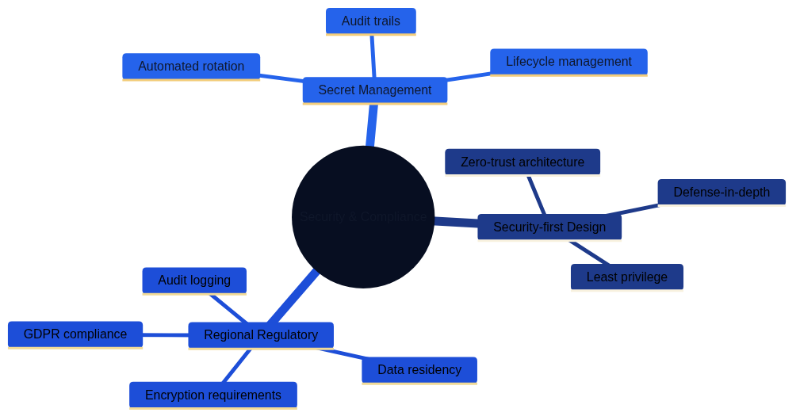

# Modern Best Practices and Lessons Learned {#chapter-best-practices}

Architecture as Code practices evolve rapidly as teams balance platform stability, compliance expectations, and product agility. The most successful organisations pair disciplined engineering routines with human-centred ways of working, ensuring that automation never removes context or accountability. This chapter distils contemporary lessons learned from teams operating at scale across finance, public services, healthcare, media, and high-growth technology sectors. Every section emphasises globally applicable guidance while using British English terminology.

## A Holistic Landscape of Practice Areas

The following mind maps present the interconnected practice areas that underpin resilient Architecture as Code delivery, helping teams navigate improvements without treating topics in isolation.

*Figure 24.2 shows best practices for repository structure, module design, and versioning strategies.*

*Figure 24.3 illustrates security-first design, regulatory compliance, and secret management approaches.*

*Figure 24.4 demonstrates optimisation, multi-region deployment, and observability practices.*

*Figure 24.5 presents governance frameworks, policy-as-code implementation, and sustainability considerations.*

*Figure 24.6 highlights cross-cultural collaboration, open source contributions, and continuous improvement cycles.*

Figure 24.2 introduces the seven practice clusters explored throughout this chapter. The mind map is read from top to bottom, emphasising the sequence in which many organisations layer their capabilities. The sections that follow provide narrative bridges between these themes so that teams can adapt the ideas to their own regulatory, cultural, and technological environments.

| Practice Cluster | Focus Area | Key Capabilities | Maturity Indicator |
|-----------------|------------|------------------|-------------------|
| Code organisation | Disciplined code organisation | Repository structure, module design, versioning, release management | Clear codebase structure, shortened feedback loops, accelerated onboarding |
| Secure foundations | Security and compliance patterns | Security-by-design, compliance automation, secret management, continuous assurance | Automated security enforcement, regulatory evidence generation |
| Performance management | Responsive performance management | Adaptive infrastructure, global deployment, observability, feedback loops | Balanced performance with sustainability, latency budgets met |
| Governance | Robust governance | Policy-as-code, financial management, change management, approval workflows | Empowered delivery teams, automated policy enforcement, fiscal control |
| People enablement | Talent development and skills | Competency frameworks, immersive learning, mentoring, communities of practice | Multidisciplinary teams, cross-functional collaboration, career development |
| Collaborative ecosystems | Vendor and tool management | Tool evaluation, multi-vendor approaches, supplier relationship management | Strategic vendor partnerships, reduced lock-in, informed decisions |
| Continuous improvement | Feedback and iteration | Integrated risk assessment, retrospectives, continuous learning | Data-driven improvements, blameless culture, sustainable pace |

## Code Organisation and Modularity

Establishing an orderly codebase is the first visible signal of a mature Architecture as Code programme. Clear structure shortens feedback loops, accelerates onboarding, and reduces the probability of accidental change in production environments.

### Repository Structure Principles

Multi-team estates benefit from a layered repository strategy. Shared modules live in dedicated libraries with strict versioning, while environment-specific overlays capture configuration drift without duplicating logic. Application repositories reference the shared components as dependencies, ensuring that infrastructure and product changes remain synchronised. Monorepositories remain viable when tooling is mature enough to enforce ownership boundaries and automated testing at scale.

### Module Design Guidelines

Reusable modules declare explicit interfaces, document required inputs, and publish examples that demonstrate expected behaviour. Tests cover typical and failure scenarios, providing confidence when modules are reused by delivery teams on different continents. To support long-lived cloud programmes, modules ship with policy guardrails embedded as defaults, avoiding surprise misconfigurations in downstream environments.

### Versioning and Release Management

Semantic versioning and immutable artefacts allow platform teams to issue non-breaking updates while maintaining confidence in previous releases. Automation enforces changelog quality, ensuring that infrastructure consumers understand upgrade implications. Dependency scanners monitor module adoption rates and raise alerts when security patches remain unapplied beyond an agreed service level.

## Security and Compliance Patterns

Security-first thinking remains essential in every jurisdiction. Regulatory expectations increasingly require evidence that infrastructure safeguards are defined as code and enforced automatically.

### Security-by-Design Foundations

Architectural baselines adopt least-privilege policies, network segmentation, and zero-trust controls by default. Platform teams implement guardrails as reusable templates rather than bespoke scripts, combining infrastructure definitions with security policies and validation tests.

### Compliance Automation

Codified controls translate regulatory obligations—such as data residency, retention limits, and encryption requirements—into enforceable policies. Automated assessments run during every pipeline execution, supplying auditable evidence and reducing the manual workload associated with external reviews. Mature programmes align these controls with international frameworks including ISO/IEC 27001, NIST 800-series guidance, and regional privacy legislation.

### Secret and Key Management

Modern secret platforms rotate credentials automatically, support hardware-backed key storage, and log every access request. Integration with developer workflows ensures that secrets never leave approved channels, while incident-response runbooks rehearse emergency key revocation.

### Continuous Assurance

Security scanning and policy-as-code engines execute continuously across development, staging, and production environments. Findings are triaged using risk-based workflows so that remediation is prioritised according to business impact, not just discovery date.

## Performance and Scalability Strategies

Performance management spans more than compute tuning; it also considers carbon intensity, customer experience, and business continuity.

### Adaptive Infrastructure Footprints

Autoscaling policies blend predictive analytics with historical demand profiles, limiting waste while safeguarding response times during promotional campaigns or emergency communications. Teams complement scaling automation with runbooks that explain how to pause or extend capacity when automated heuristics are insufficient.

### Global Deployment Patterns

Organisations operating across multiple regions design for latency budgets, data sovereignty, and resilience simultaneously. Blueprints specify replication strategies, traffic routing policies, and failover choreography, making it easier to expand into new territories without redesigning the entire platform.

### Observability and Feedback Loops

Infrastructure telemetry, distributed tracing, and synthetic testing offer shared situational awareness. Operations dashboards integrate service-level objectives with sustainability indicators so that teams can balance performance against energy consumption and cost targets.

## Governance and Policy Enablement

Effective governance empowers delivery teams rather than restricting them. The most resilient organisations automate policy enforcement while preserving clear accountability for decisions.

### Policy-as-Code Execution

Policies live alongside the infrastructure artefacts they protect. Enforcement pipelines evaluate every pull request, block non-compliant changes, and provide human-readable guidance for remediation. Dashboards summarise conformance trends for senior stakeholders, enabling data-informed risk discussions.

### Financial Management

FinOps disciplines incorporate budgets into infrastructure definitions. Tagged resources, automated shutdown rules, and predictive spending alerts maintain fiscal control without requiring manual spreadsheet audits. Shared savings targets encourage teams to reinvest efficiency gains into innovation initiatives.

### Change Management

Progressive delivery techniques—such as feature flags, blue-green deployments, and canary releases—allow infrastructure upgrades to roll out gradually. Governance boards define approval thresholds based on blast radius, so that low-risk experiments progress quickly while critical systems receive broader scrutiny.

## Talent Development and Skills Evolution

Architecture as Code success depends on multidisciplinary teams who understand both tooling and the business outcomes it supports.

### Competency Frameworks

Competency matrices describe expectations for engineers, security specialists, product leaders, and operations managers. These matrices guide career development conversations and shape hiring strategies across regions.

### Immersive Learning Environments

Hands-on sandboxes replicate production controls, allowing teams to practise deployments, incident recovery, and audit preparation without jeopardising live services. Scenario-based exercises build muscle memory for high-pressure situations.

### Mentoring and Communities of Practice

Cross-functional communities of practice meet regularly to exchange patterns, documentation updates, and lessons learned. Mentoring programmes pair experienced platform engineers with colleagues from emerging markets or new business units, accelerating adoption without relying solely on formal training courses.

## Tooling and Supplier Strategy

Tooling choices influence agility, security posture, and total cost of ownership. Modern organisations treat vendor management as a collaborative discipline that spans procurement, engineering, and legal teams.

### Evaluation and Proof of Concept

Structured scorecards evaluate functionality, interoperability, security assurances, and sustainability commitments before committing to new tooling. Proof-of-concept experiments validate real-world integration paths and provide evidence for procurement decisions.

### Multi-Vendor Approaches

Balanced portfolios prevent lock-in and create negotiation leverage. Where a single provider is necessary, contracts include exit clauses, data portability guarantees, and shared roadmaps that highlight co-investment opportunities.

### Supplier Relationship Management

Regular service reviews examine performance metrics, support responsiveness, and roadmap alignment. Joint innovation forums allow vendors and platform teams to co-design features that deliver measurable value.

## Structurizr Enablement Patterns

Architecture teams thrive when diagrams and narrative assets share the same governance standards as application code. To that end, maintain a living Structurizr workspace and reinforce shared practices:

- **Start from the curated workspace** – `docs/examples/structurizr/aac_reference_workspace.dsl` reflects the C4 hierarchy described in Chapter 06. Encourage new teams to clone this definition so that terminology, styles, and relationship semantics remain consistent.
- **Automate every validation** – Embed `structurizr.sh validate` and `structurizr.sh export` in local pre-commit hooks or repository CI workflows. Automation ensures that diagram assets regenerate on demand and prevents last-minute surprises during release reviews.
- **Treat diagram reviews as code reviews** – Pull requests should highlight the change intent, link to any relevant Architecture Decision Records, and include before/after renders. Reviewers confirm that tags, layout, and element descriptions align with repository conventions and that the change maps to an approved initiative.
- **Close the feedback loop** – When changes land, run `python3 generate_book.py && docs/build_book.sh` to refresh downstream artefacts. Sharing the resulting PNGs or Structurizr workspace exports during showcases helps teams internalise the latest architecture story.

### Adoption and Capability-Building Routines

Avoiding a single Structurizr maintainer depends on deliberate knowledge transfer. Blend the following practices with the playbook in Chapter 06 to grow confident contributors:

- **Rotating pairing circuits** – Schedule monthly pairing sessions between experienced workspace curators and new joiners. Each pairing reviews open issues, applies naming conventions, and rehearses the automation scripts so skills diffuse across teams.
- **Structured learning paths** – Catalogue on-demand recordings of Structurizr bootcamps, quick-reference sheets for DSL includes, and troubleshooting guides for Structurizr Lite and the CLI. Associate each asset with the competency framework in this chapter so managers can target coaching.
- **Visible adoption metrics** – Track the number of contributors updating the workspace, the proportion of views reusing layout templates, and the cycle time for approved diagram changes. Publish the metrics on the enablement dashboards used for other practice clusters to highlight when additional support is required.
- **Community decision logs** – Maintain a changelog that records updates to naming conventions, layout templates, or automation scripts. Link the log from pull request templates so reviewers can confirm that discussions and outcomes are transparent.

These routines eliminate duplicated diagramming effort across programmes, allowing architects to focus on structural decisions rather than cosmetic fixes.

## Risk Management and Resilience

Risk management integrates technical safeguards with business continuity planning so that infrastructure disruption does not cascade into customer harm.

### Integrated Risk Assessment

Risk registers link infrastructure components to critical business services. Automated checks measure control effectiveness, while periodic scenario planning workshops explore complex failure modes that fall outside automated coverage.

### Business Continuity and Disaster Recovery

Recovery plans include code repository restoration, pipeline rebuilds, and data recovery runbooks. Organisations rehearse disaster simulations at least annually, validating recovery time objectives (RTOs) and recovery point objectives (RPOs) under realistic conditions.

### Crisis Communication

Structured communication protocols provide timely updates to executives, regulators, partners, and customers. Templates clarify who speaks, what they share, and how frequently updates occur during major incidents.

## Community Collaboration and Open Practice

Sharing knowledge accelerates improvement across the industry while reinforcing an organisation’s own learning culture.

### Contribution Strategies

Teams define approval processes for contributing to open-source projects, ensuring that licensing, intellectual property, and confidentiality obligations remain intact. Contributions often include reusable modules, policy libraries, and documentation templates.

### Knowledge Exchange

Internal guilds, external conferences, and public blogs allow practitioners to spread lessons learned. Many organisations host open clinics where community members can discuss design questions and review infrastructure patterns together.

### Partnership Ecosystems

Strategic partnerships with academic institutions, industry consortia, and civic technology groups create neutral spaces for experimentation. These collaborations drive shared standards, reduce duplicated effort, and give smaller organisations access to expertise they could not sustain alone.

## Continuous Improvement and Innovation

*Figure 24.3 shows how insight, experimentation, and delivery reinforce one another to sustain long-term improvement.*

Continuous improvement is the connective tissue that keeps Architecture as Code programmes relevant. Feedback loops capture production telemetry, customer sentiment, regulatory changes, and retrospective findings. Improvement backlogs convert those signals into incremental experiments, each evaluated against hypothesis-driven success criteria. Innovation thrives when metrics balance reliability, speed, sustainability, and equity outcomes.

### Learning from Incidents

Blameless post-incident reviews examine systemic contributors rather than individual mistakes. Action items target tooling upgrades, skill gaps, or process refinements, and progress is tracked visibly so that learning becomes part of the culture.

### Technology Evolution

Roadmaps include scheduled reassessments of platform components, encouraging teams to retire ageing tooling, adopt managed services when appropriate, and experiment with emerging capabilities such as AI-assisted operations. Controlled pilots limit blast radius while building evidence for broader adoption.

### Measuring Outcomes

Balanced scorecards monitor leading and lagging indicators across reliability, cost, sustainability, and customer experience. Data storytelling techniques help stakeholders interpret metrics, ensuring that improvement decisions remain grounded in evidence rather than intuition.

## Summary

Modern Architecture as Code practices thrive when technical excellence, empathetic leadership, and responsible governance advance together. Disciplined code organisation, automated security controls, responsive performance management, and proactive risk mitigation form the backbone of resilient delivery. Investing in people, nurturing open communities, and sustaining continuous improvement cycles ensure that the programme adapts gracefully as technology and stakeholder expectations evolve. Teams that treat best practices as living routines—not static checklists—build platforms that are dependable, sustainable, and ready for the next wave of innovation.

## Looking to the Future

The best practices explored in this part reflect current understanding and proven patterns. However, Architecture as Code continues to evolve as new technologies emerge, regulatory requirements shift, and organisational needs change. What works today must adapt for tomorrow whilst maintaining the core principles that make Architecture as Code effective.

Part G examines emerging trends and concludes our journey through Architecture as Code. [Chapter 25 on Future Trends and Development][chapter-future-trends] explores AI-driven architecture generation, sustainability-aware infrastructure, quantum-resistant security patterns, and other developments shaping the future of the field. [Chapter 26B on Anti-Patterns in Architecture as Code Programmes][chapter-anti-patterns] highlights the warning signs and remediation tactics that keep transformations on course. The [Conclusion][chapter-conclusion] synthesises the journey from [foundational principles][chapter-fundamental-principles] through technical implementation, security, operations, and organisational transformation, providing a roadmap for continued learning and implementation.

## References

- Cloud Native Computing Foundation. *Infrastructure as Code Best Practices*. CNCF, 2024.
- HashiCorp. *Terraform Maturity Model*. HashiCorp Documentation, 2024.
- FinOps Foundation. *Cloud Financial Management Playbook*. FinOps Foundation, 2024.
- International Organisation for Standardisation. *ISO/IEC 27001:2022 Information Security Management Systems*. ISO, 2022.
- United Kingdom National Cyber Security Centre. *Security Principles for Cloud-Hosted Services*. NCSC, 2023.
- World Economic Forum. *Global Risks Report*. WEF, 2024.
