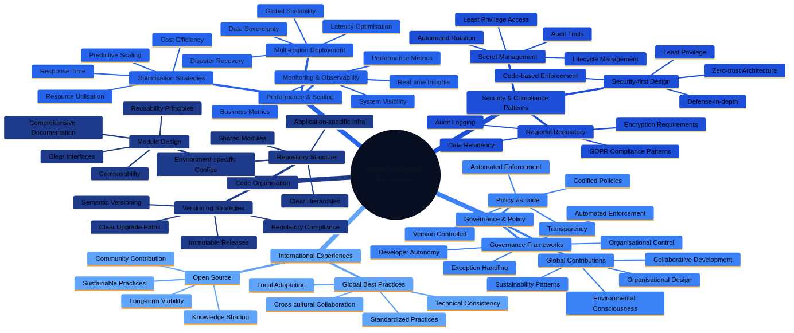

# Best Practices and Lessons Learnt

The evolution of Architecture as Code (AaC) best practices represents a continuous journey informed by practical experience, community feedback, and an ever-changing technology landscape. As organisations worldwide adopt infrastructure automation, the collective wisdom of early adopters shapes emerging standards and patterns that help others avoid common pitfalls whilst accelerating their transformation initiatives.

*Figure 24.1: Architecture as Code best practices evolve continuously through practical experience, community feedback, and technological advancement. The diagram illustrates the iterative process from initial Architecture as Code implementation to mature, optimised practices that deliver sustainable value.*

## Holistic Perspective on Best Practices

The comprehensive landscape of Architecture as Code best practices encompasses multiple interconnected domains, each contributing to successful implementation outcomes. Understanding how these domains interact enables organisations to develop coherent strategies that address technical, organisational, and business requirements simultaneously.

*Figure 24.2: The Architecture as Code best practices landscape presents the interconnected domains of code organisation, security and compliance patterns, performance optimisation, governance frameworks, and community knowledge. This holistic view helps organisations understand how different best practices work together to create successful Architecture as Code implementations whilst avoiding the trap of optimising individual areas in isolation.*

## Overall Description

Architecture as Code best practices represent the culmination of collective wisdom from thousands of organisations that have undergone infrastructure automation transformations over the past decade. These methods are not static rules but evolving guidelines that must be adapted to specific organisational contexts, technological constraints, and business requirements.

Global organisations have contributed significantly to Architecture as Code best practice development through innovative approaches to regulatory compliance, sustainable computing, and collaborative development models. Companies such as Netflix, Google, and Amazon have developed patterns that are now used worldwide for scaling Architecture as Code practices in large, complex organisations operating across multiple regulatory domains.

Lessons learnt from early Architecture as Code adopters reveal common pitfalls and anti-patterns that can be avoided through careful planning and gradual implementation. Understanding these lessons enables organisations to accelerate their Architecture as Code journey whilst avoiding costly mistakes that previously derailed transformation initiatives.

Modern best practices emphasise sustainability, security-by-design, and developer experience optimisation alongside traditional concerns such as reliability, scalability, and cost efficiency. Organisations with strong environmental consciousness and social responsibility values can leverage Architecture as Code to achieve both technical and sustainability goals through efficient resource utilisation and automated waste reduction.

## Code Organisation and Module Structure

Effective code organisation forms the foundation for maintainable and scalable Architecture as Code implementations. Well-structured repositories with clear hierarchies, consistent naming conventions, and logical module boundaries enable team collaboration and reduce onboarding time for new contributors whilst making code review processes more efficient and effective.

Repository structure best practices recommend separation of concerns between shared modules, environment-specific configurations, and application-specific infrastructure. Government agencies and regulated industries have successfully implemented standardised repository structures that enable code sharing between different departments whilst maintaining appropriate isolation for sensitive components requiring additional security controls.

Module design principles emphasise reusability, composability, and clear interfaces that enable teams to build complex infrastructure from well-tested building blocks. Effective modules encapsulate specific functionality, provide clear input-output contracts, and include comprehensive documentation for usage patterns and configuration options. This modularity accelerates development whilst reducing the risk of configuration drift and inconsistencies across environments.

Versioning strategies for infrastructure modules must balance stability with innovation through semantic versioning, immutable releases, and clear upgrade paths. Financial institutions have developed sophisticated module versioning approaches that ensure regulatory compliance whilst enabling continuous improvement and security updates without disrupting production services.

## Security and Compliance Patterns

Security-first design patterns have emerged as fundamental requirements for modern Architecture as Code implementations. These patterns emphasise defence-in-depth, the principle of least privilege, and zero-trust architectures that are implemented through code rather than manual configuration, ensuring consistent security posture across all environments.

Compliance automation patterns for regulatory requirements demonstrate how organisations can embed regulatory controls directly into infrastructure definitions. GDPR compliance patterns for data residency, encryption, and audit logging can be codified in reusable modules that automatically enforce regulatory requirements across all deployments, reducing the risk of human error whilst providing auditable evidence of compliance.

Secret management best practices have evolved from simple environment variable injection to sophisticated secret lifecycle management with automatic rotation, audit trails, and principle of least privilege access. Healthcare organisations have developed particularly robust patterns for protecting patient data according to GDPR and sector-specific regulations such as HIPAA, demonstrating that compliance and automation can coexist effectively.

Security scanning integration patterns demonstrate how security validation can be embedded throughout the infrastructure development lifecycle from development environments to production deployments. Automated security scanning with policy-as-code enforcement ensures consistent security posture without compromising development velocity, enabling rapid iteration whilst maintaining strong security boundaries.

## Performance and Scaling Strategies

Infrastructure performance optimisation patterns focus on cost efficiency, resource utilisation, and response time optimisation. E-commerce companies have developed sophisticated patterns for handling traffic spikes, seasonal variations, and flash sales through predictive scaling and capacity planning, demonstrating that automated infrastructure can respond more effectively than manual operations to dynamic demand patterns.

Multi-region deployment patterns for global scalability must consider data sovereignty requirements, latency optimisation, and disaster recovery capabilities. SaaS companies serving global markets have pioneered approaches that balance performance optimisation with data protection requirements across multiple jurisdictions whilst maintaining consistent user experiences.

Database scaling patterns for Architecture as Code encompass both vertical and horizontal scaling strategies, read replica management, and backup automation. Financial services organisations have developed particularly robust patterns for managing sensitive financial data at scale whilst maintaining audit trails and regulatory compliance, proving that automated infrastructure can meet stringent regulatory requirements.

Monitoring and observability patterns demonstrate how comprehensive system visibility can be embedded in infrastructure definitions. Telecommunications companies have developed advanced monitoring patterns that provide real-time insights into system performance, user experience, and business metrics through infrastructure-defined observability stacks that automatically adapt as infrastructure evolves.

## Governance and Policy Enforcement

Governance frameworks for Architecture as Code must balance developer autonomy with organisational control through clear policies, automated enforcement, and exception handling processes. Government organisations have developed comprehensive governance models that ensure compliance without stifling innovation, demonstrating that structure and creativity can coexist within well-designed governance frameworks.

Policy-as-code implementation patterns demonstrate how organisational policies can be codified, version controlled, and automatically enforced across all infrastructure deployments. These patterns enable consistent policy application whilst providing transparency and auditability for compliance purposes, transforming governance from a manual checkpoint into an automated continuous process.

Budget management patterns for cloud infrastructure demonstrate how cost controls can be embedded in infrastructure definitions through resource limits, automated shutdown policies, and spending alerts. Start-ups have developed innovative patterns for managing cloud costs under tight budget constraints whilst scaling rapidly, proving that cost control and growth are not mutually exclusive objectives.

Change management patterns for infrastructure evolution balance stability with agility through feature flags, blue-green deployments, and canary releases. Large enterprises have developed sophisticated change management approaches that enable continuous infrastructure evolution without disrupting critical business operations, showing that automation enhances rather than compromises operational stability.

## Global Best Practices and Community Contributions

Global best practice evolution has been influenced by innovations in organisational design, environmental consciousness, and collaborative development approaches from diverse geographical and cultural contexts. Contributions to open source Architecture as Code tools and practices have shaped international standards for sustainable computing and inclusive development practices that benefit organisations worldwide.

Cross-cultural collaboration patterns from multinational companies demonstrate how Architecture as Code practices can be adapted to different cultural contexts whilst maintaining technical consistency. These patterns are particularly valuable for global organisations that need to balance local regulations with standardised technical practices, showing that one-size-fits-all approaches rarely succeed in complex international environments.

Sustainability patterns for green computing have been pioneered by organisations with strong environmental commitments. These patterns demonstrate how Architecture as Code can optimise for carbon footprint reduction, renewable energy usage, and efficient resource utilisation without compromising performance or reliability, proving that environmental responsibility and technical excellence are complementary rather than competing objectives.

Open source contribution patterns from the global tech community showcase how organisations can benefit from and contribute to the broader Architecture as Code ecosystem development. Sustainable open source practices ensure long-term viability of critical infrastructure tools whilst fostering innovation and knowledge sharing that accelerates the entire industry forward.

## Incident Management and Response Patterns

Effective incident management forms a critical component of operational excellence within Architecture as Code environments. When infrastructure is defined as code, incident response requires new approaches that combine traditional operational practices with version control, automation, and collaborative development workflows.

Organisations have developed sophisticated incident management patterns that integrate Architecture as Code practices with emergency response procedures. These patterns emphasise rapid response, transparent communication, and systematic learning from each incident to strengthen overall system resilience, transforming incidents from purely negative events into opportunities for continuous improvement.

Modern incident management for Architecture as Code environments requires automated detection, standardised response procedures, and comprehensive post-incident analysis. Financial institutions have pioneered approaches that maintain service availability whilst ensuring regulatory compliance under the pressure of emergency situations, demonstrating that automation can enhance rather than hinder crisis response capabilities.

Incident response automation patterns enable organisations to respond rapidly to infrastructure failures, security breaches, and compliance violations. These patterns incorporate automated rollback mechanisms, emergency approval workflows, and real-time stakeholder communication to minimise business impact and recovery time whilst maintaining appropriate governance controls even during emergencies.

### Proactive Incident Prevention

Proactive incident prevention strategies focus on identifying and addressing potential issues before they become critical problems. Healthcare organisations have developed comprehensive monitoring patterns that provide early warning signals for infrastructure drift, security vulnerabilities, and performance degradation, enabling intervention before user-facing services are affected.

Risk assessment integration with Architecture as Code enables organisations to continuously evaluate potential failure scenarios and implement preventive measures. Automated compliance scanning, security vulnerability assessment, and performance monitoring provide the foundation for proactive incident prevention, shifting the focus from reactive firefighting to systematic risk management.

Emergency preparedness exercises specifically designed for Architecture as Code environments help teams practise response procedures, test automation workflows, and identify improvement opportunities. Government agencies conduct regular tabletop exercises that simulate complex infrastructure incidents and test coordinated response capabilities, ensuring that theoretical plans work effectively under pressure.

### Incident Response Automation

Automated incident response workflows reduce response time and ensure consistent handling of infrastructure emergencies. Telecommunications companies have developed self-healing infrastructure patterns that automatically detect issues, attempt remediation, and escalate to human operators when necessary, demonstrating that automation can handle routine incidents whilst preserving human expertise for complex situations.

Runbook automation for Architecture as Code environments codifies emergency procedures in executable scripts that can be triggered automatically or manually during incidents. These automated runbooks ensure consistent response procedures and reduce human error under pressure, transforming tribal knowledge into repeatable, auditable processes.

Communication automation patterns ensure stakeholders receive timely updates during incidents through automated status pages, notification systems, and escalation procedures. Financial services organisations have implemented comprehensive communication workflows that maintain transparency whilst protecting sensitive information, balancing openness with appropriate confidentiality.

## Documentation and Knowledge Management

Comprehensive documentation strategies for Architecture as Code environments must balance technical detail with accessibility for diverse stakeholders. Effective documentation serves as both reference material for daily operations and a knowledge transfer mechanism for organisational continuity, enabling teams to onboard new members efficiently whilst maintaining institutional memory.

Organisations have pioneered approaches to living documentation that automatically updates from infrastructure code, deployment logs, and operational metrics. This dynamic documentation approach ensures accuracy whilst reducing the maintenance overhead associated with traditional documentation approaches that quickly become outdated as systems evolve.

Knowledge management patterns for Architecture as Code practices encompass both explicit knowledge captured in documentation and tacit knowledge embedded in team practices and organisational culture. Successful knowledge management enables organisations to preserve institutional knowledge whilst facilitating continuous learning and improvement across generational shifts in team composition.

Documentation automation patterns demonstrate how comprehensive documentation can be generated directly from infrastructure definitions, deployment procedures, and operational runbooks. SaaS companies have developed sophisticated documentation workflows that maintain up-to-date reference materials without manual intervention, ensuring that documentation remains a valuable asset rather than a burdensome obligation.

### Architecture Decision Records for Architecture as Code

Architecture Decision Records (ADRs) specifically designed for Architecture as Code decisions provide valuable context for future teams and capture reasoning behind complex technical choices. Government organisations have standardised ADR formats that align with regulatory documentation requirements, demonstrating that compliance and agility can coexist within appropriate frameworks.

ADR automation patterns enable teams to capture architectural decisions directly in code repositories alongside infrastructure definitions. This co-location approach ensures architectural context remains accessible and relevant for ongoing development activities, reducing the risk that important context is lost or becomes disconnected from the code it describes.

Decision impact tracking through ADRs helps organisations understand long-term consequences of architectural choices and identifies opportunities for optimisation or refactoring. Financial institutions have developed sophisticated decision tracking approaches that support audit requirements and continuous improvement, transforming ADRs from documentation burden into strategic assets.

### Operational Runbook Management

Operational runbooks for Architecture as Code environments must be executable, testable, and version controlled together with infrastructure definitions. Healthcare organisations have developed comprehensive runbook management approaches that ensure procedures remain current and effective, treating operational procedures with the same rigour as application code.

Runbook testing patterns enable organisations to validate operational procedures regularly through automated testing, simulation exercises, and real-world validation. These testing approaches help identify outdated procedures and maintain operational readiness, ensuring that runbooks work correctly when needed rather than failing during emergencies.

Collaborative runbook development patterns encourage input from multiple stakeholders including development teams, operations staff, and business representatives. This collaborative approach ensures runbooks address real operational needs and maintain broad organisational support, preventing the creation of theoretically sound but practically useless procedures.

## Training and Competence Development

Strategic competence development for Architecture as Code requires comprehensive training programmes that address both technical skills and organisational transformation challenges. Organisations have developed innovative training approaches that combine formal education with practical experience and peer learning, recognising that sustainable skill development requires multiple complementary methods.

Cross-functional training patterns break down traditional silos between development, operations, and security teams through shared learning experiences and collaborative skill development. These patterns facilitate cultural transformation alongside technical adoption of Architecture as Code practices, addressing the reality that technology transformation requires parallel organisational evolution.

Continuous learning frameworks for rapidly evolving Architecture as Code technologies help teams stay current with emerging tools, techniques, and best practices. Technology companies have pioneered approaches that balance formal training with experimentation, community engagement, and knowledge sharing, creating learning cultures that adapt naturally to technological change.

Skills assessment and career development programmes specifically designed for Architecture as Code practitioners help organisations identify skill gaps, plan targeted training interventions, and support professional growth for team members. These programmes ensure that competence development aligns with both organisational needs and individual career aspirations.

### Practical Skills Training

Hands-on training environments that mirror production infrastructure enable safe experimentation and skill development without risking operational systems. Financial institutions have developed sophisticated training environments that replicate complex regulatory requirements and business constraints, enabling realistic learning experiences without production risk.

Simulation-based training scenarios provide realistic practice opportunities for incident response, deployment procedures, and troubleshooting workflows. These scenarios help teams build confidence and competence before facing real operational challenges, transforming theoretical knowledge into practical capability through experiential learning.

Mentorship programmes pair experienced Architecture as Code practitioners with team members developing new skills, facilitating knowledge transfer and accelerating professional development. Government organisations have established formal mentorship structures that support systematic skill development whilst building stronger team relationships and shared understanding.

### Certification and Standards

Professional certification paths for Architecture as Code practitioners help establish industry standards and provide career advancement opportunities. Professional organisations have contributed to international certification standards that reflect diverse approaches to sustainable technology practices, ensuring certifications remain relevant across different organisational contexts.

Internal certification programmes developed by large enterprises provide organisation-specific training that aligns with company standards, tools, and procedures. These programmes ensure consistent skill levels across teams whilst supporting individual professional development, balancing organisational needs with personal growth objectives.

Skills validation frameworks enable organisations to assess competency levels, identify training needs, and ensure teams have appropriate expertise for managing critical infrastructure. Regular skills assessment helps maintain high operational standards and identify areas for improvement, transforming assessment from a one-time checkpoint into an ongoing improvement process.

## Tool Selection and Vendor Management

Strategic tool selection for Architecture as Code environments requires careful evaluation of technical capabilities, vendor stability, community support, and long-term viability. Organisations have developed comprehensive evaluation frameworks that balance immediate needs with strategic considerations, recognising that tool choices have long-term implications that extend beyond initial feature comparison.

Multi-vendor strategies reduce dependency risks whilst providing flexibility to adopt best-of-breed solutions for different infrastructure domains. Telecommunications companies have pioneered vendor management approaches that maintain competitive negotiating positions whilst ensuring operational continuity, demonstrating that strategic vendor relationships require both collaboration and appropriate risk mitigation.

Tool standardisation patterns balance organisational consistency with team autonomy through establishing core toolsets whilst allowing flexibility for specialised use cases. This approach reduces complexity whilst enabling innovation and optimisation for specific requirements, avoiding both the chaos of unconstrained tool proliferation and the rigidity of overly restrictive standardisation.

Vendor relationship management for infrastructure tooling must consider both commercial relationships and open source community engagement. Companies have developed sophisticated approaches that contribute to community development whilst managing commercial vendor relationships strategically, recognising that healthy ecosystems require both commercial investment and community participation.

### Technical Evaluation

Comprehensive technical evaluation frameworks help organisations assess infrastructure tools against standardised criteria including functionality, performance, security, reliability, and maintainability. Financial services have developed rigorous evaluation processes that incorporate regulatory requirements and risk assessment, ensuring that tool selection aligns with compliance obligations.

Proof-of-concept development enables hands-on evaluation of tools under realistic conditions before making significant investments. These POCs help identify potential integration challenges, performance limitations, and operational considerations that might not be apparent from vendor documentation, reducing the risk of costly mistakes from premature commitments.

Performance benchmarking for infrastructure tools provides objective data for comparing alternatives and establishing baseline expectations for operational performance. Government agencies have developed standardised benchmarking approaches that support fair evaluation and procurement decisions, ensuring that tool selection is based on evidence rather than marketing claims.

### Vendor Relationships

Strategic vendor partnership development enables organisations to influence product roadmaps, receive priority support, and gain early access to new capabilities. Enterprises have leveraged collective purchasing power through industry consortia for better vendor terms and shared development costs, demonstrating that collaboration can create value beyond what individual organisations can achieve.

Contract negotiation strategies for infrastructure tooling must balance cost, functionality, support levels, and exit provisions. Legal frameworks provide specific considerations for data sovereignty, liability, and dispute resolution that influence vendor contract terms, ensuring that commercial agreements reflect technical and regulatory requirements.

Vendor performance monitoring and relationship management ensure ongoing value delivery from tooling investments. Regular vendor reviews, performance scorecards, and strategic planning sessions help maintain productive partnerships and identify optimisation opportunities, transforming vendor relationships from transactional interactions into strategic partnerships.

## Continuous Improvement and Innovation

Systematic continuous improvement programmes for Architecture as Code environments drive ongoing optimisation of processes, tools, and outcomes through data-driven decision making and regular retrospectives. Organisations have pioneered improvement frameworks that balance stability with innovation, recognising that sustainable excellence requires both operational discipline and creative exploration.

Innovation management patterns help organisations balance exploration of new technologies with operational reliability requirements. These patterns provide structured approaches for evaluating emerging tools, techniques, and practices whilst maintaining system stability and business continuity, preventing both stagnation from excessive conservatism and chaos from uncontrolled experimentation.

Experimentation frameworks enable safe exploration of new Architecture as Code practices through controlled pilot projects, isolated environments, and gradual rollout procedures. Research institutions have developed sophisticated experimentation approaches that accelerate learning whilst managing risks, demonstrating that rigorous experimentation can reduce rather than increase overall risk through systematic learning.

Feedback loop optimisation ensures rapid information flow from operational experiences back to development practices, enabling quick adaptation and continuous learning. These loops help organisations respond quickly to changing requirements and emerging opportunities, transforming operational data into actionable insights that drive continuous improvement.

### Measurement and Evaluation

Comprehensive metrics frameworks for Architecture as Code environments provide visibility into technical performance, business value, and operational effectiveness. Companies have developed balanced scorecards that track both technical metrics and business outcomes from Architecture as Code investments, ensuring that technical optimisation serves business objectives rather than becoming an end in itself.

Performance trending analysis helps organisations identify improvement opportunities and measure progress towards strategic objectives. Historical data analysis reveals patterns, trends, and correlations that inform future planning and optimisation efforts, transforming raw operational data into strategic intelligence.

Benchmarking programmes both internal and external provide comparative context for performance evaluation and improvement target setting. Industry associations have facilitated collaborative benchmarking initiatives that benefit entire sectors, demonstrating that appropriate sharing of performance data creates value for all participants without compromising competitive positions.

### Innovation Management

Innovation pipeline management for Architecture as Code helps organisations systematically explore emerging technologies whilst maintaining focus on proven practices for production systems. This balanced approach enables competitive advantage without compromising operational reliability, recognising that sustainable innovation requires both exploration and exploitation.

Research and development programmes specifically focused on Architecture as Code innovations help organisations stay ahead of technology trends and contribute to industry advancement. Universities have partnered with industry for collaborative research that benefits both academic understanding and practical application, bridging the gap between theoretical advancement and real-world utility.

Technology scouting programmes identify emerging tools, techniques, and practices that might benefit organisational objectives. Regular technology reviews, conference participation, and community engagement help organisations maintain awareness of innovation opportunities, ensuring that teams remain connected to broader industry developments.

## Risk Management and Business Continuity

Comprehensive risk management strategies for Architecture as Code environments must address both traditional operational risks and new risks introduced by code-defined infrastructure. Organisations have developed sophisticated risk frameworks that integrate technical risks with business continuity planning, recognising that infrastructure automation creates new risk patterns that require updated management approaches.

Business continuity planning specifically adapted for Architecture as Code environments considers both infrastructure failure scenarios and risks associated with code repositories, deployment pipelines, and automation systems. These plans ensure organisations can maintain operations even under complex failure conditions that affect multiple infrastructure layers simultaneously.

Risk assessment integration with Architecture as Code development processes enables proactive identification and mitigation of potential issues before they impact production systems. Automated risk scanning, compliance checking, and security assessment provide continuous risk visibility, transforming risk management from periodic review into continuous process.

Disaster recovery patterns for code-defined infrastructure demonstrate how traditional DR approaches must evolve for environments where infrastructure can be recreated from code repositories. Financial institutions have pioneered DR approaches that leverage Architecture as Code for rapid environment reconstruction, demonstrating that code-defined infrastructure can actually improve rather than complicate disaster recovery capabilities.

### Business Impact Analysis

Business impact analysis for Architecture as Code environments must consider both direct operational impacts and secondary effects from automation failures, code repository compromise, or deployment pipeline disruption. Government agencies have developed comprehensive impact assessment frameworks that account for the interconnected nature of modern infrastructure automation.

Recovery Time Objectives (RTO) and Recovery Point Objectives (RPO) for Architecture as Code environments require careful consideration of code repository recovery, automation system restoration, and infrastructure recreation procedures. These objectives drive design decisions for backup strategies and recovery procedures, ensuring that disaster recovery capabilities align with business requirements.

Critical process identification helps organisations prioritise protection efforts and recovery procedures for the most essential business functions. This prioritisation ensures limited resources focus on maintaining core business operations under adverse conditions, preventing wasteful investment in protecting less critical capabilities.

### Crisis Management

Crisis management procedures specifically designed for Architecture as Code environments integrate technical response capabilities with business communication requirements. Enterprises have developed comprehensive crisis management frameworks that coordinate technical and business responses, ensuring that crisis management addresses both technical remediation and stakeholder communication needs.

Emergency communication plans ensure stakeholders receive appropriate information during infrastructure crises without compromising security or creating additional confusion. These plans include both internal communication protocols and external customer communication strategies, balancing transparency with appropriate confidentiality.

Crisis leadership structures define clear decision-making authority and escalation procedures for complex infrastructure emergencies. This clarity enables rapid response when traditional approval processes might delay critical recovery actions, ensuring that governance structures facilitate rather than impede effective crisis response.

## Community Engagement and Open Source Contribution

Strategic community engagement for Architecture as Code enables organisations to both benefit from and contribute to broader ecosystem development. Companies have established leadership positions in global Architecture as Code communities through consistent, valuable contributions and collaborative partnership approaches, demonstrating that community leadership creates strategic value beyond immediate technical benefits.

Open source contribution strategies help organisations share innovations, attract talent, and influence technology direction whilst building industry relationships and enhancing organisational reputation. These contributions position organisations as thought leaders in the global infrastructure automation community, creating virtuous cycles where contributions attract talent and partnerships that enable further contributions.

Knowledge sharing patterns demonstrate how organisations can participate in community development without compromising competitive advantages or intellectual property. Government agencies have pioneered open source approaches that promote transparency and collaboration according to public sector values, showing that open source participation can advance mission objectives rather than conflicting with them.

Community partnership development enables access to broader expertise, shared development costs, and collective problem-solving capabilities. Enterprises have leveraged community relationships for accelerated innovation and reduced technology risks, demonstrating that collaboration creates value that individual organisations cannot achieve alone.

### Contribution Strategy

Systematic contribution planning helps organisations identify valuable ways to contribute to open source projects whilst advancing their own technical objectives. Technology companies have developed contribution strategies that align community engagement with business goals and technical roadmaps, ensuring that open source participation creates rather than consumes organisational value.

Intellectual property management for open source contributions requires clear policies and procedures that protect organisational interests whilst enabling community participation. These policies provide guidelines for what can be shared, how contributions are licensed, and how potential conflicts are resolved, creating clarity that facilitates rather than impedes contribution.

Employee engagement in open source communities provides professional development opportunities, industry visibility, and access to cutting-edge knowledge. Companies have established programmes that encourage and support employee community participation, recognising that employee development and community contribution are complementary rather than competing objectives.

### Collaboration and Partnerships

Industry collaboration initiatives enable organisations to collectively address common challenges, share development costs, and influence standards development. These partnerships leverage collective expertise for solving complex problems that individual organisations might struggle with alone, demonstrating that appropriate collaboration can create competitive advantages rather than eroding them.

Research partnerships with academic institutions provide access to advanced research, student talent, and long-term perspectives on technology evolution. Universities have established strong collaboration programmes with industry partners for mutual benefit, bridging the gap between academic research and practical application.

International collaboration enables organisations to participate in global standards development, share diverse perspectives, and build relationships with international partners. This global engagement enhances influence in international technology development and provides access to worldwide expertise, ensuring that organisations remain connected to global innovation rather than becoming isolated in local contexts.

## Organisational Maturity and Evolution

Successful Architecture as Code implementation is not a one-time project but a continuous journey of learning, adaptation, and refinement. Organisations that have achieved sustainable Architecture as Code success understand that best practices must evolve continuously based on the changing technology landscape, business requirements, and lessons learnt from real-world implementation challenges.

*Figure 24.3: Continuous improvement of Architecture as Code practices requires a systematic approach to learning, adaptation, and evolution. The diagram illustrates feedback loops between practical experience, technological development, and organisational maturity that drive sustainable Architecture as Code transformation over time.*

### Learning from Failures and Incidents

Organisational maturity in Architecture as Code development stems primarily from systematic learning from failures, incidents, and unexpected challenges that arise during practical implementation. Technology companies such as Netflix and Spotify have developed sophisticated incident response frameworks that treat infrastructure failures as valuable learning opportunities rather than simply problems to fix.

Incident retrospectives for infrastructure-related issues should focus on root cause analysis of both technical and process failures. Common patterns that emerge from organisations include inadequate testing in staging environments, insufficient monitoring of infrastructure changes, and poor communication between development and operations teams during critical deployments.

Blameless postmortem culture, pioneered by leading technology organisations, enables teams to share failure experiences openly and extract valuable insights without fear of retribution. These cultural practices have proven essential for building organisational confidence in complex infrastructure automation whilst maintaining high reliability standards for customer-facing services.

Documentation of failure patterns and their solutions creates an organisational knowledge base that enables future teams to avoid repeating the same mistakes. Government agencies have developed particularly robust failure analysis processes that ensure critical infrastructure lessons are captured and shared across different departments and projects.

### Adaptation to New Technologies

Technology evolution within cloud computing and infrastructure automation requires organisations to continuously evaluate and integrate new tools, services, and methodologies into their existing Architecture as Code practices. Organisations must balance innovation adoption with stability requirements, particularly in regulated industries where change control processes are strictly enforced.

Technology evaluation frameworks help organisations assess new Architecture as Code tools and platforms based on criteria that include technical capabilities, security implications, cost considerations, and integration complexity with existing systems. Early adopter programmes within technology companies enable careful experimentation with emerging technologies before broad organisational adoption.

Gradual technology migration strategies minimise risk during platform transitions whilst enabling organisations to benefit from technological improvements. Financial institutions have developed particularly sophisticated migration approaches that ensure regulatory compliance and operational continuity during major infrastructure platform changes.

Community engagement with open source projects and technology vendors provides organisations with early insights into emerging trends and upcoming capabilities. Active participation in technology communities also enables companies to influence technology development directions based on their specific requirements and use cases.

### Maturity Levels for Architecture as Code Implementation

Organisational maturity models for Architecture as Code help teams understand their current capabilities and plan systematic improvement paths towards more sophisticated implementation practices. Organisations have contributed significantly to these maturity frameworks through their emphasis on sustainability, collaboration, and long-term thinking.

**Initial Level** organisations typically begin with manual infrastructure management and limited automation. Focus at this level is establishing basic version control, simple automation scripts, and foundational monitoring capabilities. Government agencies often start here when transitioning from traditional IT management approaches.

**Developing Level** organisations implement comprehensive Architecture as Code practices with automated deployment pipelines, systematic testing, and basic policy enforcement. Most medium-sized companies reach this level within their first year of serious Architecture as Code adoption, typically achieving 70-80% infrastructure automation coverage.

**Advanced Level** organisations achieve full automation coverage with sophisticated governance frameworks, comprehensive security automation, and advanced monitoring capabilities. Large enterprises such as Amazon and Google have reached this level through multi-year transformation programmes and significant investment in tooling and training.

**Optimising Level** organisations demonstrate self-improving infrastructure systems with predictive monitoring, automatic optimisation, and advanced AI-driven operations. Only a few organisations have achieved this level, typically large-scale cloud-native companies with substantial investment in cutting-edge automation technologies.

### Change Management for Evolving Practices

Change management for evolving Architecture as Code practices requires careful balance between innovation adoption and operational stability. Organisations excel at collaborative change management approaches that emphasise consensus building, gradual implementation, and comprehensive stakeholder engagement throughout transformation processes.

Communication strategies for infrastructure changes must accommodate different stakeholder groups with varying technical backgrounds and risk tolerances. Collaborative culture provides a natural framework for building broad organisational support for Architecture as Code evolution, though it sometimes slows rapid technology adoption compared to more hierarchical organisational structures.

Training and competence development programmes ensure that team members can effectively utilise evolving Architecture as Code tools and practices. Organisations typically invest heavily in employee development, with comprehensive training programmes that combine technical skills with organisational change management capabilities.

Feedback mechanisms from development teams, operations teams, and business stakeholders provide essential insights for refining Architecture as Code practices and identifying areas for further improvement. Regular retrospectives, surveys, and collaborative review sessions help organisations maintain alignment between technical capabilities and business requirements as both evolve over time.

### Community Engagement and Knowledge Sharing

Active participation in global Architecture as Code communities enables organisations to benefit from collective wisdom whilst contributing their own innovations and insights. The technology community has traditionally been very active in open source contribution and knowledge sharing, particularly in areas such as environmental sustainability and inclusive development practices.

Internal communities of practice within larger organisations facilitate knowledge sharing between different teams and business units. These communities help propagate successful patterns, share lessons learnt, and coordinate technology adoption decisions across organisational boundaries.

External knowledge sharing through conferences, blog posts, and open source contributions strengthens the technology community and enhances reputations for innovation in infrastructure automation. Companies that publish their Architecture as Code practices and tools contribute to global best practice development whilst attracting talent and partnerships.

Mentorship programmes for Architecture as Code practitioners help accelerate individual skill development and ensure knowledge transfer between experienced and emerging infrastructure professionals. Organisations have developed particularly effective mentorship approaches that combine technical training with broader professional development support.

### Organisational Examples of Continuous Improvement

**Netflix** has demonstrated exceptional commitment to continuous Architecture as Code improvement through their evolution from traditional deployment practices to fully automated, scalable infrastructure management. Their journey illustrates how media companies can achieve both regulatory compliance and rapid innovation through systematic infrastructure automation maturity development.

**Spotify** exemplifies how continuous improvement culture extends to infrastructure practices through their famous "fail fast, learn fast" philosophy. Their approach to infrastructure experimentation and rapid iteration has influenced global best practices for balancing innovation with reliability in large-scale consumer-facing services.

**Amazon** showcases how traditional technology companies can successfully transform their infrastructure practices through multi-year maturity development programmes. Their experience demonstrates that even large, established organisations can achieve significant Architecture as Code transformation through sustained commitment to gradual improvement and employee development.

**UK Government Digital Service** (GDS) illustrates how public sector organisations can implement modern Architecture as Code practices whilst maintaining strict security and compliance requirements. Their approach demonstrates that government agencies can achieve both operational efficiency and regulatory compliance through thoughtful Architecture as Code adoption and continuous improvement practices.

## Summary

Best practices for Architecture as Code represent accumulated wisdom from a global community of practitioners who have navigated the challenges of scaling infrastructure management at enterprise level. Organisations worldwide have contributed significantly to these practices through innovative approaches to compliance, sustainability, and collaborative development.

Effective implementation of Architecture as Code best practices requires balanced consideration of technical excellence, business value, regulatory compliance, and environmental responsibility. Organisations that embrace comprehensive best practice frameworks position themselves for sustainable long-term success in a rapidly evolving technology landscape.

Continuous evolution of best practices through community contribution, experimentation, and learning from failures ensures that Architecture as Code implementations remain relevant and effective as technology and business requirements continue to evolve. Investment in best practice adoption and contribution delivers compounding value through improved operational efficiency, reduced risk, and enhanced innovation capability.

The modern Architecture as Code methodology represents the future of infrastructure management for organisations seeking to balance operational excellence with the flexibility required to respond to changing business needs. By learning from the collective experience of early adopters and contributing to ongoing best practice development, organisations can accelerate their transformation journeys whilst avoiding common pitfalls that have challenged others.

## Sources and References

- Cloud Native Computing Foundation. "Infrastructure as Code Best Practices." CNCF, 2023.
- HashiCorp. "Terraform Best Practices Guide." HashiCorp Documentation, 2023.
- AWS. "Well-Architected Framework for Infrastructure as Code." Amazon Web Services, 2023.
- Google. "Site Reliability Engineering Best Practices." Google SRE Team, 2023.
- Puppet. "Infrastructure Automation Best Practices." Puppet Labs, 2023.
- NIST. "Framework for Improving Critical Infrastructure Cybersecurity." National Institute of Standards and Technology, 2023.