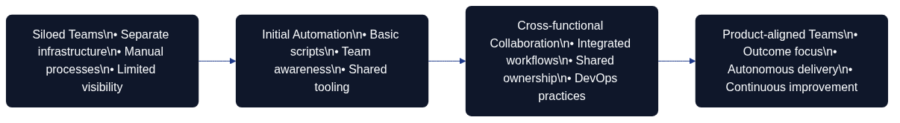

# Prerequisites for Architecture as Code Adoption

Successful Architecture as Code (AaC) programmes are never accidents. They emerge when an organisation’s cultural habits, technical capabilities, and economic discipline align with the philosophy set out in the [introduction](01_introduction.md) and the [fundamental principles](02_fundamental_principles.md). This chapter distils the readiness signals hinted at across earlier chapters—from the organisational narratives in [Chapters 17 to 20](17_organisational_change.md) to the delivery mechanics in [Chapters 5, 14, and 23](05_automation_devops_cicd.md) and the financial guardrails in [Chapter 15](15b_cost_optimization.md). Readiness is not a gate to appease governance; it is evidence that the organisation can wield AaC responsibly.

## Why Readiness Matters

The caution from [Chapter 14](14_practical_implementation.md) still stands: automation without alignment amplifies chaos. A readiness review slows the rush to tool selection. Leaders can then prove, rather than assume, that the organisation can absorb executable architecture. This review prevents brittle deployments that clash with the operational expectations described in [Chapter 05](05_automation_devops_cicd.md). It also protects the psychological safety emphasised in [Chapter 17](17_organisational_change.md), and keeps investment decisions honest in line with [Chapter 15](15b_cost_optimization.md). Readiness is therefore a contract—when the prerequisites are visible, teams earn the right to automate architectural intent.

## Cultural Foundations

AaC flourishes where experimentation and shared ownership are routine. The cultural preparation described in [Chapters 17 to 19](17_organisational_change.md) is essential: retrospectives must be regular, blameless reviews must be normal, and communities of practice must already exist. Without those habits the `as code` mindset from [Chapter 03](03_version_control.md) becomes adversarial, with review comments interpreted as personal attacks.

Leaders must also tell a compelling story that links AaC to mission, customer outcomes, and professional growth. As [Chapter 19](19_management_as_code.md) argues, narratives anchor change. When every engineer can articulate the “why”, the team structures from [Chapter 18](18_team_structure.md) feel like empowerment rather than intrusion.

Cultural readiness also involves aligning reward systems and career frameworks with the collaborative ethos described in [Chapter 20](20_ai_agent_team.md); promotions and recognition must celebrate shared delivery outcomes instead of isolated heroics.

Practitioners should already experience leaders acting as coaches, echoing the behavioural commitments in [Chapter 17](17_organisational_change.md), so that AaC feels like a natural extension of existing norms rather than an abrupt revolution.
## Technical Maturity Baselines

AaC assumes mastery of core delivery disciplines. The continuous pipelines in [Chapter 05](05_automation_devops_cicd.md), the testing depth in [Chapter 13](13_testing_strategies.md), and the Structurizr patterns in [Chapter 06](06_structurizr.md) must already be routine. Otherwise, architecture models drift from runtime reality.

Security and compliance practices from [Chapters 09, 09b, and 10](09_security_fundamentals.md) also need to be embedded so that codified architecture does not introduce blind spots.

Governance automation, as described in [Chapter 11](11_governance_as_code.md), provides the scaffolding that lets architectural code flow through the same delivery channels as application code.

Technical readiness further demands disciplined environment strategies—golden paths, reference stacks, and service catalogues—that make reuse effortless and align with the platform guidance in [Chapter 24](24_best_practices.md).

Data quality expectations must be explicit so that telemetry, cost analytics, and resilience signals inform architectural decisions in the spirit of [Chapter 20](20_ai_agent_team.md).
## Knowledge and Information Management

Readiness depends on how knowledge is curated. The distinction between documentation and architecture in [Chapter 22](22_documentation_vs_architecture.md) only holds when both are discoverable. Teams need version-controlled architecture decision records, reusable component catalogues, and glossaries such as [Chapter 28](28_glossary.md). These artefacts shorten onboarding time and anchor architectural intent in narrative context, echoing the measurement guidance from [Chapter 17](17_organisational_change.md). Telemetry and feedback channels—highlighted in [Chapters 20 and 24](20_ai_agent_team.md)—must already feed insights into design discussions; otherwise AaC becomes detached from operational reality.

## Economic Preconditions

Financial discipline underpins sustainable automation. [Chapter 15](15b_cost_optimization.md) warned that automation without cost transparency becomes an expensive hobby. Readiness therefore requires funding models that reward incremental value, cost telemetry that is trusted across finance and engineering, and procurement practices flexible enough to support the experimentation described in [Chapter 14](14_practical_implementation.md). Product-centric budgeting from [Chapter 19](19_management_as_code.md) ensures teams can reinvest savings rather than losing them to annual budget resets, while governance controls from [Chapter 11](11_governance_as_code.md) keep spending aligned with strategic guardrails. Organisations should also establish value-tracking rituals—quarterly benefit reviews, reuse inventories, and scenario planning—that echo the continuous improvement loops in [Chapter 24](24_best_practices.md). These forums allow finance, security, and engineering to recalibrate investment together, preventing the surprise budget cuts that destabilised earlier digital initiatives in [Chapter 21](21_digitalisation.md).

## Skills, Roles, and Capacity

AaC expands rather than replaces existing responsibilities. The cross-functional roles mapped in [Chapter 18](18_team_structure.md)—platform product owners, site reliability engineers, security partners—must already collaborate effectively. Career pathways should recognise hybrid skill sets so practitioners can grow without abandoning technical leadership, reflecting the advice from [Chapter 19](19_management_as_code.md). Capacity planning matters too: reviewing architecture pull requests, maintaining models, and curating knowledge bases all consume time. Organisations that ignore this guidance repeat the burnout scenario warned about in [Chapter 21](21_digitalisation.md).

## Platform and Toolchain Alignment

The technology landscape must be coherent before AaC can thrive. Pipelines, modelling tools, and knowledge repositories need to integrate cleanly, as illustrated in [Chapters 05 and 06](05_automation_devops_cicd.md). Fragmented tooling multiplies cognitive load and complicates compliance checks referenced in [Chapter 12](12_compliance.md). Readiness reviews should also confirm the availability of safe experimentation environments—sandboxes and simulation frameworks that align with the testing ethos of [Chapter 13](13_testing_strategies.md). If experimentation is slow or expensive, architecture code will stagnate.

## Governance and Compliance Preparedness

AaC codifies governance rather than bypassing it. Policies, standards, and risk tolerances must already be expressed as automated controls, building on [Chapter 11](11_governance_as_code.md). Compliance partners should participate in pull request reviews, and audit trails should be generated automatically. Organisations also need agile decision forums reminiscent of the collaborative guardrails in [Chapter 23](23_soft_as_code_interplay.md). If governance is still a periodic toll booth, AaC will either stall or erode trust by appearing to sidestep controls.

## Change Management Infrastructure

Transformation succeeds when change is treated as a service. The communication patterns, sponsorship behaviours, and learning pathways described in [Chapter 17](17_organisational_change.md) must already be active. Town halls, asynchronous updates, and leadership blogs keep stakeholders aligned; mentorship schemes from [Chapter 18](18_team_structure.md) sustain knowledge transfer; integration playbooks from [Chapter 16](16_migration.md) prevent disruption. Organisations that rely on heroics or one-off training courses find AaC enthusiasm fading as soon as the early champions move on. Mature change programmes pair formal training with peer coaching, playbooks, and the experiential learning loops referenced in [Chapter 14](14_practical_implementation.md), ensuring new behaviours are reinforced long after the initial launch.

## Readiness Assessment Framework

A structured readiness assessment keeps preparation honest. Borrowing from the measurement practices in [Chapter 17](17_organisational_change.md) and the health checks in [Chapter 24](24_best_practices.md), a pragmatic framework comprises four loops:

1. **Contextual Discovery** – Map stakeholder expectations using the techniques from [Chapter 11](11_governance_as_code.md) so that finance, security, and delivery voices are heard.
2. **Capability Baseline** – Evaluate automation, testing, modelling, and knowledge management against benchmarks from [Chapters 05, 06, and 22](05_automation_devops_cicd.md).
3. **Cultural and Economic Diagnostics** – Measure psychological safety, leadership engagement, and funding flexibility, drawing on [Chapters 17 and 15](17_organisational_change.md).
4. **Remediation Roadmap** – Sequence improvements with explicit links to the chapters above so that cultural, technical, and financial gaps close together.

Treating readiness as an iterative loop mirrors the delivery cadence promoted in [Chapter 14](14_practical_implementation.md) and the adaptive mindset in [Chapter 25](25_future_trends.md).

## Case Study: Preparing a Global Enterprise

A multinational financial services group offers a useful illustration. Automation maturity is high—CI/CD pipelines mirror [Chapter 05](05_automation_devops_cicd.md)—yet architecture still relies on static review boards. A readiness assessment uncovers three gaps. Knowledge artefacts live in static slide decks, contradicting the practices in [Chapter 22](22_documentation_vs_architecture.md). Psychological safety varies across regions, highlighting the cultural work described in [Chapter 17](17_organisational_change.md). Funding remains tied to annual projects, conflicting with the rolling investment model from [Chapter 19](19_management_as_code.md).

The remediation roadmap tackles each issue. The architecture office pilots version-controlled decision records using [Chapter 04](04_adr.md) templates. Communities of practice connect regional teams, mirroring the design from [Chapter 18](18_team_structure.md). Finance introduces rolling forecasts guided by [Chapter 15](15b_cost_optimization.md). Six months later the organisation launches AaC pilots confident that culture, tooling, and funding can sustain the change.

## Common Readiness Anti-patterns

Organisations that struggle with AaC usually repeat familiar mistakes:

- **Tool-first enthusiasm** – Buying modelling platforms without addressing the cultural foundations in [Chapter 17](17_organisational_change.md) produces shelfware.
- **Heroic ownership** – Concentrating responsibility in a few experts defies the distributed leadership model in [Chapter 18](18_team_structure.md).
- **Budget whiplash** – Treating AaC as a one-off project contradicts the continuous investment message from [Chapter 15](15b_cost_optimization.md).
- **Governance bypass** – Sidestepping compliance partners undermines the trust built through [Chapter 11](11_governance_as_code.md).
- **Metrics myopia** – Tracking deployment speed whilst ignoring culture repeats the caution from [Chapter 17](17_organisational_change.md).

Recognising these anti-patterns early enables corrective action before momentum is lost.

## Sequencing Readiness Investments

Perfection is unnecessary, but sequencing matters. Following the migration mindset in [Chapter 16](16_migration.md), organisations should start with a narrow architectural domain backed by supportive stakeholders. Establish cultural and governance guardrails first, stabilise tooling second, and adjust funding models alongside early wins. Each slice mirrors the “thin vertical” delivery style from [Chapter 14](14_practical_implementation.md), proving both capability and organisational resilience.

## Measuring Ongoing Readiness

Readiness is not a one-off audit. Dashboards should blend DORA indicators from [Chapter 05](05_automation_devops_cicd.md) with cultural metrics from [Chapter 17](17_organisational_change.md) and cost signals from [Chapter 15](15b_cost_optimization.md). Governance measures—policy drift, exception frequency, audit findings—confirm whether the codified controls in [Chapter 11](11_governance_as_code.md) still operate. Quarterly reviews keep AaC aligned with reality and feed continuous improvement loops described in [Chapter 24](24_best_practices.md) and [Chapter 25](25_future_trends.md).

## Conclusion

AaC readiness is a deliberate synthesis of culture, technology, and economics. Organisations that honour these prerequisites extend the craftsmanship of [Chapter 02](02_fundamental_principles.md), the resilience of [Chapter 17](17_organisational_change.md), and the stewardship of [Chapter 15](15b_cost_optimization.md). Those that skip the groundwork rediscover the failure modes catalogued throughout the book. By grounding adoption in readiness, teams respect the complexity of their sociotechnical systems and position themselves to explore the opportunities envisioned in [Chapter 25](25_future_trends.md) with confidence.
