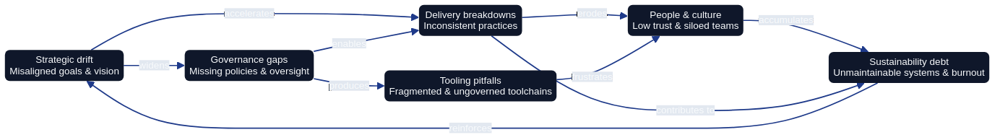

# Anti-Patterns in Architecture as Code Programmes

Architecture as Code (AaC) brings architectural thinking into the same disciplined delivery processes that teams already apply to software and infrastructure. Yet programmes stumble when they copy technical mechanisms without reshaping culture, governance, and operational rhythms. This chapter examines recurring anti-patterns that undermine AaC initiatives across diverse industries. Understanding these pitfalls helps organisations design early safeguards, establish healthier feedback loops, and sustain momentum beyond the initial transformation campaign.

*Figure 26.1 maps common anti-pattern clusters across governance, tooling, teams, and delivery lifecycles, showing how blind spots propagate risk.*

## Strategic Anti-Patterns

### Treating AaC as a Tool Purchase

Executives sometimes assume that acquiring a single modelling or provisioning platform unlocks Architecture as Code. The anti-pattern manifests when budgets focus on licences and consultants whilst neglecting change management, governance design, and internal capability building. Teams inherit sophisticated tooling without a shared architectural vocabulary or decision-making forum. Models remain stale, infrastructure definitions diverge from reality, and senior leaders declare the experiment a failure.

**How to recover:** treat AaC as a product with its own roadmap, budget for coaching, and a guild that curates shared models in Git.

### Running Without an Architectural North Star

Another strategic pitfall arises when programmes rush into codifying components without articulating architectural principles. Each team builds their own stack, enforcing local conventions that conflict with neighbouring services. The repository fragments into dozens of divergent patterns. When compliance auditors inspect the estate, they find no traceability between high-level intents and actual deployments.

**How to recover:** express architectural principles as executable templates, reference them in ADRs, and review the catalogue quarterly.

### Ignoring Organisational Boundaries

AaC is often introduced by a central platform group. The anti-pattern appears when the platform team dictates patterns without understanding delivery contexts in retail branches, public sector agencies, or regional subsidiaries. Field teams bypass the central codebase, fork modules, and configure shadow pipelines. The central team responds with more rigid controls, accelerating fragmentation.

**How to recover:** form federated governance forums where platform architects and business units co-author patterns and track adoption quality.

## Governance and Compliance Anti-Patterns

### Policy Drift Through Manual Exceptions

Organisations frequently maintain a growing list of manual policy exceptions stored in spreadsheets or email threads. Each exception bypasses automated enforcement, leading to drift between declared and actual controls. When auditors ask for evidence, the team spends weeks reconciling mismatched records.

**How to recover:** store time-boxed exceptions as code, surfaced automatically in pipelines until the owning team resolves them.

### Audit Theatre Instead of Continuous Evidence

Some programmes focus on staging elaborate compliance demonstrations just before regulatory reviews. Dashboards are hand-crafted, scripts are executed manually, and once the auditors leave, the process disintegrates. This fosters a culture where compliance is a performance, not an everyday practice.

**How to recover:** generate policy evidence automatically in pipelines so auditors can review the repository instead of staged dashboards.

### Conflating Governance with Bureaucracy

When governance boards replicate traditional change advisory boards, they become blockers rather than enablers. Requiring sign-off from multiple committees for routine adjustments encourages teams to circumvent the process altogether, undermining governance intent.

**How to recover:** replace blanket approvals with guardrails that link risk tiers to automated checks and collaborative reviews.

## Delivery Lifecycle Anti-Patterns

### Fork-First Module Evolution

Teams sometimes copy shared modules instead of contributing improvements upstream. Within months, the organisation maintains dozens of subtly different security groups, network baselines, and data storage templates. Upgrades become impossible because every fork requires a bespoke patch.

**How to recover:** enforce contribution agreements, surface module drift automatically, and mentor teams through upstream pull requests.

### Pipeline Sprawl Without Ownership

AaC depends on consistent pipelines for plan, review, and apply stages. The anti-pattern arises when each squad assembles its own toolchain. Some pipelines lack security scans, others skip unit tests, and documentation for incident recovery is missing entirely.

**How to recover:** publish managed pipeline templates with mandatory stages and monitor their availability, drift, and recovery time.

### Blind Automation and Rollout Fatigue

Automation is celebrated, but when teams ship sweeping architecture changes without progressive delivery techniques, outages multiply. Blind automation also manifests when pipelines continue deploying known-bad configurations because no one inserted automated safeties.

**How to recover:** pair canary releases with policy guards that halt risky rollouts and capture lessons through post-change retrospectives.

## Tooling Anti-Patterns

### Over-Engineering Early Stages

Teams sometimes assemble elaborate custom frameworks during the pilot phase. They invest weeks building bespoke module loaders, DSL interpreters, and orchestrators before delivering tangible value. Stakeholders lose patience and revert to manual methods.

**How to recover:** begin with standard tooling, measure time-to-first-value, and defer custom frameworks until production usage demands them.

### Vendor Lock-In Disguised as Best Practice

Many vendors market their proprietary workflows as the gold standard for AaC. Adopting them wholesale without abstraction layers can trap organisations. When strategic direction changes—such as migrating clouds or supporting sovereign deployments—the stack becomes an immovable object.

**How to recover:** add adaptor layers around proprietary services and run regular portability drills against alternative platforms.

### Monitoring as a Secondary Concern

AaC without comprehensive observability is a risky proposition. Some teams treat monitoring instrumentation as an afterthought, assuming they can retrofit metrics once the system stabilises. By then, outages are difficult to diagnose because no baseline exists.

**How to recover:** bake metrics, logs, traces, and dashboards into every module template so observability evolves with the code.

## Cultural and People Anti-Patterns

### Hero Culture and Gatekeeping

Programmes collapse when a handful of experts hoard knowledge about the architecture repository, pipeline configuration, or approval process. Progress slows whenever those experts are unavailable, and other teams feel excluded.

**How to recover:** rotate maintainers and host open clinics so knowledge flows across teams and gatekeeping dissolves.

### Treating AaC as a Platform Team Hobby

When the wider organisation perceives AaC as a pet project belonging solely to the platform team, participation dwindles. Product teams continue using legacy processes, claiming that the new approach does not reflect their reality.

**How to recover:** embed AaC coaches into squads, align sprints around shared automation goals, and celebrate cross-team contributions.

### Neglecting Learning and Career Pathways

Engineers may view AaC roles as career cul-de-sacs if progression frameworks emphasise only coding ability or infrastructure certifications. Without deliberate investment in skill development, the programme struggles to attract and retain talent.

**How to recover:** include AaC competencies in career paths and fund training so practitioners see clear progression.

## Scaling and Sustainability Anti-Patterns

### Expanding Without Maturity Gates

Some organisations scale AaC across dozens of teams before stabilising foundational practices. The anti-pattern manifests as inconsistent module quality, missing tests, and overwhelmed support channels.

**How to recover:** require maturity gates—tests, observability, and runbooks—before teams join the shared platform.

### Sustainability as a Postscript

Sustainability commitments are often bolted on after architecture choices harden. Teams retrofit energy dashboards or carbon budgets once stakeholders demand ESG reporting, discovering that the underlying platform cannot expose the required metrics.

**How to recover:** version-control sustainability KPIs, carbon budgets, and scheduling policies alongside the architecture code.

## Detection and Early Warning Techniques

Anti-patterns rarely appear overnight; they emerge gradually. Organisations that track the right signals catch problems early.

### Leading Indicators

- **Repository contribution imbalance:** a small minority of contributors performing the majority of merges suggests gatekeeping or insufficient coaching.
- **Exception backlog growth:** increasing numbers of unresolved policy waivers indicate governance drift.
- **Pipeline failure clustering:** repeated failures in the same stage hint at automation fatigue or missing safeguards.
- **Shadow tooling proliferation:** discovery of undocumented scripts or alternative pipelines signals trust gaps.

### Feedback Channels

Combine quarterly health checks with short surveys so teams can flag where the AaC vision, support, or guardrails need reinforcement. Catalogue lessons from incidents and launches in a shared knowledge base tagged by anti-pattern.

### Visualising Risk

Use the radar in Figure 26.1 as a live dashboard, plotting risk across governance, delivery, tooling, culture, and sustainability to trigger interventions before drift escalates.

## Remediation Playbook

When anti-patterns surface, structured responses prevent recurrence.

1. **Diagnose the root cause** by reviewing artefacts and interviewing stakeholders without blame.
2. **Run a corrective experiment** with clear success metrics and safeguards that lock in the improved behaviour.
3. **Share the learning and watch for regression** through updates to playbooks, coaching sessions, and lightweight monitoring.

## Summary

Recognising Architecture as Code anti-patterns requires equal attention to technology, governance, culture, and sustainability. Programmes falter when they treat AaC as a tool purchase, neglect architectural principles, or rely on heroic individuals. Persistent success depends on codifying governance, nurturing cross-functional ownership, investing in observability, and embedding sustainability from the outset. By using early-warning indicators, federated decision-making, and structured remediation playbooks, organisations convert missteps into durable improvements and maintain trust in their codified architecture estate.

## Sources

- FinOps Foundation. *Cloud Cost Management for Sustainable Delivery*. FinOps Foundation, 2024.
- International Organisation for Standardisation. *ISO/IEC 42010:2011 Systems and Software Engineering — Architecture Description*. ISO, 2011.
- National Cyber Security Centre. *Principles for Secure Design*. NCSC, 2023.
- Open Policy Agent Project. *Policy as Code Cookbook*. OPA Community, 2024.
- Thoughtworks Technology Advisory Board. *Technology Radar — Volume 30*. Thoughtworks, 2024.
- United Kingdom Government Digital Service. *Service Manual: Technology and Architecture*. GDS, 2024.
