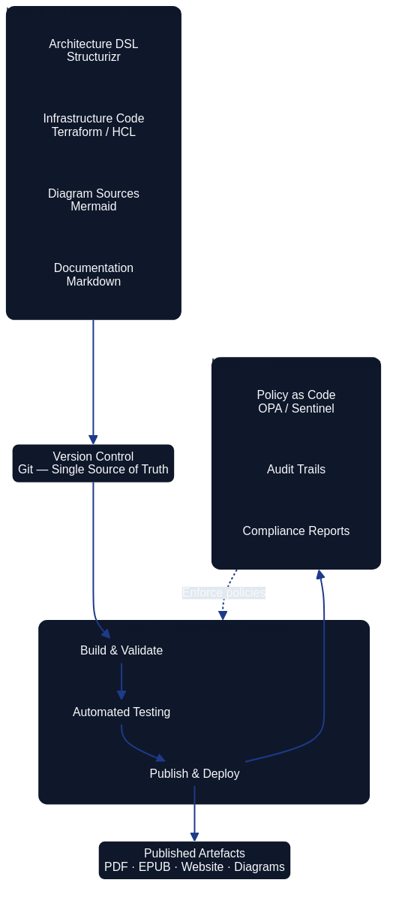
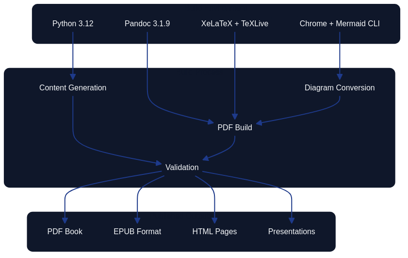
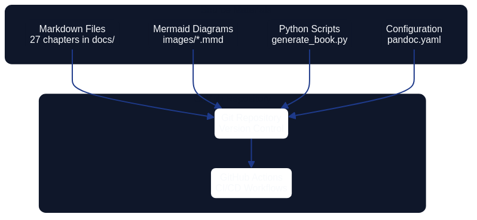

# Chapter 27 – Conclusion {#conclusion}

Architecture as Code has transformed how organisations design, deliver, and evolve their technology estates. By managing
architectural artefacts as executable code we realise the same precision, repeatability, and governance controls that software
engineering teams have relied on for decades. This book has traced that transformation from the
[fundamental concepts](01_introduction.md) to [forward-looking developments](25_future_trends.md), showing how the
practice underpins modern digital capabilities.

## 27.1 Consolidating the Architecture as Code mindset

Sustained success with Architecture as Code depends on the interplay between technical craft and organisational intent. The
most effective transformations are led by committed sponsors, supported by clear communication, and reinforced through
structured learning programmes. The change practices explored in [chapter 17 on organisational change](17_organisational_change.md)
show how leadership, coaching, and incremental adoption reduce disruption whilst building confidence across teams.

Architecture as Code stretches beyond infrastructure automation by codifying decision logic, policies, and integration
patterns that articulate the enterprise blueprint. Maintaining this emphasis ensures that architectural outcomes remain the
focal point, with infrastructure services treated as one contributor to a broader design system.

### 27.1.1 Technical and organisational alignment

Architecture as Code asks teams to think about cloud platforms, automation tooling, and security principles as a single
strategic capability. The technical foundations span [fundamental principles](02_fundamental_principles.md), disciplined
[version control](03_version_control.md), and [automation through CI/CD](05_automation_devops_cicd.md). These practices must be
matched by organisational investment in skills, culture, and operating models so that new workflows can flourish.

*Figure 27.1 – The technical structure of an Architecture as Code platform, showing the layered relationship between declarative definitions, automation pipelines, and governance controls.*

## 27.2 Embedding continuous improvement

The journey through this book charts a deliberate increase in sophistication: from declarative blueprints and idempotent
configuration in [chapter 2](02_fundamental_principles.md), through [container orchestration](07_containerisation.md), to
[future-facing automation patterns](25_future_trends.md). Security is treated as an architectural concern from the
outset, evolving from [policy and security](10_policy_and_security.md) through [governance as code](11_governance_as_code.md)
and [compliance operations](12_compliance.md). Each capability builds on the previous layer to create a resilient Architecture
as Code platform.

### 27.2.1 Measuring and refining delivery

Continuous improvement is woven into Architecture as Code. Metrics from [automation and DevOps practices](05_automation_devops_cicd.md)
and insights from [team structure guidance](18_team_structure.md) help identify areas for refinement. Observability patterns,
first introduced in [security and resilience chapters](09_security_fundamentals.md), support data-driven decisions and proactive
optimisation. By regularly reviewing feedback loops, teams maintain momentum and prevent regression.

*Figure 27.2 – The Architecture as Code build pipeline, illustrating how architectural definitions flow through validation, testing, and deployment stages to produce governed, auditable outcomes.*

## 27.3 European context and opportunities

Operating across the European Union demands consistent stewardship of information, resilient supply chains, and ethically governed
automation. The [policy and security guidance](10_policy_and_security.md) and [compliance practices](12_compliance.md) illustrate
how GDPR, the NIS2 Directive, and emerging AI governance proposals influence design choices from the earliest architectural
blueprints. Treating data residency as a first-class requirement keeps infrastructure definitions aligned with EU data boundary
commitments and sector-specific controls such as DORA for financial services and the European Data Governance Act for cross-border
data sharing.

European initiatives create space for Architecture as Code teams to collaborate beyond national boundaries whilst still respecting
local obligations. Programmes such as Horizon Europe, Digital Europe, GAIA-X, and the European Alliance for Industrial Data, Edge
and Cloud encourage interoperable platforms, harmonised reference architectures, and sector-specific data spaces that can be
codified as re-usable modules. Access to EU-funded sandboxes and regulatory support, including the AI Act's conformity assessment
regime, helps organisations evidence compliance earlier in delivery cycles and accelerate acceptance by supervisory authorities.

Sustainability remains a parallel obligation. [Future trends](25_future_trends.md) emphasise carbon-aware workloads,
energy-efficient automation, and transparent procurement aligned with the European Green Deal, the Fit for 55 package, and the
Corporate Sustainability Reporting Directive. The wider transformation agenda explored in [chapter 21 on digitalisation](21_digitalisation.md)
shows how coordinated change across Member States, public institutions, and private enterprises benefits from codified architectural
knowledge that can be shared, audited, and re-used without reinventing country-specific artefacts.

## 27.4 Recommendations for organisations

Organisations embarking on Architecture as Code initiatives should focus on pilot programmes that demonstrate tangible value
without jeopardising critical services. Education, shared tooling, and clear ownership models build confidence and set
expectations. The leadership guidance in [organisational change](17_organisational_change.md) reinforces the importance of
communication, coaching, and community building.

### 27.4.1 Step-by-step adoption strategy

1. **Foundational education**: Establish a common understanding of [Architecture as Code principles](02_fundamental_principles.md)
   and disciplined [version control practices](03_version_control.md).
2. **Pilot projects**: Use [automation pipelines](05_automation_devops_cicd.md) to modernise a contained, low-risk service whilst
   collecting feedback and metrics. Validate quality using the [testing strategies](13_testing_strategies.md) described in Chapter 13,
   and apply the [migration guidance](16_migration.md) from Chapter 16 when transitioning existing services.
3. **Security integration**: Embed [policy and security](10_policy_and_security.md) controls and [compliance processes](12_compliance.md)
   into every delivery workflow.
4. **Scaling and automation**: Expand towards [container orchestration](07_containerisation.md) and platform capabilities described in
   [management as code](19_management_as_code.md). Explore the [soft-as-code interplay](23_soft_as_code_interplay.md) from Chapter 23
   to align behavioural and technical dimensions as the programme scales.
5. **Readiness and risk management**: Before expanding to new domains, validate organisational readiness using the framework in
   [Chapter 26A: Prerequisites for Architecture as Code Adoption](26a_prerequisites_for_aac.md) and consult
   [Chapter 26B: Anti-Patterns in Architecture as Code Programmes](26b_aac_anti_patterns.md) to anticipate and mitigate common pitfalls.
6. **Future readiness**: Track [emerging trends](25_future_trends.md) and sustainability expectations so that the
   Architecture as Code platform remains adaptable.

Centres of excellence or platform teams can accelerate adoption by curating reusable modules, publishing reference
implementations, and providing hands-on support. Governance structures maintain security and compliance without constraining
innovation, enabling teams to deliver change with confidence.

## 27.5 Closing reflection

Architecture as Code is more than a technical milestone; it represents a fundamental shift in how we design and manage digital
platforms. The journey from [introduction](01_introduction.md) through [technical implementation](14_practical_implementation.md),
[security strategy](10_policy_and_security.md), and [future-oriented innovation](25_future_trends.md) shows that
Architecture as Code thrives when engineering discipline and organisational stewardship progress together.

### 27.5.1 The way forward

The concepts outlined in this book—declarative intent, idempotence, automated testing, and continuous delivery—remain constants
even as tooling evolves. By combining technical excellence with attention to sustainability, security, and regulatory
obligations, organisations can use Architecture as Code to create enduring competitive advantage. The work continues: experiment,
learn, and refine so that Architecture as Code keeps pace with the ambitions of the business and the expectations of society.

One challenge that remains genuinely unsolved is the governance of AI-generated architecture decisions. As large language models begin proposing infrastructure patterns, module configurations, and security controls, the profession must grapple with how to audit, attribute, and enforce human accountability over machine-authored artefacts. Version control captures what changed; it does not yet capture whether the reasoning behind a change was sound, who held responsibility, or how to roll back a conceptual mistake rather than merely a configuration error. This is not a tooling gap alone—it is a governance, ethics, and organisational design problem that the Architecture as Code community is uniquely positioned to address.

**A direct challenge for practitioners:** identify one AI-assisted decision in your current architecture estate that lacks a traceable human rationale, write an Architecture Decision Record for it retrospectively, and share your approach with your community of practice. That single act—making the implicit explicit—is the habit on which trustworthy, sustainable Architecture as Code programmes are built.

The open-source ecosystem that underpins this discipline—from Terraform and Pulumi to Structurizr and Open Policy Agent—advances because practitioners share their experiments, patterns, and failures. Consider contributing a module, a reusable policy template, or a postmortem to a public repository. Collective stewardship of shared tooling is the most direct way to ensure that the next generation of architects inherits a richer, more humane, and more governable platform than the one we inherited.

*Figure 27.3 – Source materials and intellectual lineage underpinning the Architecture as Code approach presented in this book.*

## Key Works

The thesis of this book draws most directly on:

- Skelton, M. & Pais, M. (2019). *Team Topologies*. IT Revolution Press.
- Forsgren, N., Humble, J. & Kim, G. (2018). *Accelerate: The Science of Lean Software and DevOps*. IT Revolution Press.
- Bass, L., Clements, P. & Kazman, R. (2021). *Software Architecture in Practice* (4th ed.). Addison-Wesley.

For a full bibliography, see [Chapter 33: References and Sources](33_references.md).
