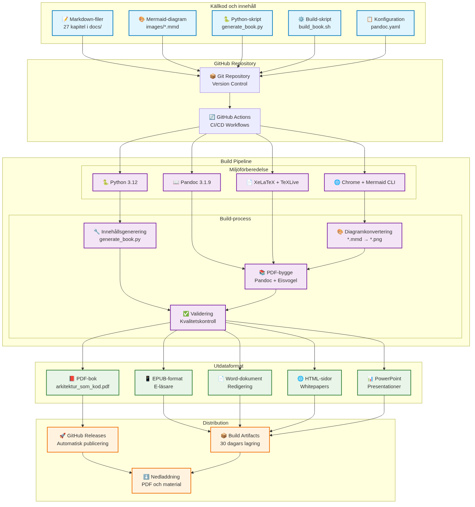
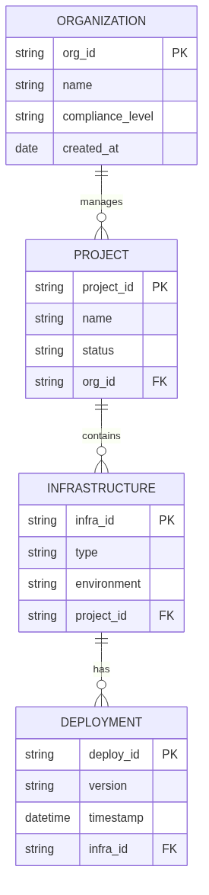

# technical uppbyggnad for bokproduktion

This chapters describes The technical infrastructureen and arbetsflödet as används to create, bygga and publicera "Architecture as Code". Systemet exemplifierar praktisk toämpning of Architecture as Code-principerna by use code to definiera and automatisera entire bokproduktionsprocessen.



*The diagram illustrates the comprehensive technical systemet as driver bokproduktionen, from markdown-Sources via automatiserade pipelines to slutliga publikationer.*



Ovanstående entitetsrelationsdiagram shows The logiska dataStructureen for how organisationer, projekt, infrastructure and deployments relaterar to varandra in a Architecture as Code-Architecture as Code-implementation.

## Markdown-filer: structure and syfte

### Filorganisation and namnkonvention

Book content is organiserat in 27 markdown-filer within `docs/`-katalogen, where each File represents A chapters:

```
docs/
├── 01_inledning.md                    # Introduktion and vision
├── 02_grundlaggande_principer.md      # Fundamental Concepts
├── 03_versionhantering.md             # Git and version control
├── ...                                # Tekniska chapters (04-22)
├── 23_slutsats.md                     # Avslutning
├── 24_ordlista.md                     # Terminologi
├── 25_om_forfattarna.md               # Författarinformation
├── 26_appendix_kodexempel.md          # Tekniska example
└── 27_teknisk_uppbyggnad.md           # This chapters
```

### Markdown-struktur and semantik

each chapters follows a konsistent structure as optimerar both läsbarhet and maskinell bearbetning:

```markdown
# Kapiteltitel (H1 - creates new sida in PDF)

Introduktionstext with kort Description of kapitlets content.


*Bildtext as förklarar diagrammets content.*

## Huvudsektion (H2)
### Undersektion (H3)
#### Detaljsektion (H4)

- Listpunkter for strukturerat content
- Kodexempel in fenced code blocks
- Referenser and källor
```

### Automatisk innehållsgenerering

Systemet uses `generate_book.py` to automatically generera and uppdatera kapitelContents:

- **Iterativ generering**: creates Contents in kontrollerade batch-processes
- **Mermaid-integration**: Automatisk generering of diagram-placeholders
- **Konsistenshållning**: ensures enhetlig structure over all chapters
- **version control**: all ändringar spåras through Git

## Pandoc: Konvertering and formatering

### Konfigurationssystem

Pandoc-konverteringen styrs of `pandoc.yaml` which definierar all format-specific inställningar:

```yaml
# Fundamental inställningar
standalone: true
toc: true
toc-depth: 3
number-sections: true
top-level-division: chapter

# Eisvogel-template for professionell PDF-layout
template: eisvogel.latex
pdf-engine: xelatex

# Metadata and variabler
metadata:
  title: "architecture as code"
  subtitle: "Infrastructure as Code (architecture as code) in praktiken"
  author: "Kodarkitektur Bokverkstad"
```

### Build-process and architecture as code-automation

`build_book.sh` orchestrerar entire build-processen:

1. **Miljövalidering**: Kontrollerar Pandoc, XeLaTeX and Mermaid CLI
2. **Diagram-konvertering**: Konverterar `.mmd`-filer to PNG-format
3. **PDF-generering**: Sammanställer all chapters to a sammanhållen bok
4. **Format-variationer**: Stöd for PDF, EPUB and DOCX-export

```bash
# Konvertera Mermaid-diagram
for mmd_file in images/*.mmd; do
    png_file="${mmd_file%.mmd}.png"
    mmdc -in "$mmd_file" -o "$png_file" \
         -t default -b transparent \
         --width 1400 --height 900
done

# Generera PDF with all chapters
pandoc --defaults=pandoc.yaml "${CHAPTER_FILES[@]}" -o arkitektur_som_kod.pdf
```

### Kvalitetssäkring and validation

- **Template-validation**: Automatisk kontroll of Eisvogel-template
- **Konfigurationskontroll**: Verifierar pandoc.yaml-inställningar
- **Bildhantering**: ensures all diagram-References is giltiga
- **Utdata-verification**: Kontrollerar genererade filer

## GitHub Actions: CI/CD-pipeline

### Huvudworkflow for bokproduktion

`build-book.yml` automatiserar entire publikationsprocessen:

```yaml
name: Build Book
on:
  push:
    branches: [main]
    paths:
      - 'docs/**/*.md'
      - 'docs/images/**/*.mmd'
  pull_request:
    branches: [main]
  workflow_dispatch: {}

jobs:
  build-book:
    runs-on: ubuntu-latest
    timeout-minutes: 90
```

### Workflow-step and optimeringar

1. **Miljöuppställning (15 minuter)**:
   - Python 3.12 installation
   - TeXLive and XeLaTeX (8+ minuter)
   - Pandoc 3.1.9 installation
   - Mermaid CLI with Chrome-dependencies

2. **Cachning and performance**:
   - APT-paket caching for snabbare builds
   - Pip-dependencies caching
   - Node.js modules caching

3. **Build-process (30 sekunder)**:
   - Diagram-generering from Mermaid-Sources
   - PDF-kompilering with Pandoc
   - quality controls and validation

4. **Publicering and distribution**:
   - Automatisk release-creatende at main-branch pushes
   - Artifact-lagring (30 dagar)
   - PDF-distribution via GitHub Releases

### Kompletterande workflows

**Content Validation** (`content-validation.yml`):
- Markdown-syntaxvalidering
- Länk-kontroll and bildvalidering
- Språklig quality control

**Presentation Generation** (`generate-presentations.yml`):
- PowerPoint-material from bokkapitel
- Structureerade presentationsoutlines
- Kvadrat-branding and professionell styling

**Whitepaper Generation** (`generate-whitepapers.yml`):
- Individuella HTML-documents per chapters
- Standalone-format for distribution
- SEO-optimerat and print-vänligt

## Presentation-material: Förberedelse and generering

### Automatisk outline-generering

`generate_presentation.py` creates Presentation materials from bokContents:

```python
def generate_presentation_outline():
    """Genererar presentationsoutline from all bokkapitel."""
    docs_dir = Path("docs")
    chapter_files = sorted(glob.glob(str(docs_dir / "*.md")))
    
    presentation_data = []
    for chapter_file in chapter_files:
        chapter_data = read_chapter_content(chapter_file)
        if chapter_data:
            presentation_data.append({
                'file': Path(chapter_file).name,
                'chapter': chapter_data
            })
    
    return presentation_data
```

### PowerPoint-integration

Systemet genererar:
- **Presentation outline**: Structured markdown with nyckelbudskap
- **Python PowerPoint-script**: Automatisk slide-generering
- **Kvadrat-branding**: Konsistent visuell identitet
- **Contentssoptimering**: Anpassat for muntlig presentation

### Distribution and use

```bash
# Ladda ner artifacts from GitHub Actions
cd presentations
pip install -r requirements.txt
python generate_pptx.py
```

Resultatet is professionella PowerPoint-presentationer optimerade for:
- Konferenser and workshops
- UtbildningsPurpose
- Marknadsforingsaktiviteter
- Tekniska seminarier

## Omslag and whitepapers: design and integration

### Omslag-designsystem

Bokens omslag are created through A HTML/CSS-baserat designsystem:

```
exports/book-cover/
├── source/
│   ├── book-cover.html              # Huvuddesign
│   ├── book-cover-light.html        # Ljus variant
│   └── book-cover-minimal.html      # Minimal design
├── pdf/                             # Print-färdiga PDF-filer
├── png/                             # Högupplösta PNG-exportar
└── scripts/
    └── generate_book_cover_exports.py
```

### Kvadrat-varumärkesintegrering

Designsystemet implement Kvadrat-identiteten:

```css
:root {
    --kvadrat-blue: hsl(221, 67%, 32%);
    --kvadrat-blue-light: hsl(217, 91%, 60%);
    --kvadrat-blue-dark: hsl(214, 32%, 18%);
    --success: hsl(160, 84%, 30%);
}

.title {
    font-size: 72px;
    font-weight: 800;
    line-height: 0.9;
    letter-spacing: -2px;
}
```

### Whitepaper-generering

`generate_whitepapers.py` creates standalone HTML-documents:

- **26 individuella whitepapers**: A per chapters
- **Professionell HTML-design**: Responsiv and print-vänlig
- **Svenska anpassningar**: Optimerat for Swedish organizations
- **SEO-optimering**: Korrekt meta-data and structure
- **Distribution-vänligt**: can delas via e-post, webb or print

## technical architecture and systemintegration

### holistic view at architecture

Entire systemet exemplifierar Architecture as Code through:

1. **codified Contentsshantering**: Markdown as källa for sanning
2. **Automatiserad pipeline**: Ingen manuell intervention krävs
3. **version control**: Fullständig history of all ändringar
4. **reproducibility**: Identiska builds from same källkod
5. **scalability**: Enkelt to lägga to new chapters and format

### Kvalitetssäkring and testing

- **Automatiserad validation**: Kontinuerlig kontroll of Contents and format
- **Build-verification**: ensures all format genereras korrekt
- **Performance-monitoring**: Spårning of build-tider and resursanvändning
- **Error-handling**: Robusta felwithdelanden and återställningsmekanismer

### Framtida development

Systemet is designat for kontinuerlig forbättring:
- **Modulär architecture**: Enkelt to uppdatera individual components
- **API-possibilities**: Potential for integration with externa systems
- **Skalning**: Stöd for fler format and distributionskanaler
- **Internationalisering**: Forberedelse for flerspråkig publicering

## Summary


The modern Architecture as Code methodology represents framtiden for infrastructurehantering in svenska organisationer.
The technical uppbyggnaden for "Architecture as Code" demonstrerar praktisk toämpning of bokens egna principles. by kodifiera entire publikationsprocessen uppnås:

- **Architecture as Code-automation**: Komplett CI/CD for bokproduktion
- **Kvalitet**: Konsistent format and professionell presentation
- **Effektivitet**: Snabb iteration and feedback-loopar
- **scalability**: Enkelt to utöka with nytt Contents and format
- **Transparens**: Öppen källkod and documentserad process

This technical systems functions as a konkret illustration of how Architecture as Code-principerna can toämpas also utanfor traditionella IT-systems, which creates värde through automation, reproducibility and kontinuerlig forbättring.

Sources:
- GitHub Actions Documentation. "Workflow syntax for GitHub Actions." GitHub, 2024.
- Pandoc User's Guide. "Creating documents with Pandoc." John MacFarlane, 2024.
- Mermaid Documentation. "Diagram syntax and examples." Mermaid Community, 2024.
- LaTeX Project. "The Eisvogel template documentation." LaTeX Community, 2024.