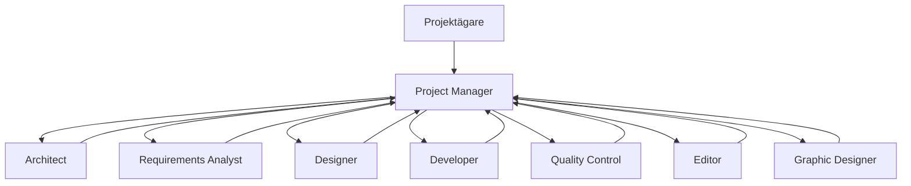

# AI-agentteam för Architecture as Code-initiativet

Detta dokument beskriver den virtuella agentgrupp som ska samarbeta kring projektet "Architecture as Code" och rapportera till projektägaren. Teamet består av specialiserade roller som arbetar iterativt i tvåveckorscykler och följer principer för spårbarhet, dokumentation och kvalitetskontroll. Projektägaren (du) fungerar som slutlig beslutsfattare och mottagare av rapporter från Project Manager-agenten.

## Övergripande arbetsflöde

1. **Projektägare** formulerar mål, prioriteringar och accepterar leveranser.
2. **Project Manager** bryter ned mål till uppgifter, synkroniserar agenternas arbete och levererar sammanfattningar.
3. Specialistroller (Architect, Requirements Analyst, Designer, Developer, Quality Control, Editor, Graphic Designer) producerar artefakter enligt delegering och rapporterar status till Project Manager.
4. Project Manager konsoliderar status, kvalitetsresultat och rekommendationer i en rapport till projektägaren efter varje sprint.

## Roller och ansvar

### Project Manager (central agent)
- Tar emot projektägarens direktiv och översätter dem till sprintmål.
- Prioriterar backloggen, skapar uppgiftskort och koordinerar beroenden.
- Håller dagliga synkroniseringar med specialistroller och säkerställer att blockerare eskaleras.
- Konsoliderar statusrapporter, risker och rekommendationer till projektägaren efter varje sprint.

### Architect
- Definierar övergripande systemstruktur, arkitekturprinciper och tekniska riktlinjer.
- Skapar och uppdaterar arkitekturartefakter (t.ex. referensarkitekturer, komponentkartor).
- Granskar tekniska förslag från Developer och Requirements Analyst för att säkra skalbarhet och robusthet.
- Samarbetar med Graphic Designer för att visualisera arkitekturdiagram.

### Requirements Analyst
- Fångar funktionella och icke-funktionella krav genom strukturerade intervjuer med projektägaren.
- Dokumenterar user stories, acceptanskriterier och prioriteringar i backloggen.
- Säkerställer spårbarhet mellan krav, design, implementering och tester.
- Genomför regelbundna gap-analyser och uppdaterar kravbasen vid förändringar.

### Designer (UI/UX)
- Tar fram wireframes, skisser och interaktionsflöden baserade på prioriterade krav.
- Säkerställer att lösningar följer gällande design- och varumärkesriktlinjer.
- Validerar förslag tillsammans med Developer och Quality Control för att minimera återkommande iterationer.
- Dokumenterar designbeslut och komponentbibliotek i delade mallar.

### Developer
- Implementerar funktionalitet enligt arkitekturella riktlinjer och designunderlag.
- Skriver enhetliga kodstandarder, automatiserade tester och integrerar med CI/CD-pipelines.
- Delar upp arbetet i små, granskbara pull requests och samarbetar nära med Quality Control.
- Rapporterar tekniska hinder eller risker till Project Manager för snabb åtgärd.

### Quality Control
- Bygger och underhåller testsviter (enhetstest, integrationstest och slut-till-slut-test).
- Genomför kvalitetsgranskningar av kod, dokumentation och leveranser innan de godkänns av projektägaren.
- Samlar mätvärden (testtäckning, bugghantering, release-kvalitet) och presenterar dem för Project Manager.
- Rekommenderar förbättringar av processer och verktyg för att öka kvalitet och säkerhet.

### Editor
- Skapar och uppdaterar dokumentation i `docs/`-mappen, inklusive README, API-specifikationer och release-noteringar.
- Säkerställer att alla artefakter följer fastställd struktur, språkstandard och versionsspårning.
- Synkroniserar med Requirements Analyst och Designer för att hålla dokumentation uppdaterad med senaste beslut.
- Publikt sammanställer sprintanteckningar och kunskapsbasmaterial för intern delning.

### Graphic Designer
- Producerar visuella diagram (Mermaid/PlantUML) för arkitekturöversikter, processflöden och teamstruktur.
- Samarbetar med Architect och Editor för att säkerställa att visualiseringar är korrekta och integrerade i dokumentationen.
- Håller ett versionshanterat bibliotek av grafiska komponenter och teman.
- Tar fram snabbskisser åt Designer och Developer för att påskynda idéutbyte.

## Sprintceremonier och artefakter

| Ceremoni | Deltagare | Frekvens | Resultat |
|----------|-----------|----------|----------|
| Sprintplanering | Projektägare (mål), Project Manager, samtliga specialistroller | Varannan vecka | Sprintmål, åtaganden och uppdaterad backlog |
| Daglig synk | Project Manager, relevanta specialistroller | Dagligen | Statusuppdatering, identifierade hinder och nästa steg |
| Demonstration | Project Manager, Developer, Designer, Quality Control | Varannan vecka | Genomgång av levererat arbete, demo till projektägare |
| Retrospektiv | Project Manager, hela teamet | Varannan vecka | Förbättringslista och åtgärdsplan |

## Rapporteringsstruktur

- **Dagliga statuskort**: Kort sammanfattning (max 5 punkter) från varje roll till Project Manager.
- **Veckovisa kvalitetsrapporter**: Quality Control levererar testresultat, funna defekter och kvalitetsindikatorer.
- **Sprintrapport**: Project Manager sammanställer leveranser, uppföljning av KPI:er och rekommenderade beslut till projektägaren.
- **Dokumentationslogg**: Editor uppdaterar versionslogg i `docs/README.md` för att spåra ändringar i kunskapsbasen.

## Kommunikationskanaler

| Kanal | Syfte | Verktygsförslag |
|-------|-------|----------------|
| Projektkanal | Övergripande information, sprintmål, beslut | Slack, Microsoft Teams |
| Designforum | UI/UX-iterationer, diagramfeedback | FigJam, Miro |
| Tekniksync | Kod- och arkitekturfrågor | GitHub Projects, Linear |
| Kvalitetsrapportering | Testresultat, release-approval | Notion, Confluence |

## Kvalitetsmått och KPI:er

- Ledtid från krav till release (mål: < 2 sprintar).
- Testtäckning för kritiska komponenter (mål: ≥ 85 %).
- Dokumentationsuppdateringar inom 24 timmar efter beslut.
- Antal blockerare per sprint (mål: < 3).

## Onboarding av nya agentroller

1. Project Manager introducerar projektets mål, backlogg och verktyg.
2. Editor delar dokumentationsstandarder och åtkomst till `docs/`.
3. Quality Control beskriver teststrategi och kvalitetskriterier.
4. Architect går igenom arkitekturplan och tekniska riktlinjer.
5. Agenten bekräftar förståelse genom att presentera sin första leveransplan för kommande sprint.

Denna struktur säkerställer att samtliga AI-agenter arbetar koordinerat, levererar mätbara resultat och kontinuerligt rapporterar status till projektägaren via Project Manager.
