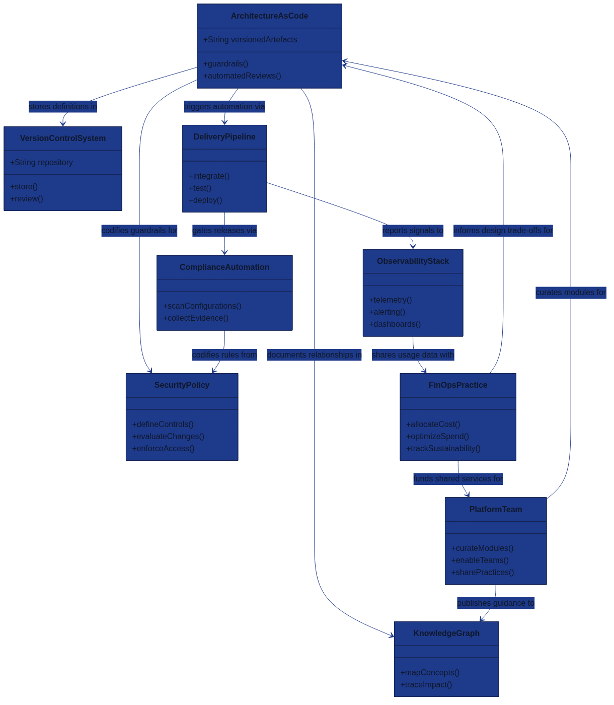

# Glossary

The glossary gathers the key terminology that shapes the Architecture as Code approach across this book. It embraces inclusive language so that every practitioner—regardless of background, role, or level of experience—can connect their work to the concepts shown in the relationships diagram above.

## How to use this glossary
- **Start with the diagram:** The class diagram summarises how foundational Architecture as Code elements interact. Trace the relationships before diving into the definitions.
- **Explore by theme:** Terms are grouped so product teams, platform engineers, security specialists, and organisational leaders can quickly find language relevant to their responsibilities.
- **Cross-reference chapters:** Each definition reflects the terminology used throughout the book. When you see a highlighted concept in other chapters, return here for a concise explanation.
- **Keep language inclusive:** Use these definitions when collaborating so every team member hears consistent, people-first language.

## Core Architecture as Code foundations

| Term | Definition |
|------|------------|
| Architecture as Code (AaC) | Treating architectural decisions, guardrails, and platform capabilities as versioned artefacts that are reviewed, tested, and deployed through automated pipelines. |
| Infrastructure as Code (IaC) | A practice closely related to AaC where infrastructure resources are defined declaratively and managed through version control to deliver predictable environments. |
| Architecture Decision Record (ADR) | A lightweight document that captures context, decision, and consequences so teams understand why architectural choices were made and can revisit them together. |
| Declarative Programming | A style of describing desired outcomes rather than procedural steps, enabling automation tools to converge systems on the target state reliably. |
| Idempotence | The property that a command or template can run repeatedly with the same end result, protecting teams from accidental drift or double execution. |
| Reusable Module | A parameterised building block—such as a Terraform module or Helm chart—that encapsulates best practice and is published for teams to compose new solutions quickly. |
| API (Application Programming Interface) | A contract that allows systems to interact predictably, enabling modular architectures and integrated delivery workflows. |

## Automation, tooling, and delivery

| Term | Definition |
|------|------------|
| Continuous Integration / Continuous Delivery (CI/CD) | A feedback-driven workflow where code changes are integrated, tested, and promoted through automated stages, reducing manual hand-offs. |
| Delivery Pipeline | The orchestrated flow of automated checks, approvals, and deployments that transform committed code into resilient production services. |
| Version Control System (VCS) | A collaborative platform—Git being the most common—that stores source code, policies, and templates, preserving history and peer review. |
| GitOps | Operating models that use a VCS as the single source of truth so that merges trigger automated reconciliation against live environments. |
| Configuration Management | Tooling such as Ansible or Chef that applies desired system states, often working alongside declarative templates to maintain consistency. |
| Terraform | A widely used IaC tool that compiles declarative configurations into API calls, offering modular composition and policy enforcement hooks. |
| Helm | The package manager for Kubernetes that bundles manifests, default values, and documentation into shareable charts. |
| Kubernetes | An open-source orchestration platform that schedules containers, scales workloads, and standardises operational tasks. |
| Container | A lightweight, portable runtime package that combines application code with dependencies for consistent execution across environments. |
| Service Mesh | A dedicated infrastructure layer that manages service-to-service security, routing, and observability without each team writing bespoke logic. |
| Runbook Automation | Automated execution of the procedural knowledge once held in runbooks, shortening incident response while keeping humans in control of critical decisions. |
| Observability Stack | The telemetry pipelines, dashboards, and alerting rules that provide actionable insight into system behaviour and guide inclusive on-call collaboration. |

## Governance, compliance, and security

| Term | Definition |
|------|------------|
| Policy as Code | The practice of expressing organisational policies in code so they can be versioned, tested, and enforced automatically across platforms. |
| Continuous Compliance | Automated validation that checks regulatory and internal controls with every change, generating evidence that auditors and teams can trust. |
| Zero Trust | A security stance that continuously verifies identities, device health, and context before granting access, reducing implicit trust between services. |
| Security Policy | A codified set of safeguards—identity, encryption, network, and data-handling—that shapes how architecture components interoperate securely. |
| Data Sovereignty | Ensuring data is handled in accordance with the laws of the jurisdiction where it resides, influencing design choices and deployment regions. |
| Risk Assessment Matrix | A structured view of likelihood versus impact that helps teams evaluate and prioritise mitigations collaboratively. |
| Access Federation | Coordinated identity management across platforms so that people have the least-privileged access they need to perform their roles. |

## Reliability and operational excellence

| Term | Definition |
|------|------------|
| Site Reliability Engineering (SRE) | An engineering discipline that applies software practices to operations work, balancing reliability with delivery velocity. |
| Service Level Objective (SLO) | A shared target for reliability, expressed as a measurable goal that teams use to evaluate whether customer expectations are being met. |
| Service Level Indicator (SLI) | The quantitative measurement—such as latency or error rate—that shows whether an SLO is being achieved. |
| Error Budget | The agreed allowance for unreliability that guides deployment pace and prioritisation of improvement work. |
| Chaos Engineering | Intentional experimentation that reveals weaknesses by introducing controlled failure, strengthening resilience and team confidence. |
| Incident Command | An inclusive, role-based structure that coordinates response efforts during major events so everyone understands responsibilities and communication paths. |
| Blameless Post-Incident Review | A learning-focused conversation after incidents that identifies systemic improvements without placing personal blame. |
| Runway Health Check | A periodic review of capacity, tooling, and process debt to ensure teams have the runway to deliver sustainable change. |

## Financial stewardship and sustainability

| Term | Definition |
|------|------------|
| FinOps | A collaborative financial practice that aligns engineering, finance, and product teams on cost efficiency while supporting innovation. |
| Cost Allocation Tag | Metadata attached to resources that enables transparent reporting by product, team, or initiative. |
| Rightsizing | Optimising resource shapes and reservations based on observed usage to reduce waste without compromising performance. |
| Reserved and Spot Capacity | Cloud purchasing models that trade commitment or flexibility for lower cost, requiring automation to manage safely. |
| Resource Quota | A constraint that limits how much of a resource can be consumed in a namespace or account, preventing unintended overspend. |
| Carbon-Aware Computing | Scheduling workloads and scaling strategies to coincide with renewable energy availability, supporting environmental goals. |

## Organisational alignment and culture

| Term | Definition |
|------|------------|
| Platform Team | A multidisciplinary group that curates reusable services, standards, and documentation so product teams can focus on customer value. |
| Community of Practice | An open forum where people with a shared interest learn together, improving patterns and vocabulary across the organisation. |
| Cross-Functional Team | A team with diverse skills—engineering, security, operations, product, and design—working together from discovery through run-time. |
| DevOps Culture | The mindset that values shared ownership, rapid feedback, and continuous improvement over siloed hand-offs. |
| Psychological Safety | An environment where every team member can contribute ideas or raise concerns without fear, enabling inclusive innovation. |
| Servant Leadership | A leadership style that removes obstacles, amplifies team voices, and nurtures growth instead of commanding outcomes. |
| Change Management | A transparent approach to guiding people through change with empathy, communication, and supportive training. |

**Continuous Improvement Loop:** A feedback rhythm—retrospectives, reviews, and experiments—that keeps practices evolving alongside technology.

**Anti-Pattern:** A common but counterproductive practice that appears helpful yet creates long-term issues, signalling an opportunity for shared learning.

## Future-focused and advanced concepts
**Multi-Cloud Strategy:** Using services from multiple providers to balance capability, resilience, and regulatory needs while avoiding lock-in.

**Edge Computing:** Placing compute capabilities closer to data sources or users to reduce latency and improve responsiveness.

**Post-Quantum Cryptography:** Cryptographic techniques designed to withstand attacks from both classical and quantum computers.

**Digital Twin:** A synchronised virtual representation of a system that allows teams to explore changes safely before applying them in production.

**AI for IT Operations (AIOps):** Applying machine learning to operational data to surface anomalies, predict incidents, and guide human responders.

**Sustainability KPI:** A measurable objective—such as emissions per transaction—that keeps environmental impact visible during planning and prioritisation.

**Knowledge Graph:** A connected representation of architectural artefacts, policies, and services that supports richer impact analysis and discovery.

---

Revisit this glossary as new capabilities emerge. Update both the definitions and the diagram when introducing a novel concept so that every reader can see how their contribution fits into the Architecture as Code ecosystem.
