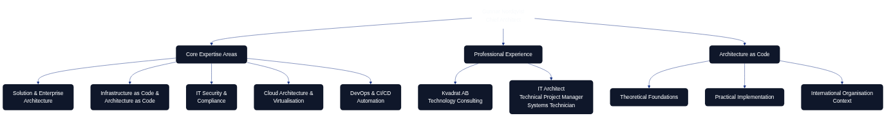

# About the Author

This book represents the culmination of extensive experience in architecture, infrastructure, and systems development, bringing together theoretical foundations with practical expertise to create a comprehensive resource for organisations embracing Architecture as Code.

*An overview of the expertise and experience that shaped this comprehensive guide to Architecture as Code and Infrastructure as Code.*

## Gunnar Nordqvist

**Gunnar Nordqvist** is a self employed certified Chief Architect and IT Architect consultant associated with Kvadrat, a leading Swedish technology consultancy. As an IT generalist with a profound interest in technology, Gunnar has worked across diverse roles throughout his career, including IT architect, technical project manager, and systems technician.

### Professional Background

Gunnar's extensive experience spans solution and enterprise architecture, IT infrastructure, and specialised information security engagements. His varied technical background encompasses network solutions, servers, virtualisation, and IT security, amongst other critical facets of contemporary technology estates.

**Core Areas of Expertise:**
- Solution and Enterprise Architecture
- Infrastructure as Code and Architecture as Code
- IT Security and Compliance
- Cloud Architecture and Virtualisation
- DevOps and CI/CD Automation
- Network Solutions and Infrastructure Design

### Architecture as Code Journey

Throughout his career, Gunnar has witnessed the evolution from manual, document-led architecture practice to the modern paradigm of codified architecture. This shift has shaped his approach to system design and his conviction that architecture must be treated with the same rigour and methodology as software engineering.

## About Kvadrat
**Kvadrat** is Sweden's largest network of independent consultants (often referred to as "egenföretagare" or sole proprietors) dedicated to driving organizational change. Founded as a community-driven platform, it connects highly skilled, motivated specialists who operate with autonomy while benefiting from the support of a larger collective. The company's core strength lies in its model of empowering individual experts to deliver high-impact solutions, fostering innovation and problem-solving for clients.

### Mission and Approach
Kvadrat's mission is to provide "Sweden's sharpest consultants" to help companies and organizations navigate transformation. It emphasizes freedom, self-determination, and expertise, appealing not only to clients seeking specialized help but also to professionals craving independence or those considering joining a supportive network. The tagline "Sveriges vassaste konsulter" (Sweden's sharpest consultants) underscores its focus on elite, driven talent that uncovers and resolves hidden challenges.

### Services and Expertise
Kvadrat offers top-tier consulting services across several key areas:

- **System Development**: Building and optimizing software and IT systems.
- **Digitalization**: Guiding digital transformation initiatives.
- **Information Management**: Strategies for data handling, storage, and utilization.
- **Leadership and Organizational Development**: Support for management, structure, and process improvements.
- **Business Development**: Enhancing operations and fostering growth.

These services are delivered through a flexible network model, allowing clients to engage individual specialists or teams as needed. More details on hiring consultants are available on their site.

### Target Markets
Kvadrat primarily serves businesses and organizations in Sweden undergoing change, from startups to large enterprises. It targets entities needing experienced hands for complex projects, as well as individual consultants looking to "become more Kvadrat-like" by joining the network for collaboration, resources, and community.

### Additional Notes
While specific details on company history, sustainability initiatives, or notable partnerships are not prominently featured on the site, Kvadrat positions itself as a leader in the Swedish consulting landscape through its scale and specialist focus. For those interested in joining, the platform highlights the benefits of community without sacrificing independence.

## Swedish Terminology Reference

> **Terminology Note:** The Swedish organisations and institutions referenced here keep their native names to preserve accuracy. The translations below clarify the meaning for readers unfamiliar with Swedish terminology.

- **Kvadrat AB** – `AB` stands for *aktiebolag*, Sweden’s equivalent of a limited company. The firm’s name translates literally to “square” but is always written as Kvadrat in branding.
- **KTH Royal Institute of Technology** – Commonly referred to as KTH, the Swedish name is *Kungliga Tekniska högskolan* (“Royal Institute of Technology”).
- **Linköping University** – In Swedish, *Linköpings universitet*; the apostrophe-free form follows Swedish grammar rules.
- **Malmö University** – *Malmö universitet* retains the letter `ö`, pronounced roughly like the vowel sound in “blur”.
- **Nordqvist** – A Swedish family name combining *nord* (“north”) and *qvist* (“twig”), reflecting traditional Swedish surname construction.

## The Book's Technical Foundation

This publication demonstrates Architecture as Code principles not only in its content but in its very creation. The book itself is built using modern DevOps practices and automated workflows.

### Publishing Toolchain

**Content Generation:**
- **Python 3.12** for content automation and orchestration
- **Pandoc 3.1.9** for document conversion and multi-format publishing
- **XeLaTeX** with Eisvogel template for professional PDF production
- **Mermaid CLI** for diagram-as-code generation

**Automation and Quality:**
- **GitHub Actions** for CI/CD automation
- **Version Control** for all content and diagrams
- **Automated Testing** for validation and quality assurance
- **Multi-format Publishing** (PDF, EPUB, DOCX)

### Living Documentation Principles

This book embodies the principles it teaches:

- **Version Controlled**: Every change tracked in Git
- **Automated Building**: CI/CD pipelines ensure consistent quality
- **Diagram as Code**: All diagrams defined in Mermaid and version controlled
- **Reproducible**: Anyone can build the book from source
- **Continuously Improved**: Regular updates based on feedback and evolution

## Acknowledgements

### Open Source Community

This book builds upon the outstanding work of the open source community, particularly:

- **Terraform** - Infrastructure as Code foundation
- **Ansible** - Configuration management automation
- **Docker** - Containerisation technology
- **Kubernetes** - Container orchestration
- **Pandoc** - Document conversion excellence
- **Mermaid** - Diagram as Code visualisation

## Continuous Improvement

This book is designed as a living resource that evolves with:

- **Community Feedback** - Input from organisations implementing Architecture as Code
- **Technical Evolution** - Updates as new tools and methods emerge
- **Practical Lessons** - Integration of new case studies and best practices
- **Language Refinement** - Continuous improvement of clarity and precision

### Contributing to Future Editions

Contributions from the technology community are welcomed:

**Content Contributions:**
- Case studies from real implementations
- Best practices from diverse organisations
- Coverage of new tools and technologies
- Improvements in clarity and precision

**Technical Contributions:**
- Code examples and automation scripts
- Build pipeline enhancements
- New export formats and distribution channels
- Accessibility and usability improvements

### Contact Information

For questions, feedback, or suggestions for improvements:

- **GitHub Repository**: [https://github.com/Geonitab/architecture_as_code](https://github.com/Geonitab/architecture_as_code)
- **Issues and Pull Requests**: Welcomed for content and technical improvements
- **Discussions**: GitHub Discussions for broader conversations about Architecture as Code

## Licence and Usage

This book is distributed under terms that enable:

- **Free Distribution** for educational purposes
- **Adaptation** for organisation-specific needs
- **Commercial Use** with proper attribution
- **Translation** to other languages whilst maintaining quality

All reuse should acknowledge the original author and contributors according to established academic and technical standards.

## Closing Reflections

The journey towards Architecture as Code represents more than a technical evolution—it embodies a fundamental shift in how we conceive, design, and operate technology systems. By codifying architecture, we bring the rigour, repeatability, and reliability of software engineering to the entire technology landscape.

This book aims to accelerate the adoption of Architecture as Code principles and contribute to improved technical outcomes across organisations. The success of these methodologies depends not only on technical implementation but on cultural transformation and organisational commitment to treating architecture as a first-class engineering discipline.

As technology continues to evolve, the principles outlined in this book—declarative design, version control, automation, and continuous validation—will remain fundamental to building reliable, scalable, and maintainable systems.

Sources:
- Kvadrat AB. 'Gunnar Nordqvist - Chief Architect Profile.' Konsultprofil, 2024. Available at: https://www.kvadrat.se/anlita-kvadrat/hitta-konsult/gunnar-nordqvist/
- Kvadrat AB. 'Technology Consulting Excellence.' Company Profile, 2024. Available at: https://www.kvadrat.se/
- ThoughtWorks. 'Architecture as Code: The Next Evolution.' Technology Radar, 2024.
- GitHub Open Source Community. 'Collaborative Software Development.' Platform Documentation, 2024.
