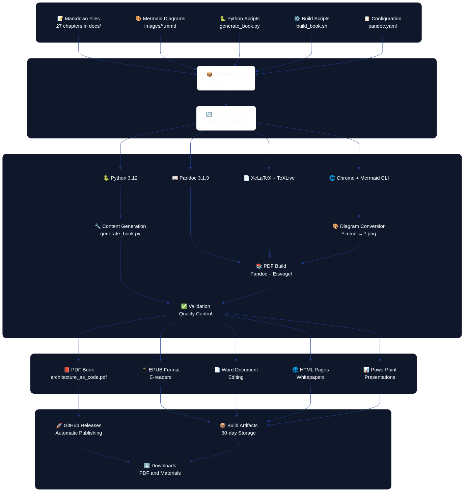

# Appendix B: Technical Architecture for Book Production {.unnumbered}

This chapter describes the technical infrastructure and workflow that produce, build, and publish "Architecture as Code". The system is a practical demonstration of Architecture as Code principles, showing how code defines and automates the entire book production process.



*The diagram illustrates the end-to-end technical system that powers book production, from Markdown sources through automated pipelines to the final publications.*


The entity relationship diagram above shows the logical data structure that connects organisations, projects, infrastructure, and deployments in an Architecture as Code implementation.

## 31.1 Markdown Files: Structure and Purpose

### 31.1.1 File Organisation and Naming Conventions

Book content is organised in 31 Markdown files within the `docs/` directory, where each file represents a chapter:

```
docs/
├── 01_introduction.md              # Introduction and vision
├── 02_fundamental_principles.md    # Fundamental concepts
├── 03_version_control.md           # Git and version control
├── ...                             # Technical chapters (04–21)
├── 21_digitalization.md            # Digitalisation strategy
├── 23_soft_as_code_interplay.md    # Interplay between soft disciplines
├── 24_best_practices.md            # Methods and lessons learned
├── 25_future_trends_development.md # Future trends and development
├── 27_conclusion.md                # Conclusion
├── 28_glossary.md                  # Terminology
├── 29_about_the_authors.md         # Author information
├── 30_appendix_code_examples.md    # Technical examples
└── 31_technical_architecture.md    # This chapter
```

### 31.1.2 Markdown Structure and Semantics

Each chapter follows a consistent structure that optimises both readability and automated processing. The template below demonstrates how headings, diagrams, lists, and code samples are arranged.

```markdown
# Chapter Title (H1 – creates a new page in the PDF)

Introductory text with a short description of the chapter’s contents.


*Caption that explains the diagram content.*

## Main section (H2)
### Sub-section (H3)
#### Detail section (H4)

- Bullet points for structured content
- Code examples in fenced code blocks
- References and sources
```

This layout ensures that readers can skim the content quickly, while the build pipeline can reliably transform every chapter into the desired publication formats.

### 31.1.3 Automated Content Generation

The system uses `generate_book.py` to generate and update chapter content automatically:

- **Iterative generation**: Creates content in controlled batch processes.
- **Mermaid integration**: Automatically generates diagram placeholders.
- **Consistency management**: Keeps structure uniform across all chapters.
- **Version control**: Tracks every change through Git.

## 31.2 Pandoc: Conversion and Formatting

### 31.2.1 Configuration System

Pandoc conversion is governed by `pandoc.yaml`, which defines all format-specific settings:

```yaml
# Core settings
standalone: true
toc: true
toc-depth: 3
number-sections: true
top-level-division: chapter

# Eisvogel template for professional PDF layout
template: eisvogel.latex
pdf-engine: xelatex

# Metadata and variables
metadata:
  title: "Architecture as Code"
  subtitle: "Infrastructure as Code (Architecture as Code) in practice"
  author: "Code Architecture Book Workshop"
```

### 31.2.2 Build Process and Architecture as Code Automation

`build_book.sh` orchestrates the entire build process:

1. **Environment validation**: Confirms the availability of Pandoc, XeLaTeX, and the Mermaid CLI.
2. **Diagram conversion**: Converts `.mmd` files to PNG format.
3. **PDF generation**: Compiles all chapters into a single book.
4. **Format variations**: Supports PDF, EPUB, and DOCX exports.

```bash
# Convert Mermaid diagrams
for mmd_file in images/*.mmd; do
    png_file="${mmd_file%.mmd}.png"
    mmdc -in "$mmd_file" -o "$png_file" \
         -t default -b transparent \
         --width 1400 --height 900
done

# Generate the PDF with all chapters
pandoc --defaults=pandoc.yaml "${CHAPTER_FILES[@]}" -o architecture_as_code.pdf
```

### 31.2.3 Quality Assurance and Validation

- **Template validation**: Automatically checks the Eisvogel template.
- **Configuration control**: Verifies Pandoc settings in `pandoc.yaml`.
- **Image handling**: Ensures every diagram reference resolves correctly.
- **Output verification**: Confirms the generated files meet expectations.

## 31.3 GitHub Actions: CI/CD Pipeline

### 31.3.1 Primary Workflow for Book Production

`build-book.yml` automates the entire publication process:

```yaml
name: Build Book
on:
  push:
    branches: [main]
    paths:
      - 'docs/**/*.md'
      - 'docs/images/**/*.mmd'
  pull_request:
    branches: [main]
  workflow_dispatch: {}

jobs:
  build-book:
    runs-on: ubuntu-latest
    timeout-minutes: 90
```

### 31.3.2 Workflow Steps and Optimisations

1. **Environment setup (15 minutes)**:
   - Install Python 3.12.
   - Install TeX Live and XeLaTeX (8+ minutes).
   - Install Pandoc 3.1.9.
   - Install the Mermaid CLI with Chrome dependencies.

2. **Caching and performance**:
   - Cache APT packages to accelerate future builds.
   - Cache Python dependencies via pip.
   - Cache Node.js modules.

3. **Build process (30 seconds)**:
   - Generate diagrams from Mermaid sources.
   - Compile the PDF with Pandoc.
   - Execute quality controls and validation steps.

4. **Publishing and distribution**:
   - Create automatic releases on pushes to the `main` branch.
   - Store build artefacts for 30 days.
   - Distribute the PDF through GitHub Releases.

### 31.3.3 Complementary Workflows

- **Content Validation** (`content-validation.yml`): Markdown syntax checks, link validation, and language quality control.
- **Presentation Generation** (`generate-presentations.yml`): Creates PowerPoint-ready outlines with Kvadrat branding.
- **Whitepaper Generation** (`generate-whitepapers.yml`): Builds standalone HTML documents optimised for search engines and printing.

## 31.4 Presentation Materials: Preparation and Generation

### 31.4.1 Automated Outline Generation

`generate_presentation.py` creates presentation materials from the book’s content:

```python
def generate_presentation_outline():
    """Generate presentation outlines from every book chapter."""
    docs_dir = Path("docs")
    chapter_files = sorted(glob.glob(str(docs_dir / "*.md")))

    presentation_data = []
    for chapter_file in chapter_files:
        chapter_data = read_chapter_content(chapter_file)
        if chapter_data:
            presentation_data.append({
                'file': Path(chapter_file).name,
                'chapter': chapter_data
            })

    return presentation_data
```

### 31.4.2 PowerPoint Integration

The system delivers:

- **Presentation outlines**: Structured Markdown that highlights the key messages.
- **Python PowerPoint scripts**: Automatically generated slide decks.
- **Kvadrat branding**: Consistent visual identity.
- **Content optimisation**: Arranged for confident verbal delivery.

### 31.4.3 Distribution and Use

```bash
# Download artefacts from GitHub Actions
cd presentations
pip install -r requirements.txt
python generate_pptx.py
```

The result is a set of professional PowerPoint presentations tailored for conferences, workshops, training sessions, marketing activities, and technical seminars.

## 31.5 Cover and Whitepapers: Design and Integration

### 31.5.1 Cover Design System

The book cover is produced through an HTML/CSS design system:

```
exports/book-cover/
├── source/
│   ├── book-cover.html              # Primary design
│   ├── book-cover-light.html        # Light variant
│   └── book-cover-minimal.html      # Minimalist design
├── pdf/                             # Print-ready PDF files
├── png/                             # High-resolution PNG exports
└── scripts/
    └── generate_book_cover_exports.py
```

### 31.5.2 Kvadrat Brand Integration

The design system implements Kvadrat’s visual identity:

```css
:root {
    --kvadrat-blue: hsl(221, 67%, 32%);
    --kvadrat-blue-light: hsl(217, 91%, 60%);
    --kvadrat-blue-dark: hsl(214, 32%, 18%);
    --success: hsl(160, 84%, 30%);
}

.title {
    font-size: 72px;
    font-weight: 800;
    line-height: 0.9;
    letter-spacing: -2px;
}
```

### 31.5.3 Whitepaper Generation

`generate_whitepapers.py` creates standalone HTML documents:

- **Twenty-six whitepapers**: One per chapter.
- **Professional HTML design**: Responsive and print-friendly.
- **Swedish market adjustments**: Tuned for Swedish organisations.
- **Search optimisation**: Accurate metadata and structure.
- **Distribution ready**: Suitable for email, web, or print.

## 31.6 Technical Architecture and System Integration

### 31.6.1 Holistic View of the Architecture

The system demonstrates Architecture as Code through:

1. **Codified content management**: Markdown as the single source of truth.
2. **Automated pipeline**: No manual intervention required.
3. **Version control**: A complete history of every change.
4. **Reproducibility**: Identical builds from the same source code.
5. **Scalability**: Simple to add new chapters and formats.

### 31.6.2 Quality Assurance and Testing

- **Automated validation**: Continuous checks of content and formatting.
- **Build verification**: Ensures every format is generated correctly.
- **Performance monitoring**: Tracks build times and resource usage.
- **Error handling**: Provides clear messages and recovery options.

### 31.6.3 Future Development

The system is designed for continuous improvement:

- **Modular architecture**: Straightforward updates to individual components.
- **API opportunities**: Potential integrations with external systems.
- **Scaling**: Support for additional formats and distribution channels.
- **Internationalisation**: Prepared for multilingual publishing.

## Summary

The modern Architecture as Code methodology represents the future of infrastructure management in Swedish organisations. The technical architecture behind "Architecture as Code" demonstrates the practical application of the book’s principles. By codifying the entire publication process the team achieves:

- **Architecture as Code automation**: Complete CI/CD for book production.
- **Quality**: Consistent formatting and professional presentation.
- **Efficiency**: Rapid iteration and feedback loops.
- **Scalability**: Simple expansion with new content and formats.
- **Transparency**: Open-source code and a fully documented process.

This technical system serves as a concrete illustration of how Architecture as Code principles can be applied beyond traditional IT systems, delivering value through automation, reproducibility, and continuous improvement.
