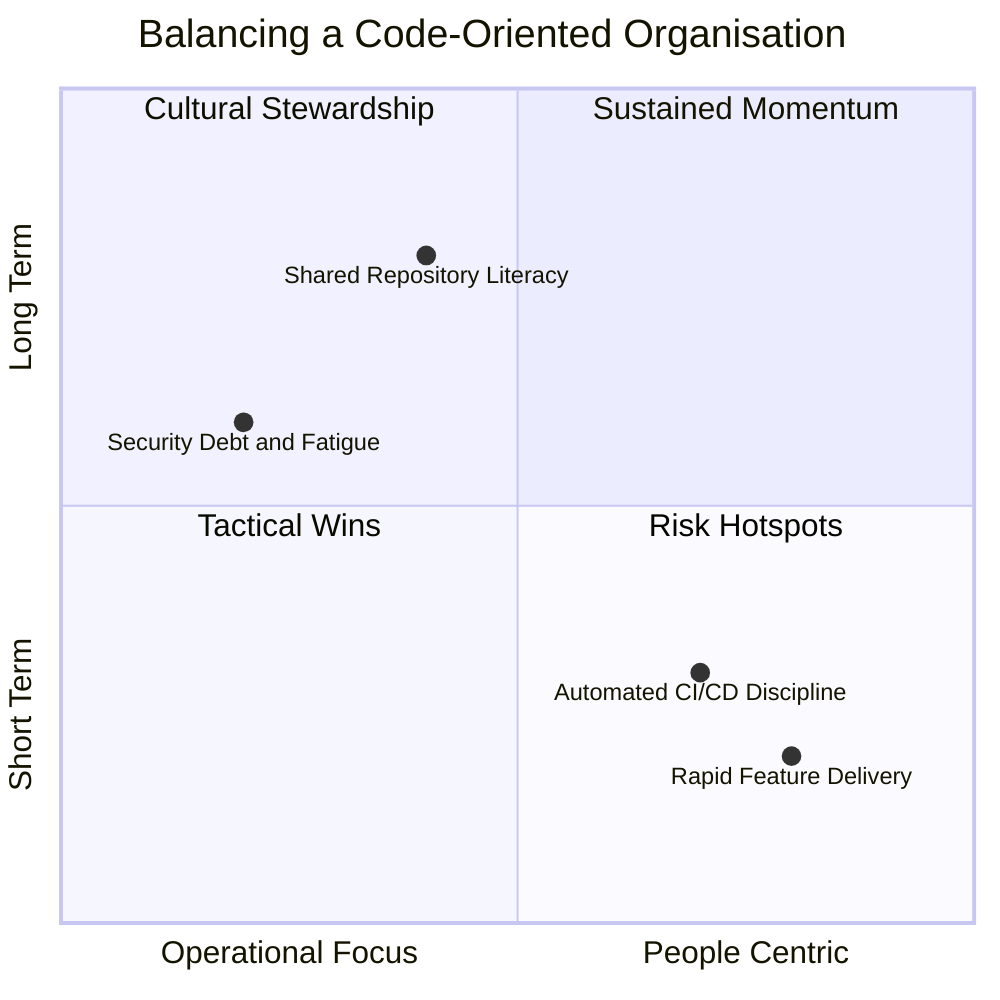

# Advantages and Disadvantages of Working in a Code-Oriented Organisation

A code-oriented organisation places software artefacts at the centre of collaboration. Meetings are minimised, and work happens directly in the editor, making each pull request a transparent expression of intent. This chapter explores the compelling aspects of this culture alongside the pressures that can emerge when code becomes the primary medium of communication.

## Why a Code-Oriented Approach Attracts Teams

Code-led environments appeal because they feel lively and immediate. Engineers often start their day by scanning pull requests from diverse teams, treating the repository as a living library of ideas. This routine keeps focus on creation rather than abstract theorising: features evolve through commits, refactors, and tests rather than prolonged discussions.

The format is inherently engaging. Developers experience a tangible feedback loop—merge a branch, watch the tests pass, and see value delivered. The energy of continuous contribution fosters a sense of shared ownership and keeps motivation high.

## Daily Practices That Reinforce the Culture

A typical morning involves logging in, reviewing outstanding pull requests, and contributing updates without ceremony. Pair programming remains central; seniors and juniors frequently share dual screens, narrating their reasoning while writing tests or refining functions. Continuous integration pipelines provide constant reassurance: push the code, wait for the green ticks, and merge to the main branch.

Informal rituals keep knowledge circulating. Lunchtimes double as impromptu code reviews, with animated conversations about elegant regex solutions or newly discovered refactoring patterns. These practices turn day-to-day collaboration into a continuous learning loop.

## Structural Enablers and Tooling

Infrastructure mirrors the culture. Git is treated almost as a shared belief system, with teams adopting strategies such as GitFlow or trunk-based development supported by feature flags. CI/CD pipelines ship every push to staging, while container orchestration with Docker and Kubernetes keeps environments reproducible. Infrastructure as code ensures application and platform definitions live side by side, eliminating the divide between development and operations.

## Collaborative Dynamics Beyond Traditional Roles

Cross-boundary roles flourish when everyone contributes to the repository. Product owners draft stories in Markdown, designers fine-tune CSS directly, and QA specialists automate checks in Jest. Meetings are concise stand-ups focused on yesterday’s outcomes, today’s intentions, and any blockers before teammates return to the keyboard. Quarterly hackathons encourage experimentation, from AI chatbots to tooling prototypes, reinforcing camaraderie and rewarding ingenuity (the winner chooses the pizza).

## Challenges to Monitor

The same intensity that drives innovation also amplifies risk. Common pressure points include:

- **Tech debt and code smells:** Rapid iteration can duplicate logic and erode code quality, especially in sprawling monorepos or performance-critical services. Without deliberate refactoring, complexity grows unchecked.
- **Coordination overhead:** Parallel contribution from multiple regions or squads invites merge conflicts, delays, and integration friction when branch strategies or release cadences diverge.
- **Psychological strain from reviews:** Direct feedback—“split up that long function!”—aims to help, yet it can feel brutal without a culture of psychological safety.
- **Burnout:** Deadline-driven adrenaline encourages long hours, making rest feel secondary to delivery unless pair programming, shared ownership, and mental health days are prioritised.
- **Security drift:** Speed can outpace vigilance. Skipped scans or inconsistent policies leave vulnerabilities unaddressed, especially in large dependency graphs.
- **Scaling the codebase:** Managing a single source of truth across teams stresses versioning, infrastructure scripts, and release governance.
- **Speed versus adaptability:** The desire for quick wins may overshadow long-term fit, particularly when adopting low-code integrations or bespoke automation.
- **Limited perspective diversity:** Overemphasis on engineering voices risks sidelining non-technical insights, reducing the breadth of ideation.

## Deep Dive: Security Vulnerabilities in High-Velocity Teams

Security requires explicit investment when development velocity is prized. Tooling complexity often breeds gaps: teams juggle static analysis, composition scanning, container checks, and secrets management, yet inconsistent policies allow flaws to slip through pipelines. Integrating these tools into CI/CD flows can feel disruptive, leading some teams to postpone enforcement.

Skill gaps compound the issue. Developers who excel at functionality might overlook security fundamentals such as injection prevention or least-privilege configuration, particularly when training is sporadic. With cybersecurity talent in short supply, high-velocity teams must embed education through IDE guidance, wikis, or certification pathways to ensure secure coding becomes second nature.

Vulnerability management introduces further friction. Traditional scoring systems rarely reflect runtime context, creating alert fatigue when automated scanners raise countless low-priority issues. Developers become desensitised, allowing critical threats to linger. Risk-based automation—filtering alerts by exploit likelihood and business impact—helps restore focus.

Supply chain exposure is another concern. Attackers target ecosystems such as npm or PyPI, inserting malicious packages that propagate through automated build systems. Without software bills of materials, maintainer attestations, and secrets rotation, these threats become difficult to detect. Long-lived credentials in pipelines magnify the risk until teams adopt short-lived authentication methods.

Cultural barriers often undermine technical efforts. If security specialists are perceived as gatekeepers rather than collaborators, developers may circumvent safeguards through manual “click-ops.” Security champions within delivery teams, coupled with leadership backing, encourage shared accountability and keep protective practices embedded in daily routines.

## AI-Augmented Automation as a Safety Net

AI-augmented automation offers a pragmatic route to balancing speed with assurance. Machine learning models embedded in IDEs and pipelines analyse commits, build logs, and runtime telemetry to detect anomalies in real time. When combined with large language models that draft remediation suggestions, mean time to resolution drops dramatically and security conversations become more data-driven.

Autonomous remediation tools can patch dependencies, harden container settings, or suggest code changes before incidents reach production. Predictive analytics reduce false positives by prioritising alerts based on exploit likelihood, while explainable AI techniques maintain trust by showing why specific recommendations were made. Organisations that pair these capabilities with continuous upskilling and governance rituals create a resilient feedback loop: automation handles repetitive checks, humans focus on nuanced design and ethical oversight.

## Quadrant View of Benefits and Challenges

## Balancing the Equation

A code-oriented organisation thrives on transparency: bugs become lessons, and ideas are tested directly in sandboxes that scale to millions of users. Yet sustainability hinges on balance. Pair programming, mental health safeguards, and inclusive rituals preserve well-being. Dedicated security investment, AI-assisted automation, and continuous learning prevent short-term wins from undermining long-term resilience. When teams treat the repository not only as a delivery engine but also as a communal knowledge base, they do more than write code—they live it responsibly.
