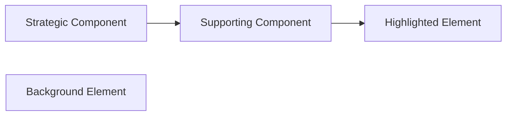
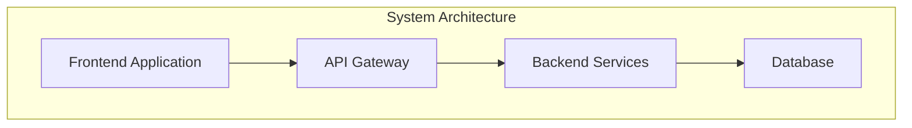
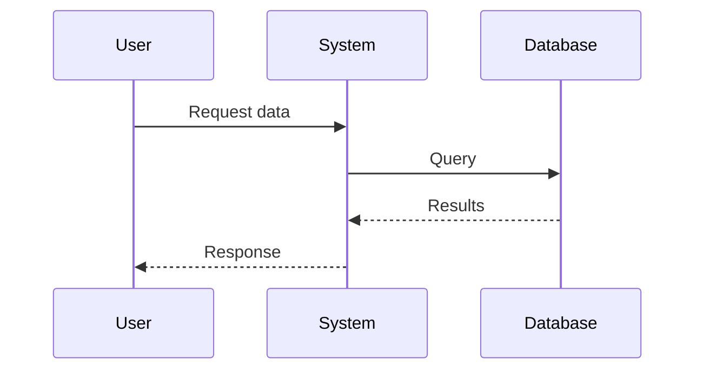
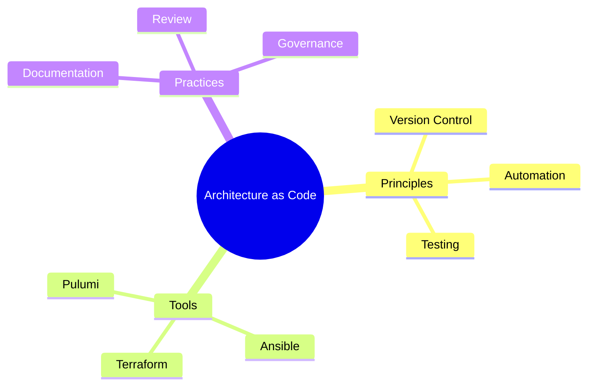
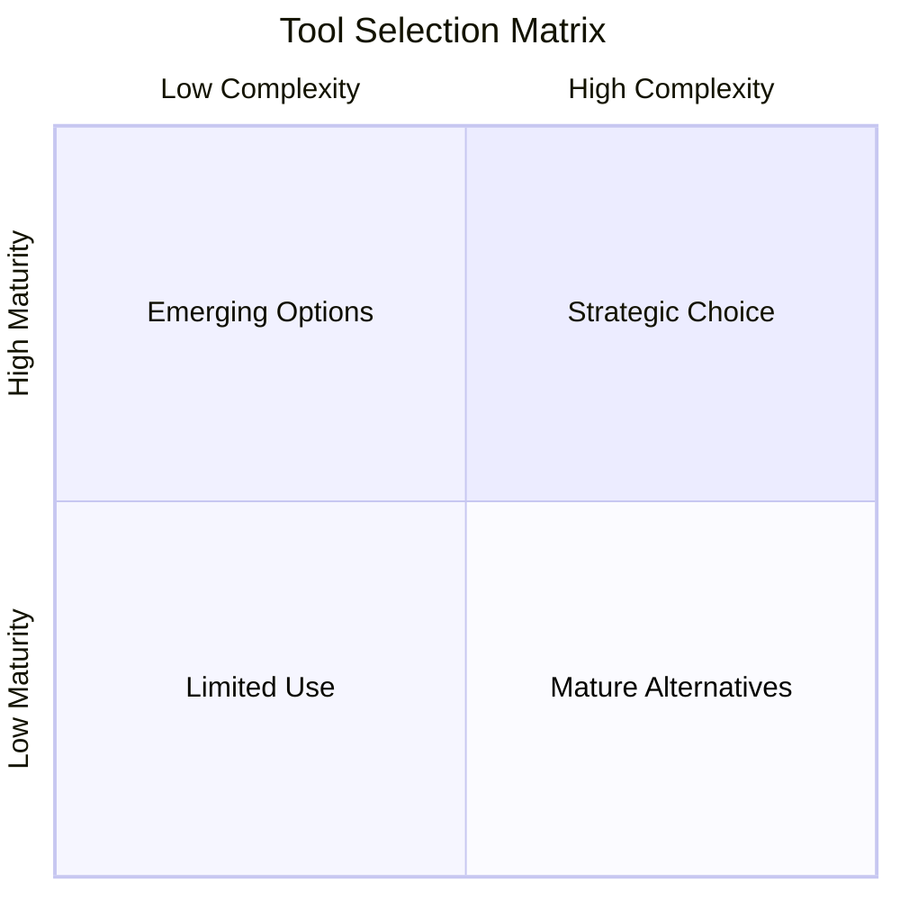
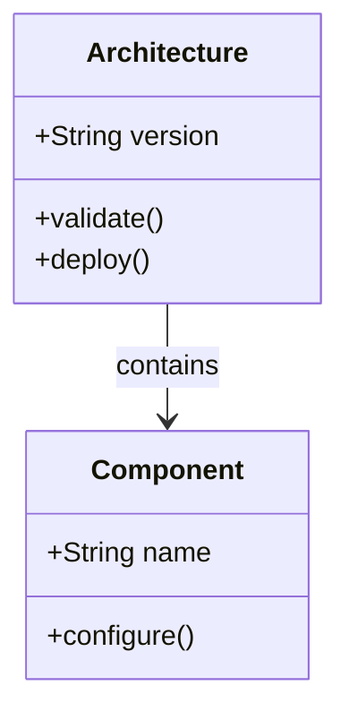
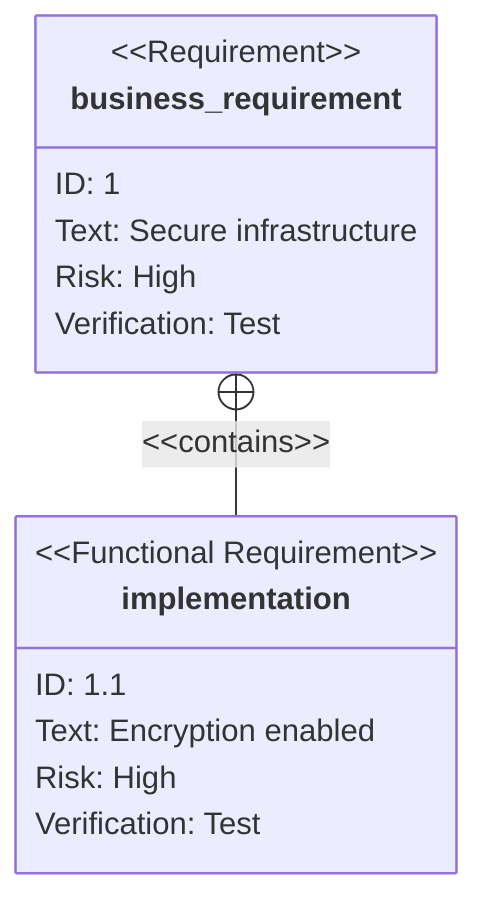
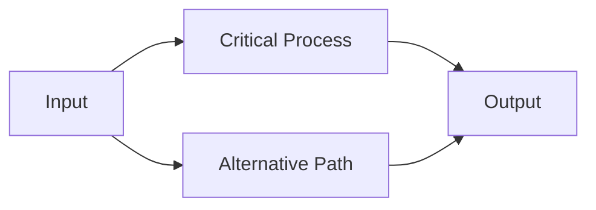
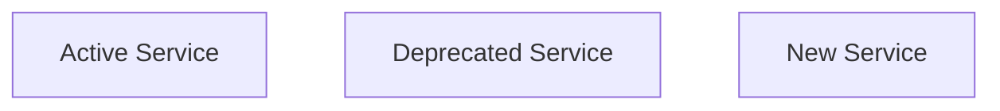
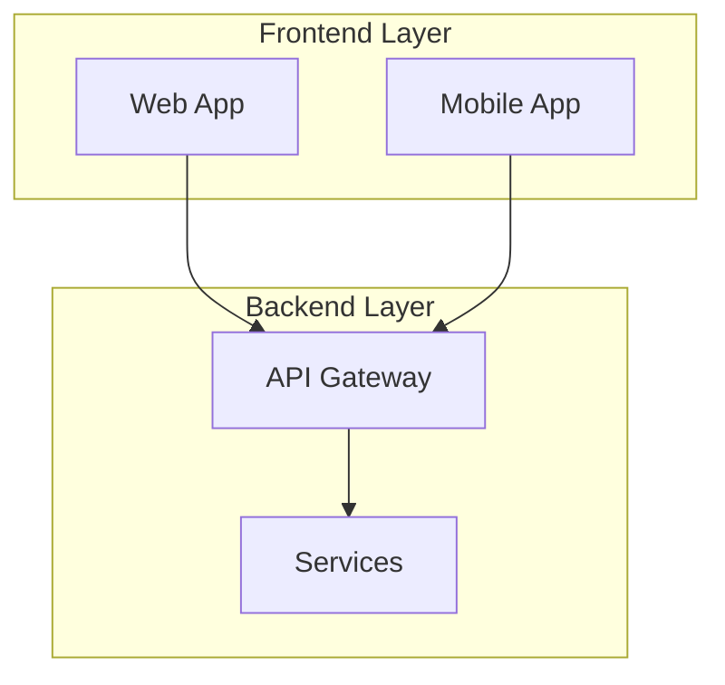

# Diagram Style Guide for Architecture as Code

## Purpose

This guide documents the standards for creating brand-compliant diagrams for the Architecture as Code book. All diagrams must follow the Kvadrat brand guidelines and maintain professional, consistent visual presentation throughout the publication.

## Brand Compliance Overview

All diagrams must adhere to:
- **Kvadrat Brand Guidelines**: Professional, corporate aesthetic without decorative elements
- **Colour Palette**: Use only defined Kvadrat blue shades
- **Typography**: Inter font family with appropriate sizing
- **Language**: British English spelling and grammar
- **Professionalism**: Clear, descriptive text without emojis or informal language

For detailed brand requirements, see `docs/archive/book-cover/source/BRAND_GUIDELINES.md`.

## Colour Palette

All diagrams use the Kvadrat blue colour palette defined in `docs/mermaid-kvadrat-theme.json`. Apply CSS classes to diagram elements using the `:::kv-*` syntax:

### Available Colour Classes

| Class | Colour | Hex Code | Usage |
|-------|--------|----------|-------|
| `:::kv-primary` | Kvadrat Blue (Dark) | #1E3A8A | Primary elements, strategic components |
| `:::kv-accent` | Blue (Medium) | #2563EB | Secondary elements, supporting components |
| `:::kv-highlight` | Light Blue | #3B82F6 | Emphasis elements, callouts |
| `:::kv-muted` | Ice Blue | #E0F2FE | Background, deprecated elements |
| `:::kv-pattern` | Lighter Blue | #93C5FD | Pattern elements, tertiary items |
| `:::kv-outline` | White with Border | White + border | Hollow boxes, outline elements |

### Example Usage



## Typography

- **Font Family**: Inter (with fallbacks: 'Segoe UI', sans-serif)
- **Base Font Size**: 16px
- **Title Font Size**: 20px
- **Font Weight**: 600 (semi-bold) for labels and titles
- **Text Colour**: Dark Blue (#0F172A)

Typography is automatically applied through the theme configuration. Do not override font settings in individual diagrams.

## Diagram Types with Examples

### Flowcharts and Graphs

Use flowcharts for process flows, system architectures, and component relationships.



### Sequence Diagrams

Use sequence diagrams for interaction flows and temporal processes.



**Important**: No emojis in participant names or labels. Use clear, professional text only.

### Mindmaps

Use mindmaps for concept hierarchies and knowledge structures.



### Quadrant Charts

Use quadrant charts for analysis and decision matrices.



### Class Diagrams

Use class diagrams for data models and object relationships.



### Requirement Diagrams

Use requirement diagrams for tracing requirements to implementation.



## Do's and Don'ts

### DO

✅ Use `:::kv-*` CSS classes for all styled nodes  
✅ Write all text in British English (organisation, optimisation, behaviour)  
✅ Keep titles clear, professional, and descriptive  
✅ Rely on the central theme file (`mermaid-kvadrat-theme.json`)  
✅ Test diagram rendering before committing  
✅ Use rounded corners (defined in theme)  
✅ Apply consistent stroke widths (defined in theme)  
✅ Use subgraphs to group related elements  
✅ Keep diagrams simple and focused on one concept  
✅ Use descriptive labels that explain the purpose  

### DON'T

❌ Use inline theme configurations or style overrides  
❌ Include emojis in titles, labels, or annotations  
❌ Use American English spellings (organization, optimization, behavior, center)  
❌ Override theme colours manually with hex codes  
❌ Create overly complex diagrams (break into multiple instead)  
❌ Use decorative elements that don't add meaning  
❌ Mix different styling approaches in the same diagram  
❌ Forget to add CSS classes to important nodes  
❌ Use informal language or colloquialisms  
❌ Leave diagrams without meaningful titles  

## File Naming Convention

Diagram files should follow this pattern:

```
diagram_[chapter]_[description].mmd
```

Examples:
- `diagram_04_iac_tools_quadrant.mmd`
- `diagram_12_requirements_testing.mmd`
- `diagram_23_glossary_class.mmd`
- `code_review_sequence.mmd`

## Validation Process

Before committing diagram changes:

### 1. Verify British English Spelling

```bash
# Check for American spellings in diagram files
grep -ri "organizat\|optimiz\|behavior\|center" docs/images/*.mmd
```

**Expected result**: No matches (empty output)

### 2. Verify No Emojis

```bash
# Search for common emojis in diagram files
find docs/images -name "*.mmd" -exec grep -l "🛠\|🏆\|📊\|🔧\|📈\|💡\|🚀\|✅\|❌\|🎯" {} \;
```

**Expected result**: No files found (empty output)

### 3. Test Diagram Rendering

```bash
# Generate PNG files from Mermaid diagrams
PUPPETEER_EXECUTABLE_PATH=$(which google-chrome) mmdc -i docs/images/your_diagram.mmd -o docs/images/your_diagram.png -t docs/mermaid-kvadrat-theme.json
```

**Expected result**: PNG file generated successfully with correct colours and styling

### 4. Validate Complete Book Build

```bash
# Full book build with all diagrams
python3 generate_book.py && docs/build_book.sh
```

**Expected result**: PDF, EPUB, and DOCX generated successfully in `releases/book/`

## Troubleshooting

### Problem: Colours Not Applying

**Symptom**: Nodes appear in default Mermaid colours instead of Kvadrat blue shades

**Solution**: 
- Check CSS class syntax: `[Label]:::kv-primary` (note the triple colons)
- Verify the class name is exactly one of: `kv-primary`, `kv-accent`, `kv-highlight`, `kv-muted`, `kv-pattern`, `kv-outline`
- Ensure no extra spaces between node definition and class

### Problem: Text Truncated

**Symptom**: Labels are cut off or abbreviated in rendered PNG

**Solution**:
- Reduce label length to 30-40 characters maximum
- Use `<br/>` to break long labels into multiple lines
- Consider using a note or annotation for detailed text

### Problem: Mermaid Rendering Errors

**Symptom**: `mmdc` command fails with syntax errors

**Solution**:
- Validate Mermaid syntax using online editor: https://mermaid.live
- Check for missing spaces around arrows (`-->`, `->>`)
- Ensure proper indentation in subgraphs
- Verify diagram type keyword is correct (`graph`, `sequenceDiagram`, `classDiagram`, etc.)

### Problem: Theme Not Loading

**Symptom**: Diagrams render with default theme instead of Kvadrat theme

**Solution**:
- Ensure `mmdc` command includes `-t docs/mermaid-kvadrat-theme.json` parameter
- Verify theme file exists and is valid JSON
- Check that `PUPPETEER_EXECUTABLE_PATH` environment variable is set

### Problem: Chrome Executable Error

**Symptom**: `mmdc` fails with "Chrome executable not found"

**Solution**:
```bash
# Set Chrome executable path
export PUPPETEER_EXECUTABLE_PATH=$(which google-chrome)

# Or use chromium if chrome not available
export PUPPETEER_EXECUTABLE_PATH=$(which chromium)
```

## Diagram Creation Workflow

1. **Plan**: Sketch the diagram structure and identify key components
2. **Create**: Write Mermaid syntax in `.mmd` file following naming convention
3. **Style**: Apply appropriate `:::kv-*` classes to all important nodes
4. **Validate**: Run validation checks (spelling, emojis, syntax)
5. **Render**: Generate PNG using `mmdc` with Kvadrat theme
6. **Review**: Verify rendered PNG matches brand guidelines
7. **Commit**: Add both `.mmd` source and `.png` output to version control
8. **Test**: Run full book build to ensure diagram appears correctly

## Common Patterns

### Highlighting Critical Paths

Use `:::kv-primary` for critical path elements:



### Showing Status or State

Use different classes to indicate state:



### Grouping with Subgraphs

Use subgraphs for logical grouping:



## Integration with Build Process

Diagrams are automatically converted during the book build process:

1. **Source Files**: `.mmd` files in `docs/images/` directory
2. **Conversion**: GitHub Actions workflow runs `mmdc` to generate PNG files
3. **Inclusion**: Pandoc embeds PNG files in PDF, EPUB, and DOCX outputs
4. **Version Control**: Both `.mmd` and `.png` files are committed

### Manual Diagram Regeneration

To regenerate all diagrams locally:

```bash
# Navigate to images directory
cd docs/images

# Regenerate all diagrams (requires Chrome/Chromium)
for file in *.mmd; do
    PUPPETEER_EXECUTABLE_PATH=$(which google-chrome) \
    mmdc -i "$file" -o "${file%.mmd}.png" -t ../mermaid-kvadrat-theme.json
done

# Verify count matches
ls -1 *.mmd | wc -l
ls -1 *.png | wc -l
```

## Quality Checklist

Before considering a diagram complete, verify:

- [ ] Diagram uses only Kvadrat colour palette (`:::kv-*` classes)
- [ ] All text uses British English spelling
- [ ] No emojis in titles, labels, or annotations
- [ ] Title is clear, professional, and descriptive
- [ ] Diagram complexity is appropriate (not too busy)
- [ ] PNG renders correctly with theme applied
- [ ] File naming follows convention
- [ ] Both `.mmd` and `.png` are committed
- [ ] Diagram appears correctly in book build
- [ ] Visual hierarchy is clear and logical

## References

- **Editorial Standards**: `docs/STYLE_GUIDE.md`
- **Theme Configuration**: `docs/mermaid-kvadrat-theme.json`
- **Brand Guidelines**: `docs/archive/book-cover/source/BRAND_GUIDELINES.md`
- **Mermaid Documentation**: https://mermaid.js.org/
- **Build Process**: `docs/build_book.sh`
- **Book Generator**: `generate_book.py`

## Getting Help

If you encounter issues not covered in this guide:

1. Check existing diagrams in `docs/images/` for examples
2. Review the Mermaid documentation for syntax help
3. Test diagrams in the online editor: https://mermaid.live
4. Verify the build process with: `python3 generate_book.py && docs/build_book.sh`
5. Consult the project README for additional troubleshooting

## Version History

- **v1.0** (2025-11-05): Initial diagram style guide creation
  - Documented Kvadrat colour palette and CSS classes
  - Added examples for all diagram types
  - Defined validation process and quality checklist
  - Created troubleshooting section
