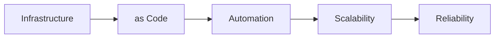

# Architecture as Code - Book Project

A comprehensive book about Infrastructure as Code in English.

## 📚 About the book

This book covers Infrastructure as Code from fundamental principles to advanced implementation, with focus on practical application within organizations.

### Target audience
- System architects
- DevOps engineers  
- Developers
- Project managers
- IT managers

### Content
23 chapters covering:
- Fundamental IaC principles
- Cloud architecture as code
- Security and compliance
- CI/CD and automation
- Organizational transformation
- Practical case studies

## 🛠️ Technical implementation

### Structure
```
english/docs/            # Book content
├── *.md                # Markdown chapters (01_introduction.md, 02_chapter1.md, etc)
├── images/*.mmd        # Mermaid diagram source files  
├── images/*.png        # Generated PNG diagrams
├── build_book_en.sh   # Local PDF build script
└── architecture_as_code.pdf # Generated book (95KB with images)

english/src/            # React web application (English UI)
├── components/ui/      # shadcn/ui components
├── pages/Index.tsx     # Main dashboard page
└── App.tsx            # React router setup

english/.github/workflows/ # CI/CD automation
└── build-book-en.yml  # Automated PDF publishing on push
```

## 📊 Diagrams and illustrations

All diagrams are created with Mermaid and follow these guidelines:
- Maximum 5 elements per diagram
- Horizontal orientation (LR)
- Automatically converted to PNG in CI/CD

Example:


## 🔄 Contributions and updates

### Workflow for changes:
1. Create branch for changes
2. Modify markdown files in `english/docs/`
3. Commit and push
4. GitHub Actions automatically builds PDF
5. Merge to main → automatic release

### Chapter structure:
Each chapter follows the same structure:
- H1 main heading
- Diagram with description
- Introductory text (500 characters)
- Deep-dive sections
- Sources

## 🏗️ CI/CD Pipeline

GitHub Actions workflow (`build-book-en.yml`) handles:
- **Triggers**: Push/PR on markdown files
- **Dependencies**: Pandoc, TeXLive, Mermaid CLI
- **Build**: Converts diagrams + generates PDF
- **Artifacts**: Saves PDF for download
- **Releases**: Automatic versions on main branch

### Status badges:


## 📖 Chapter list

1. **Introduction to Architecture as Code** - Fundamental concepts and motivation
2. **Basic principles for Infrastructure as Code** - Core principles and foundations
3. **Version control and code structure** - Code organization and Git workflows
4. **Automation and CI/CD pipelines** - Continuous integration and deployment
5. **Cloud architecture as code** - Cloud-native IaC approaches
6. **Security in Infrastructure as Code** - Security by design
7. **Monitoring and observability** - Operational excellence
8. **Scalability and performance** - Performance optimization
9. **Digitalization through code-based infrastructure** - Digital transformation
10. **Organizational change and team structures** - Cultural transformation
11. **Project management for IaC initiatives** - Leadership and governance
12. **Innovation through infrastructure transformation** - Innovation enablement
13. **Product development with IaC tools** - Product-centric approaches
14. **Compliance and regulatory adherence** - Governance and compliance
15. **Cost optimization and resource management** - Financial operations
16. **Testing strategies for infrastructure code** - Quality assurance
17. **Migration from traditional infrastructure** - Legacy transformation
18. **Future trends and technologies** - Emerging technologies
19. **Best practices and lessons learned** - Wisdom and guidance
20. **Case studies and practical examples** - Real-world applications
21. **Conclusion** - Summary and next steps
22. **Glossary** - Terms and definitions
23. **About the authors** - Author information

## 👥 Authors

**Dr. Anna Bergström** - Senior Cloud Architect  
**Marcus Andersson** - DevOps Engineer and Automation Specialist

## 📄 License

This work is licensed under Creative Commons Attribution-ShareAlike 4.0 International License.

## 🚀 Getting started

1. Clone repository
2. Make changes in English markdown files
3. Push to GitHub
4. Download generated PDF from Actions artifacts or Releases

---

*Automatically built with GitHub Actions and Pandoc*