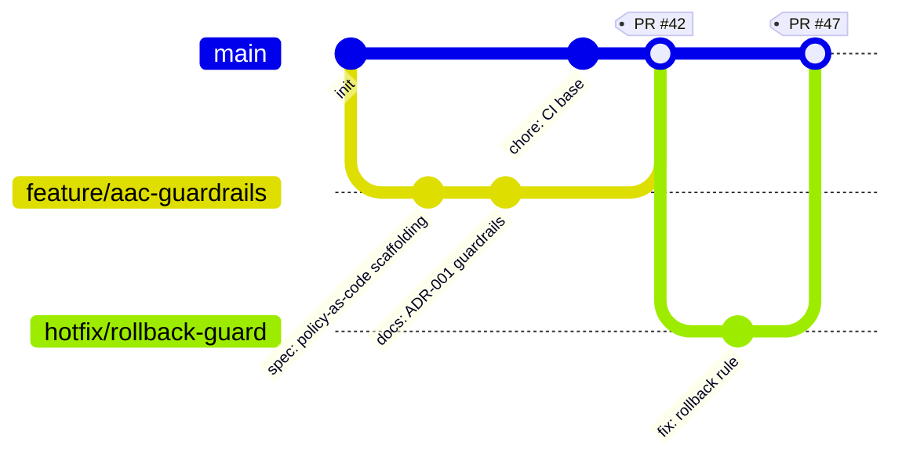

# Issue: Audit and expand our Git-based workflow for infrastructure

**Summary**
Chapter 3 (“Version Control and Code Structure”) describes a Git-based workflow for Architecture as Code (AaC) with clear commit history, PR-based review, and transparent branching strategies. We should align our repositories with these practices, decide on the default branching model (trunk vs GitFlow), and document contribution rules.

**Why**
- Ensure architectural guardrails are enforced via Git.
- Improve traceability, review quality, and onboarding.
- Make PR checks and governance explicit.

**Scope**
- Revisit branch strategy, PR templates, CODEOWNERS, and mandatory checks.
- Define commit message conventions and cross-linking to ADRs/Issues.
- Clarify separation of AaC vs IaC repositories.

**References**
- Site: “Version Control and Code Structure” (includes “Git-based workflow for infrastructure”, “Transparency through version control”).

**Acceptance Criteria**
- [ ] A documented branching strategy with examples.
- [ ] Standard PR template (review checklist for governance/policy).
- [ ] CODEOWNERS with required reviewers for sensitive areas.
- [ ] Commit message convention documented; link to ADR policy.
- [ ] Example “happy path” PR from feature to main with checks.

**Tasks**
- [ ] Decide and document branch strategy (trunk-based or GitFlow).
- [ ] Add `.github/pull_request_template.md` with governance checklist.
- [ ] Add `CODEOWNERS` and enforce status checks.
- [ ] Add `CONTRIBUTING.md` detailing commit messages, linking Issues/ADRs.
- [ ] Provide examples of AaC vs IaC repository boundaries.

---

## Git history and flow (illustrative)

*Source: Chapter 3, “Version Control and Code Structure”.*
