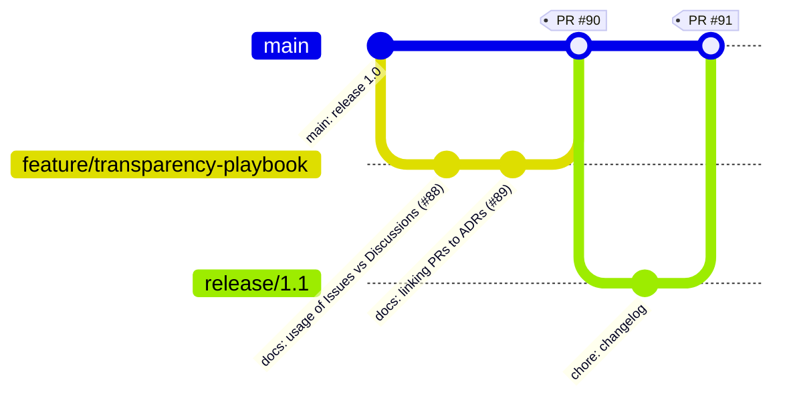

# Issue: Document transparency via Issues, Discussions, and commit history

**Summary**
Chapter 3 emphasises transparency: PRs for peer review, Issues for work tracking, Discussions for strategy, and branch strategies to make flow visible. We should codify how we use these surfaces and add cross-link standards.

**Why**
Auditable trail for “what/when/who/why”, better stakeholder visibility, and quicker onboarding.

**Scope**
- Define when to use Issues vs Discussions.
- Reference patterns for linking Issues ↔ PRs ↔ ADRs.
- Add labels and project boards per area.
- Showcase commit history queries for audits.

**Acceptance Criteria**
- [ ] Playbook with examples (Issue → PR → ADR).
- [ ] Label set and default project board created.
- [ ] Search snippets for “show me all changes to X between Y–Z”.

---

## Transparent branch strategy (illustrative)

*Source: “Transparency through version control” in Chapter 3.*
